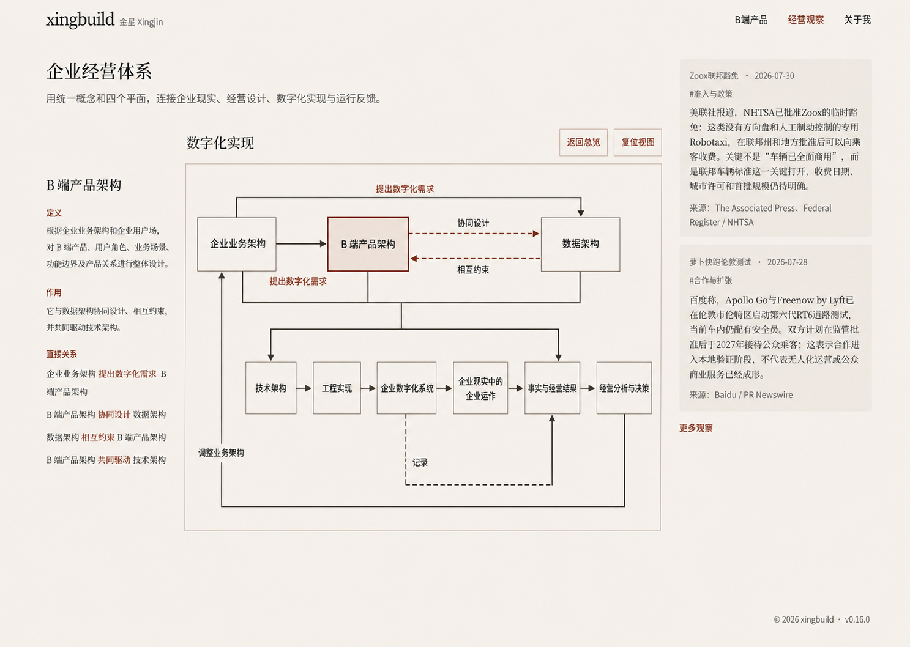

# v0.17.0 企业经营体系固定架构图与全站返回统一方案

## 1. 方案结论

本版本只解决两个已确认的产品问题：

1. `digital-implementation` 架构图默认关系不可读、图形会因指针和视口交互产生晃动，读者难以一次理解完整闭环。
2. Article、观察集合和 Framework 使用不同返回结构、文案和视觉，形成页面私有导航。

采用已选择的方案 1“Architecture Spine”作为 GraphCanvas 内部视觉方向；同时建立全站唯一的 `ReturnNavigation（返回导航）`。这不是网站结构改版。

选定视觉证据：

效果图只约束 GraphCanvas 内部的布局、连线、标签、选中和稳定性。Header、页面标题、ShowcaseLayout、208px 说明列、20px 关系间距、SystemStage、304px Observation rail、ReadingShell 与 Footer 继续以现有网站母版为准；效果图中的偶然比例不得覆盖母版。

## 2. 事实源与非目标

事实源按以下顺序使用：

1. `src/content/frameworkModel.js`：9 个节点、13 条边、名称、定义、作用、关系方向和标签的唯一网站图形源。
2. 根 `AGENTS.md`：网站目标、ShowcaseLayout、内容对象和返回治理。
3. `docs/design/xingbuild Visual System v1.md`：全站视觉、交互和 `ReturnNavigation` 合同。
4. 本方案：v0.17.0 的视觉方向、范围和验收。

本版本不得：

- 修改、复制或补造 `frameworkModel` 的节点、边、权威文案或业务关系；
- 修改网站一级信息架构、Header、页面标题、Robotaxi、Observation 内容、About、Footer 或发布能力；
- 新增第二个局部入口、节点 URL、详情页或二次下钻；
- 建立 Mermaid、LikeC4、D2 或其他第二图模型；
- 让效果图成为新的内容或几何数据源。

## 3. 架构图阅读合同

### 3.1 读者问题

视图只回答：

> 企业业务架构如何通过产品、数据、技术与工程形成进入企业现实运作的数字化系统，并如何由事实与经营结果反馈调整业务架构？

### 3.2 关系表达

默认状态同时保留全部 9 个节点和 13 条关系：

- 主推进：业务架构分支进入产品与数据，汇入技术、工程和数字化系统，再进入企业运作、事实与经营结果及经营分析与决策。
- 协同：`B 端产品架构 ↔ 数据架构` 的“协同设计 / 相互约束”始终可见。
- 记录：`企业数字化系统 → 事实与经营结果` 的“记录”不得替代企业运作产生事实的关系。
- 反馈：`经营分析与决策 → 企业业务架构` 的“调整业务架构”必须清楚闭环。

桌面和中宽默认显示全部关系线与关系标签；选择节点只强化该节点及直接关系，其他关系保持为可读上下文，不得消失。选中说明只列权威定义、作用和直接关系，不重复整张图。

### 3.3 固定画布

GraphCanvas 是固定架构视图，不是自由画布：

- 不提供拖拽平移、滚轮缩放、双指缩放、MiniMap 或其他画布移动；
- 不使用 pointer capture 抢夺节点点击或页面滚动；
- 不提供“复位视图”或等价 reset 控件；
- hover、focus、preview、selected 不得使用 `translate`、lift 或改变节点边界框的动效；
- 初次渲染允许一次确定性适配，之后选择、焦点或说明更新不得重新 fit、移动节点或改变缩放；
- 点击、Enter 或 Space 只更新选中节点和说明。

无法在 SystemStage 内完整呈现时，应修正确定性布局和响应式投影，不能用拖动、缩放或复位掩盖。

## 4. 页面结构

企业经营体系继续与 Robotaxi、首页投影复用同一 ShowcaseLayout。进入 `?view=digital-implementation` 只替换同一对象内部的 GraphCanvas 和说明。

必须删除 SystemStage 上方额外的“数字化实现 + 返回总览 + 复位视图”标题/工具栏行。局部状态不得创造新的页面层级、标题角色或工具栏。

默认选中仍为 `b2b-product-architecture`。刷新、直接访问、浏览器前进/后退和未知 `view` 回退继续满足现有路由合同。

## 5. 全站 ReturnNavigation

全站返回统一为一个共享导航对象：

- 输入：真实 `href`、目的地名称、安全 `origin/returnTo`、可选 `focusTarget`；
- 主文案：`← 返回{真实目的地名称}`；
- 视觉：辅助文字链接，不使用描边/填充按钮、surface、圆角、shadow 或浮动工具栏；
- 状态：统一 default、hover、focus-visible，触控目标至少 44px，状态变化不移动布局；
- 数量：同页只显示一个主返回；确有栏目入口时允许一个不重复目标的次级栏目链接；
- 行为：刷新、直接访问和浏览器历史成立，使用安全 fallback，不依赖 `history.back`。

位置固定：

- ReadingShell：当前内容对象标题之前；
- ShowcaseLayout 局部视图：说明列当前对象标题之前；
- 不在 SystemStage 上方增加私有返回行。

Framework 局部视图显示 `← 返回企业经营体系`。返回时移除 `view`，恢复总览中的 `digital-implementation` 选择、键盘焦点和必要滚动现场。未来若正式增加下一层，文案必须指向真实上层，例如 `← 返回数字化实现`，不得使用“返回上级”或“返回总览”。

Engineering 应形成一个共享 `ReturnNavigation` 组件与统一 token。ArticleHeader、ObservationsPage、FrameworkExplorer 只提供目标和上下文，不得保留页面私有按钮、文案或 CSS 变体。

## 6. 响应式

### 桌面 1024px 及以上

- 保持 208px 说明列 + 20px + SystemStage。
- GraphCanvas 内全部 9 节点、13 条边和标签一次可读。
- 节点、标签、箭头、节点/标签及标签/标签均无碰撞。

### 中宽 520–1023px

- 沿用现有 ShowcaseLayout 单列转换，不整体缩小桌面双栏。
- SystemStage 使用可用内容宽度，说明紧随其后。
- 继续显示全部关系线和标签，不依赖水平滚动。

### 手机 519px 及以下

- 使用同一模型的既有手机投影和页面自然纵向滚动。
- 保留全部节点和关系线；线内标签可隐藏以避免碰撞。
- 按 `GraphCanvas → 当前节点说明 → 完整关系清单` 提供语义，完整关系清单由同一 13 条边生成，不单独维护。
- GraphCanvas 不建立内部纵向滚动，不抢夺页面触控滚动。

## 7. Engineering 最小范围

只允许：

- 调整现有 FrameworkExplorer / GraphCanvas 的默认关系显隐、确定性布局、稳定交互和响应式投影；
- 移除平移、缩放、pointer capture、复位及额外局部工具栏；
- 新增共享 `ReturnNavigation` 及统一 token，并迁移 ArticleHeader、ObservationsPage、FrameworkExplorer；
- 增加模型边集、几何稳定、返回上下文、焦点恢复、键盘、响应式和回归测试。

不得夹带其他页面、内容、业务事实、发布脚本或 backlog。

## 8. 验收

1. 运行时只读取现有 `frameworkModel`；9 节点、13 边、名称、方向、标签、定义和作用无差异。
2. 1440、1024、768、557 默认可见全部关系线和标签；390、320 有完整文本关系清单。
3. 指针依次经过并选择所有节点时，节点边界框、画布 transform 和关系几何不变化。
4. 鼠标拖动、滚轮、触控拖动和双指手势不能移动或缩放 GraphCanvas；页面自然滚动正常。
5. 不存在“数字化实现 + 返回总览 + 复位视图”额外工具栏，也不存在“复位视图”。
6. Framework 只显示一个 `← 返回企业经营体系` 主返回，并正确恢复 URL、选择、焦点和必要滚动现场。
7. Article、观察集合和 Framework 使用相同 ReturnNavigation 结构、token、hover、focus-visible 与触控合同。
8. 六档无横向溢出、嵌套纵滚、节点/标签碰撞、裁切、布局晃动或 console error/warning。
9. `npm run release:check`、closeout-check 和 preflight 按发布阶段通过。

## 9. 状态边界

本文件与选定视觉证据表示产品和视觉方案已定稿，不表示 Engineering 已实现、测试、提交、打 tag、push、部署或公网验收。上述状态必须分别报告。
