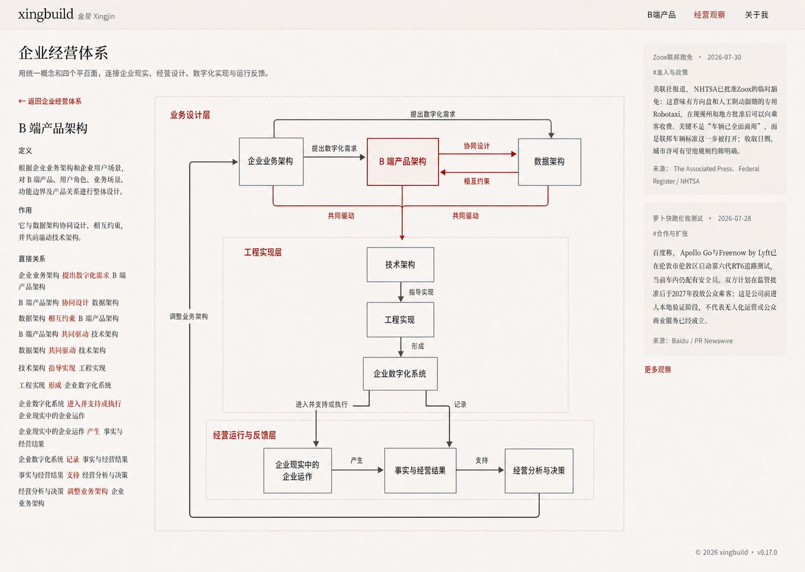
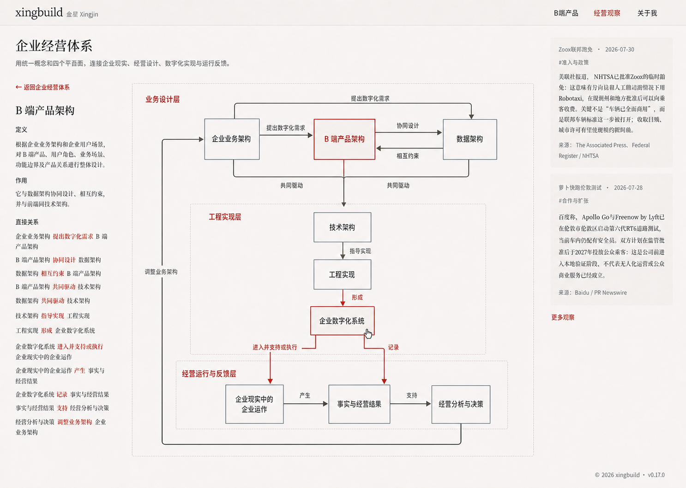
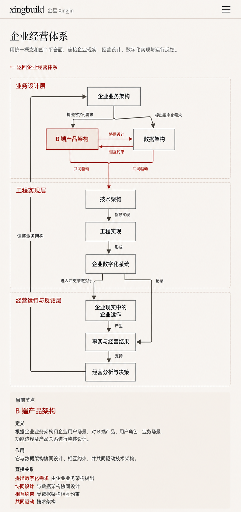

# v0.18.0 企业经营体系多层架构浏览器重构方案

## 1. 方案结论

`v0.18.0` 不再修补现有平面 GraphCanvas，而是把
`企业经营体系 → 数字化实现` 重构为一个 LikeC4 风格的多层架构浏览器。

本版本只改变企业经营体系架构图内部的产品结构、视觉表达、交互运行时和
响应式投影；不修改网站一级信息架构、ShowcaseLayout、Header、
Observation rail、ReturnNavigation、内容对象或权威业务事实。

选定视觉事实源：

- 桌面选中状态：
  
- 桌面 Hover 预览状态：
  
- 手机选中状态：
  

效果图约束信息层级、架构边界、构图、间距、布线、状态和视觉语言，不是
业务事实或像素坐标的数据源。节点、关系、方向、标签、定义和作用仍必须由
批准后的唯一模型生成。

## 2. 为什么不能继续修补 v0.17.0

`v0.17.0` 的自动验证证明了节点和边存在，却没有证明读者能够看见并理解
拓扑。公网真实使用暴露出四个根本问题：

1. 九个节点被当作同层散点，缺少责任层和系统边界；
2. 关系标签与关系线脱离，闭环无法被连续追踪；
3. React Flow 的编辑画布能力被关闭后，没有形成适合只读架构浏览的产品；
4. 验收过度依赖 DOM 数量、computed style 和局部截图，没有验证真实鼠标、
   点击、缩放和用户阅读结果。

因此本版本不是线条加深或再次调整 ELK 坐标，而是更换图形语法，并把
“架构语义建模”与“网站精确投影”拆成边界清楚的两项责任。

## 3. 读者、问题与范围

### 3.1 目标读者

- 希望理解企业经营、业务、产品、数据和工程之间关系的读者；
- 用户本人在产品、业务架构和技术架构协作中的长期阅读与复盘；
- 未来需要继续进入局部架构，但当前只阅读 `digital-implementation` 的读者。

### 3.2 当前视图只回答一个问题

> 企业业务架构如何通过产品、数据、技术与工程形成进入企业现实运作的
> 数字化系统，并如何由事实与经营结果反馈调整业务架构？

### 3.3 明确不做

- 不修改 `/business-observations` 的页面责任和网站一级导航；
- 不增加第二个公开局部入口、节点 URL、详情页或二次下钻；
- 不改写 career 上游概念或 `digital-implementation` 的 9 节点、13 关系；
- 不修改 Robotaxi、Observation、Article、About、Header、Footer 或发布能力；
- 不保留 React Flow 作为该局部视图的第二套运行时；
- 不允许 LikeC4 模型、旧 `frameworkModel` 边集和移动关系清单三处手工维护。

## 4. 唯一模型与技术方向

### 4.1 事实边界

1. career 是企业经营概念和定义的上游权威源；
2. xingbuild 保存经批准的网站展示快照；
3. `digital-implementation` 的结构和关系迁移为一个版本化 LikeC4 模型；
4. 页面、桌面视图、手机视图和文本降级都从该模型或其生成物读取；
5. 视觉效果图不得补造节点、边、定义或作用。

### 4.2 LikeC4 的正式责任

LikeC4 是本版本的架构语义模型、CLI 校验与 typed data（类型化数据）生成
工具，不作为网站公开视图的强制运行时或固定几何引擎。

当前 LikeC4 的公开 DSL 与 React runtime 以自动布局和架构浏览为主，不能
稳定声明本方案要求的两套响应式坐标、端口、外部反馈布线槽和全部固定路径。
把它继续设为硬运行时，会迫使 Engineering 依赖内部 XYFlow 状态或不可控
布局产物，反而破坏可验证性。

正式流水线：

```text
career 批准事实
→ LikeC4 .c4 语义模型
→ likec4 validate / codegen
→ 生成的 typed architecture data
→ ArchitectureExplorer 受控 React + SVG 投影
```

### 4.3 单一来源与投影分离

Engineering 必须选择一次性迁移，不得长期双写：

- LikeC4 模型保存节点、边、方向、关系标签和语义层级边界；
- 节点的权威定义与作用按稳定 ID 关联到同一内容对象；
- 现有 `frameworkModel` 中 `digital-implementation` 的手工节点/边投影在迁移
  完成后删除或改为只读取 LikeC4 生成物；
- 手机完整关系清单从同一生成边集产生；
- 生成的 typed architecture data 不得人工编辑；
- 网站可以有一个 `ArchitectureExplorerProjection`，但它只能保存桌面/手机
  的节点位置、端口、路径控制点和安全区，不得重复名称、标签、方向、定义、
  作用或增删关系；
- DOM 节点和 SVG 关系线都必须由生成数据与上述投影组合产生，不得在组件
  JSX 中逐条手写节点或关系；
- 校验必须证明投影引用的 ID 全部存在、模型中的 9 节点和 13 关系全部被
  投影且只投影一次，不允许额外节点、关系或失配端点。

这不是第二份架构模型：LikeC4 拥有“是什么、如何关联”，Projection 只拥有
“在该断点如何摆放和布线”。两者职责不得互相渗透。

公开运行时使用受控 React + SVG 投影，而不是 LikeC4 React runtime、React
Flow 或 ELK。节点使用可聚焦的语义 DOM button；SVG 只承担从投影生成的关系
路径、箭头和标签。不得引入平移、缩放、fitView 或编辑画布状态。

## 5. 产品结构

网站结构保持：

```text
经营观察
└── 企业经营体系
    └── 数字化实现（当前唯一局部入口）
```

局部视图内部由三个系统层构成：

```text
业务设计层
├── 企业业务架构
├── B 端产品架构
└── 数据架构

工程实现层
├── 技术架构
├── 工程实现
└── 企业数字化系统

经营运行与反馈层
├── 企业现实中的企业运作
├── 事实与经营结果
└── 经营分析与决策
```

桌面继续使用 `208px 说明列 + 20px + SystemStage`。左列是被点击后锁定的
节点说明；SystemStage 是主要阅读对象。右侧 Observation rail 和全站
ShowcaseLayout 不变。

## 6. 权威关系

以下 13 条关系必须完整、同向、同名，不得合并或替代：

| # | 来源 | 关系 | 目标 |
|---|---|---|---|
| 1 | 企业业务架构 | 提出数字化需求 | B 端产品架构 |
| 2 | 企业业务架构 | 提出数字化需求 | 数据架构 |
| 3 | B 端产品架构 | 协同设计 | 数据架构 |
| 4 | 数据架构 | 相互约束 | B 端产品架构 |
| 5 | B 端产品架构 | 共同驱动 | 技术架构 |
| 6 | 数据架构 | 共同驱动 | 技术架构 |
| 7 | 技术架构 | 指导实现 | 工程实现 |
| 8 | 工程实现 | 形成 | 企业数字化系统 |
| 9 | 企业数字化系统 | 进入并支持或执行 | 企业现实中的企业运作 |
| 10 | 企业现实中的企业运作 | 产生 | 事实与经营结果 |
| 11 | 企业数字化系统 | 记录 | 事实与经营结果 |
| 12 | 事实与经营结果 | 支持 | 经营分析与决策 |
| 13 | 经营分析与决策 | 调整业务架构 | 企业业务架构 |

产品与数据的两条“共同驱动”先进入一个明确汇合点，再由单一箭头进入
技术架构。不得把“共同驱动”接到工程实现。

“企业运作产生事实”与“数字化系统记录事实”必须使用两条独立关系。

## 7. 视觉语法

### 7.1 层与节点

- 三个层使用轻量边界和层标题，表示真实责任范围；
- 节点使用一致的矩形结构，不使用 dashboard 卡片、阴影、渐变或浮起；
- 结果节点允许使用既有轻暖结果面；
- 选中节点使用 `accent-strong` 边框和轻暖填充；
- 节点文字使用 UI 无衬线字体，页面和说明标题继续使用既有衬线角色。

### 7.2 关系线

- 默认关系始终可见，不能依赖 Hover 或 Click 才出现；
- 默认线建议使用 `#4f4941`，在画布背景上的非文本对比不低于 `3:1`；
- 默认线宽不低于 `1.7px`，选中/预览关系为 `2px–2.2px`；
- 所有方向使用清晰箭头；
- 关系标签必须附着于自己的关系路径，不得漂浮在空白区域；
- 标签背景只能作为克制的画布色 knockout，不得形成 badge 或卡片。

### 7.3 布线安全区

这是硬性合同：

- 任一关系线段不得与 GraphCanvas 外框、系统层边界、布局 divider 或节点
  边框共线、重合或复用同一条视觉边；
- 桌面关系线距 GraphCanvas 外框至少 `32px`；
- 关系线与系统层边界平行时至少保持 `16px` 间距；
- 手机反馈通道距 GraphCanvas 外框至少 `14px`；
- 关系只能在已登记端口处垂直穿越系统层边界；
- 穿越点是一个点，不得沿边界运行形成重叠线段；
- 外部反馈闭环使用独立内部布线槽，不能借用画布左边或底边；
- 节点连接只通过明确端口，关系线不得穿越节点、标签或说明文字。

几何测试必须识别“线段与边界共线重叠”，不能只检查矩形相交或端点存在。

## 8. 交互状态

### 8.1 默认

- 直接访问局部视图时默认锁定 `b2b-product-architecture`；
- 全部 9 节点和 13 关系保持可读；
- 左侧显示 B 端产品架构的权威定义、作用和直接关系。

### 8.2 Hover / Focus 预览

- 指针进入或键盘聚焦节点后，临时强调该节点、直接邻居和直接关系；
- 当前锁定节点仍保留 selected 状态；
- Hover 不更新左侧说明，不改变 URL；
- pointer leave / blur 清除预览；
- 状态过渡只允许颜色、边框和 opacity，建议 `120ms`；
- 禁止 `translate`、lift、缩放、重新布局、重新 fit 或几何变化；
- 节点必须显示真实 `cursor: pointer`。

### 8.3 Click / Enter / Space 选择

- 点击、Enter 或 Space 锁定新节点并更新左侧说明；
- 更新后节点、边、标签、画布 transform 和 scrollWidth 不变化；
- 当前版本不通过节点进入第二层；
- 说明更新使用现有 heading 与 aria-live 合同；
- focus-visible 清晰可见，返回总览后恢复 `digital-implementation` 焦点。

### 8.4 画布行为

- 不允许拖动、平移、滚轮缩放、双指缩放或双击缩放；
- 不显示 reset、MiniMap、toolbar 或局部标题行；
- 图形不能抢夺页面滚动；
- 不需要“复位图”，因为任何交互都不改变几何。

## 9. 响应式

### 9.1 1024px 及以上

- 保持桌面 208px 说明列与 SystemStage；
- 三层系统景观、9 节点、13 关系和反馈闭环一次可读；
- Observation rail 保持现有页面责任。

### 9.2 768–1023px

- ShowcaseLayout 转为单列时，SystemStage 先显示，当前节点说明紧随其后；
- 可以压缩层内间距，但不得整体缩成不可读缩略图；
- 全部关系标签仍可读，不使用水平滚动。

### 9.3 520–767px

- 网站 Header 仍按现有内容断点决定是否保持行内；
- 架构图已切换为手机纵向分层，不继续压缩桌面横向构图；
- 页面自然滚动，图内没有纵向或横向滚动容器。

### 9.4 519px 及以下

- 使用选定手机视觉目标；
- 业务设计层保留产品/数据并行与双向关系；
- 工程实现和经营反馈使用纵向主脊柱；
- 外部反馈闭环使用独立左侧内部通道；
- 节点高度至少 `48px`，点击区域至少 `44px`；
- 图后紧接“当前节点”说明和同源完整关系文本；
- 手机没有 Hover，tap 直接选择并更新说明。

## 10. Engineering 最小任务

1. 引入并固定开源 LikeC4 CLI 依赖、校验与 codegen 构建入口；
2. 将 `digital-implementation` 迁移为唯一 LikeC4 语义模型并生成 typed data；
3. 建立只含位置、端口、路径控制点和安全区的
   `ArchitectureExplorerProjection`；
4. 使用受控 React DOM + SVG 投影替代该视图的 React Flow、ELK 和 LikeC4
   React runtime；
5. 生成并嵌入桌面、中宽和手机视图；
6. 将节点选择、Hover/Focus 预览与既有权威说明关联；
7. 生成同源文本降级和手机完整关系清单；
8. 增加模型/投影一致性、关系、边界、布线安全区、状态稳定性、响应式和
   视觉回归测试；
9. 不夹带其他页面、内容、导航、Observation 或发布能力修改。

## 11. 验收合同

### 11.1 模型与事实

- 唯一模型恰好包含 9 节点和上表 13 关系；
- 名称、方向、标签、定义和作用与批准事实逐项一致；
- 桌面、手机和文本降级从同一模型产生；
- 构建产物中不存在第二份手工关系表。
- Projection 不包含任何业务名称、关系标签、方向、定义或作用；
- 模型与 Projection 的 ID 覆盖、唯一性和端点一致性校验全部通过。

### 11.2 几何与视觉

- 任一关系线与外框、层边界、divider 或节点边框的共线重叠数为 `0`；
- 节点/节点、节点/标签、标签/标签、线/无关节点碰撞数均为 `0`；
- 默认状态无需互动即可追踪完整主路径和反馈闭环；
- 默认线、箭头和标签在真实页面截图中可见，不以 computed style 代替；
- 选中和 Hover 状态与三张视觉目标同屏对照后无结构性偏差。

### 11.3 互动

- 实际鼠标逐一 Hover 九节点，预览关系正确，左侧锁定说明不变化；
- 实际点击九节点，说明逐一更新，节点位置和路径几何变化为 `0`；
- Enter / Space 与 click 等价；
- 指针显示可点击反馈；
- 页面滚动正常，画布不能被拖动或缩放。

### 11.4 响应式与缩放

真实浏览器至少覆盖：

- `1440 / 1024 / 768 / 557 / 390 / 320`；
- 浏览器缩放 `100% / 125% / 150% / 200%` 的代表性组合；
- 390 手机 tap、滚动、选择和说明归属；
- 所有状态无横向溢出、嵌套滚动、裁切、布局晃动或 console error/warning。

### 11.5 专业与用户验收

- Product/Visual 必须使用真实页面分别验收默认、Hover、Click 和手机状态；
- 验收截图必须与对应视觉目标同屏比较；
- 用户实际浏览器环境必须在发布前完成一次人工检查；
- DOM 数量、自动测试、computed style 或 Engineering 截图均不能单独构成通过；
- Product/Visual 与用户检查通过后，才允许 commit/tag/push/deploy；
- 发布后再次核对 release、manifest 和公网关键状态。

## 12. 状态边界

本方案、视觉目标和验收合同已经形成 Engineering 输入，但不表示已经实现、
测试、提交、打 tag、push、部署或公网验收。所有状态必须分别回传。
