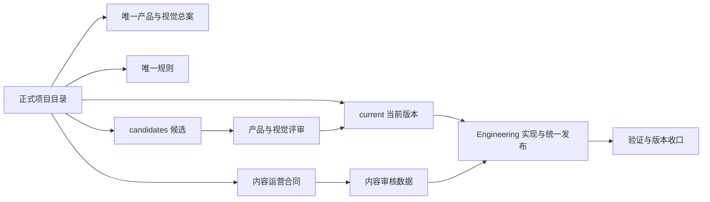
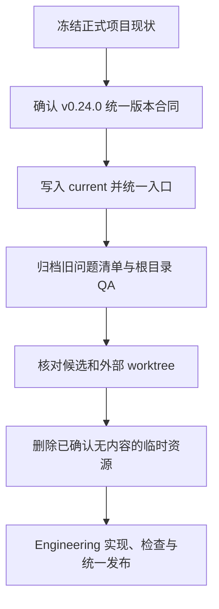

# v0.24.0 项目文件与协作基线治理方案

状态：正式产品工程与统一发布方案；本方案治理文件、事实源、候选入口、worktree、task 协作和统一版本发布，不改变读者页面、内容对象字段或视觉表现。

版本边界：本文件是 v0.24.0 的正式版本方案。用户已确认直接进入 Engineering；产品与视觉已将范围、统一版本合同和验收写入 `docs/iterations/current.md`。本版本将 v0.23.0 之后已经进入 main 的治理与发布能力变化统一收口，不移动既有 v0.23.0 tag。

## 1. 目标

解决项目长期出现的路径分裂、重复规则、旧问题入口、临时 worktree 残留和 task 私有事实源问题，使所有后续产品、视觉、Engineering 与内容运营工作都从同一项目基线开始。

本方案的最终目标是：



任何外部 clone、临时 worktree、task 消息或历史文件都不能成为第二事实源。

## 2. 唯一正式项目位置

唯一项目目录：

`/Users/kingjin/Documents/Builder/xingbuild`

规则：

- 产品方案、候选、规则、current、历史、QA 和运营合同只能创建在该目录内；
- `/private/tmp`、`/Users/kingjin/.codex/worktrees` 和其他外部目录不得保存长期方案、候选、规则、版本结果或分支工作成果；
- 临时命令缓存、浏览器 profile 和构建临时产物可以短时存在，但不得进入 Git，也不得成为协作事实；
- 如必须隔离执行，隔离目录必须位于正式项目内的受控临时位置，完成后立即释放。

## 3. 唯一文档事实源

```text
AGENTS.md                         项目入口与最小边界
docs/product/                     唯一网站产品与视觉总案
docs/rules/                       唯一迭代、协作、分支与发布规则
docs/iterations/current.md        唯一当前版本指针
docs/iterations/candidates/       唯一问题与产品优化候选入口
docs/iterations/history/          已完成版本结果
docs/operations/                  有效内容运营合同
docs/qa/                          版本验证证据
docs/upstream/                    career/Robotaxi 上游事实快照
```

### 3.1 视觉与 x.ai CLI 学习材料

- 当前视觉、互动、自适应和能力展示合同只写入产品总案；
- x.ai/cli 的学习和候选方案只保留在 `docs/iterations/candidates/` 的对应 DRAFT；
- `docs/design/视觉系统与交互原则.md` 作为历史兼容入口，不再追加规则；
- `docs/design/xingbuild Visual System v1.md` 作为历史视觉快照，不再拥有当前决策权；
- 不新建第二份“x.ai 分析”“视觉交互原则”或“能力展示总案”。

## 4. 候选与版本边界

每个候选文件必须记录：

```text
candidate ID
status: pending | confirmed | closed
executionAuthorization: pending | confirmed
事实与证据路径
用户影响与目标
非目标
责任 task
路由与下一动作
```

流程：

1. 任何 task 发现问题，只写 `status: pending` 候选并同步到正式项目 `main`；
2. 产品与视觉 task 统一决定 `confirmed / pending / closed`；
3. 只有 `status=confirmed`、`executionAuthorization=confirmed` 且写入 `current.md` 的候选才进入 Engineering；
4. 运营工具、CLI 或 Skill 出错时立即停止本次运营，不得自行开工程分支或修改 `main`，只登记候选；本版本已确认的发布能力修复进入 v0.24.0；
5. 新采集、draft、review、recovery 和未审核内容不进入产品版本；任何正式 `publish-*` 进入公网的内容都必须进入统一版本提交和 tag；
6. 当前版本完成后只检查 candidates，不读取 roadmap 或 task 历史来补全队列。

### 4.1 当前版本验收失败的特殊路径

当前版本已经本地提交或已发布，但产品/视觉验收发现缺陷时，不跳过候选入口直接读取“下一版本”队列。该缺陷本身先登记为新的候选，并以当前版本为父版本；产品与视觉据此形成修复方案，确认版本号和范围后重新写入 `current.md`，作为一次新的小版本或大版本闭环。只有当前版本验收通过并完成归档后，才检查其他排队候选。

## 5. 文件归档与清理合同

### 保留但不再作为当前事实源

- `docs/design/v*.md`：正式版本历史方案；
- `docs/design/xingbuild Visual System v1.md`：历史视觉快照；
- `docs/design/视觉系统与交互原则.md`：兼容入口；
- `docs/product/个人网站定位、内容与信息架构设计 v1.0.md`：早期产品定位；
- `docs/iterations/history/`、`docs/qa/`、`docs/upstream/`：追溯和证据。

### 必须归档或降级为历史参考

- `docs/operations/内容运营与发布问题清单.md`：移入 `docs/operations/history/`，不再登记新问题；
- `docs/iterations/roadmap.md`：保留历史链接，但不参与版本授权、候选排序或 Engineering 判断；
- 根目录 `design-qa.md`：移入 `docs/qa/`，根目录不保存 QA 文档。

### 可删除的外部临时资源

只有同时满足“工作区 clean、内容已在正式项目或远端保留、没有唯一候选或证据”时，才可删除外部 clone/worktree。任何含未提交内容的 worktree 必须先核对，不得强制删除。

## 6. 协作与通知

跨 task 消息最多传递：

```text
候选或方案 ID
正式项目内文件路径
canonical commit / 当前版本
已完成证据
阻断 ID
下一动作
```

消息不能替代文件，不能传递完整历史、媒体或 base64。源 task 交接后结束当前回合，不持续轮询或等待。

## 7. 验收合同

- 正式项目 `main` 与远端基线一致；
- 不存在外部长期事实文件或未登记候选；
- `AGENTS.md`、规则、产品总案、current 和 candidates 的引用一致；
- 不再引用活动 roadmap 或旧运营问题清单；
- 候选元数据完整、路径唯一、DRAFT 未进入版本；
- `git diff --check` 与 `npm run check` 通过；
- `package.json`、`VERSION.md`、`current.md`、Git commit、annotated tag、`release.json` 与 `content-manifest.json` 的版本和最终 commit 完全一致；
- 三个内容发布命令与主发布命令共用统一版本发布合同；不存在 content-only tag、content-only manifest 或产品版本不变的线上发布；
- 本方案不改变页面、内容对象字段或上游事实，但会改变发布能力、版本记录和正式线上发布状态。
- 本方案自身完成的标志是：唯一目录、唯一入口、候选元数据、归档边界和跨 task 消息合同均可由项目文件直接检查；不存在需要靠聊天历史补全的隐含步骤。

## 8. 非目标

- 不重做网站产品架构或视觉；
- 不修改 Robotaxi、Observation、Article 或 Practice 内容；
- 不在本方案内实现新的 CapabilityHost、VisualizationHost 或 renderer；
- 不以清理为理由删除历史证据、用户未提交内容或上游事实。

## 9. 交付顺序



本方案完成后，下一次产品版本启动只从 `AGENTS.md → rules → current → candidates` 开始。

## 10. 统一发布指令合同

本版本必须修复所有会产生第二套版本身份的指令、脚本、测试和文档。统一规则如下：

```text
Ops 采集 / draft / review / recovery
        ↓ 仅为内部运营数据
content:approve
        ↓ 事实与审核通过
publish-content / publish-article / publish-practice / publish-xingbuild
        ↓ 同一 release worktree、同一版本、同一最终 commit
package + VERSION + current + annotated tag + release.json + content-manifest
        ↓
GitHub main/tag + EdgeOne + 公网验收
```

- `content:approve` 不发布、不创建版本、不修改线上状态；
- 任一正式 `publish-*` 必须串行取得 release lease，生成或确认目标版本，更新统一版本记录，创建 annotated tag，并将同一最终 commit 推送和部署；
- 所有 scope/readiness 检查必须拒绝“产品版本不变”或“内容提交不得创建 tag”的旧逻辑；
- 线上验证必须同时核对 `release.json` 和 `content-manifest.json` 的 version/commit，不能只核对内容 URL；
- 历史已发布 tag 不移动；失败使用新修订版本，不覆盖旧版本；
- 运营活动本身仍不改变产品/页面事实，只有正式公开发布事件进入统一版本记录。
