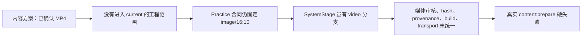
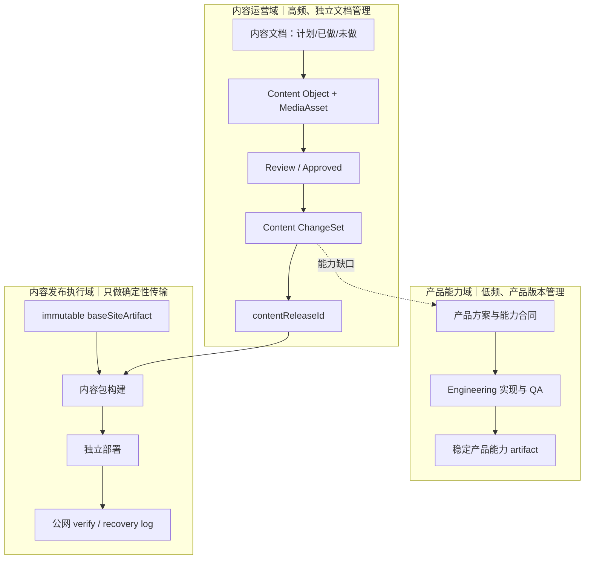
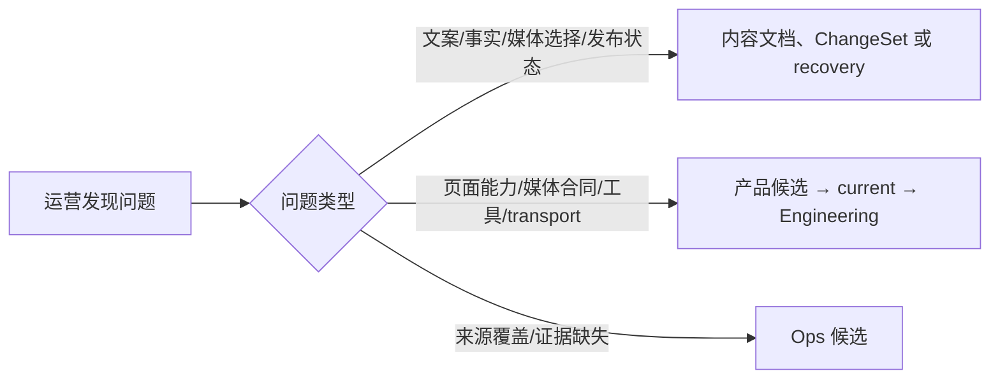
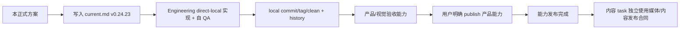

# v0.24.23 统一媒体独立运营能力与内容发布架构方案

> 状态：已确认产品设计方案，待 Engineering 实现
> 方案类型：产品能力与工程合同，不是一次内容发布
> 产品责任：产品与视觉主线
> Engineering 责任：Engineering 主线 `019fc263-abf9-7732-84ef-73914e6e0a85`
> 父版本：`v0.24.22` / `97d095ca5d9c5e6a6cbe92940b188af58f298c80`

## 1. 用户目标与根因

从零开始，产品能力与内容运营必须是两个独立平面：产品提供稳定的页面、字段、媒体和发布能力；内容 task 只使用这些能力管理日常内容，不因为产品版本推进而重新进入产品工程闭环。

本次 MP4 阻断的根因不是单个文件类型错误，而是能力边界没有完整落地：



页面表现分支不等于可运营能力。以后必须先完成一次通用媒体能力建设，之后图片、视频和其他已批准媒体才由内容 task 独立日常运营。

## 2. 总体架构



### 2.1 产品能力域

产品与 Engineering 负责页面结构、内容槽位、媒体合同、渲染能力、校验器、ChangeSet 消费器和内容发布工具。产品能力建设按 `current → Engineering → commit/tag → history → 产品/视觉验收` 形成产品版本。

产品 publish 继续使用现有产品合同：clean `main`、annotated tag 和匹配的产品 `dist/client`；不被本方案的内容发布身份替代。

### 2.2 内容运营域

内容 task 负责内容文档、文案、媒体选择、来源、事实边界、用户确认、内容 ChangeSet 和独立内容发布状态。内容文档记录：

- 本轮计划做什么；
- 已确定、已完成、未完成和待修改什么；
- 每个目标对象、来源、边界和用户确认；
- 哪个 `contentReleaseId` 已发布、哪个仍未发布、哪个需要 recovery。

内容文档不是产品 Git 事实，也不产生产品 `v0.x`。它必须进入独立、可持久化的内容存储或文档工作区；不能只依赖聊天上下文或一次性临时文件。

### 2.3 内容发布执行域

内容发布工具只消费：

```text
已确认内容 ChangeSet
+ 已批准媒体
+ 明确 immutable baseSiteArtifact
→ 内容 release package
→ build
→ transport
→ 公网内容 manifest / verify
```

它不读取当前产品 `HEAD/tag`、`current.md`、产品 `release:preflight`，不 push、commit、tag，不运行网站业务逻辑。`baseSiteArtifact` 只表示内容包所基于的已发布产品能力，不是新的产品版本体系。

## 3. 三套事实账本

| 对象 | 唯一事实源 | Git 关系 |
| --- | --- | --- |
| 产品能力、页面结构、媒体合同、组件 | 产品文档、Engineering 代码与产品 history | 进入 canonical 产品 Git |
| 内容计划、正文、媒体、已做/未做 | 独立内容文档与内容对象 | 不进入产品 Git |
| 内容发布、部署、回滚、公网验证 | `contentReleaseId`、content manifest、append-only 发布日志 | 不进入产品 Git |
| 产品发布工具执行结果 | Publish Incident / Engineering release log | 不写入内容文档或产品 history |

内容文档是运营管理入口；manifest 和发布日志是不可变执行证据。两者互补，不能用自然语言文档替代部署事实，也不能把内容事实写进产品版本历史。

## 4. 统一媒体合同

### 4.1 MediaAsset

已登记并允许独立运营的媒体对象统一使用以下语义：

```text
MediaAsset {
  id
  type: image | video
  src 或 archivePath
  altZh
  ratio: 实际声明的宽高比，不固定为 16:10
  assetSha256
  reviewStatus
  publicStatus
  provenance
  reviewRecord（如有）
}
```

校验器必须同时检查声明类型、文件路径、实际 hash、审核状态、公开状态、来源和事实边界。视频可增加必要的媒体元数据（例如 MIME、时长或 poster），但不能为单个 MP4 建立特殊旁路。

### 4.2 模块无媒体

模块的 `mediaId` 是可选绑定：

```text
mediaId 存在 → 必须解析到已批准、可公开的 MediaAsset
mediaId 不存在 → 不渲染媒体区域，不生成占位媒体
```

现有 `ShowcaseLayout → PracticePage → SystemStage` 继续复用；`SystemStage` 负责 image/video 的展示，不负责审批、来源或发布状态。

### 4.3 ChangeSet

注册表必须能登记媒体目标与模块绑定。ChangeSet 只能改变已登记的媒体字段、媒体对象或明确模块绑定，必须保存：

```text
targetId / scope / beforeHash / before / after
sourceRefs / boundary / authority / affectedRoutes
```

禁止整文件覆盖、未登记媒体、按文件名猜测、修改路由/IA/schema/组件或伪造审批状态。正向 ChangeSet 和逆向 recovery ChangeSet 都只写独立内容工作区。

## 5. immutable baseSiteArtifact 合同

内容发布不依赖当前产品工作区，而依赖一个明确、不可变、可读取的产品能力基座：

```text
baseSiteArtifact {
  baseSiteArtifactId
  productVersion（仅来源证明）
  productCommit（仅来源证明）
  releaseManifestHash
  artifactContentHash
  sourceDeploymentId
}
```

规则：

- 内容包必须明确选择一个已验证的 `baseSiteArtifactId`；
- 当前产品正在实现新版本，不阻断基于上一个稳定基座的内容发布；
- 基座缺失、内容包与基座不匹配或基座不可验证时硬失败；
- 产品版本变化不会自动修改已发布内容；只有页面能力合同不兼容时，才把问题转产品候选；
- 该基座不替代产品 HEAD/tag 身份，也不改变产品 publish 合同。

## 6. 问题分流



内容 task 不因普通内容问题启动产品版本；也不因产品版本发布而重做已独立完成的内容。只有能力问题才进入产品候选。

## 7. 独立内容生命周期

```text
内容文档计划
→ Draft
→ Review
→ 用户确认
→ Approved
→ Content ChangeSet
→ contentReleaseId / package
→ 独立 build
→ transport
→ 公网 verify
→ Published / Superseded / Recovery
```

失败只保留内容 draft、review、recovery、release manifest 和工具日志；不写产品 `current.md`、产品 history、commit/tag 或产品完成声明。

## 8. 本次产品版本实现范围

Engineering 只实现能力，不写本轮 MP4 文案，不替内容 task 做内容确认：

- 统一 image/video MediaAsset 校验，移除 Practice 的 `type=image` 与固定 `16:10` 限制；
- 允许模块无 `mediaId`，并保持无媒体区域为空；
- 注册媒体 target、模块绑定、媒体 ChangeSet 和逆向 recovery；
- 引入明确的 immutable `baseSiteArtifact` 内容构建输入，解除对当前产品 HEAD/tag/preflight 的依赖；
- 内容包 manifest、contentReleaseId、contentHash、sourceRefs、baseSiteArtifactId、deploymentId、publicVerify 和 recovery 证据；
- 独立内容 build/transport/public verify 不修改产品版本文件、不 push/commit/tag；
- 更新唯一相关规则与 Engineering/内容发布入口，使能力建设与能力使用不再混写；
- 增加正向、反向、漂移、权限、hash、媒体状态、空模块和产品迭代并行专项测试。

## 9. 明确不做

- 不重做页面 IA、路由、页面组合、组件布局或视觉系统；
- 不为 MP4 建立一次性特例，不增加人工 CMS、RBAC 或第二套产品版本；
- 不把内容文档、内容发布日志写入产品 Git；
- 不把产品能力缺口伪装成内容运营，也不由内容 task 修改 `src/`、schema 或 Engineering 工具；
- 不创建 branch、worktree、并行 task、automation 或 scheduler；
- 不在本版本直接发布当前 MP4，能力验收完成后仍由内容 task 按独立合同重新准备。

## 10. 验收合同

### 正向

- 产品主线存在未提交修改或正在形成新产品版本时，仍可基于明确稳定 `baseSiteArtifactId` 独立发布已审核 MP4；
- image 与 video 均能通过统一媒体合同、hash、审批、provenance、build、transport 和公网 verify；
- 未提供媒体的模块保持为空，不生成占位媒体；
- 正向发布后可从原始 before/after 生成 recovery 并恢复到此前内容；
- 内容发布不修改产品 `current.md`、`VERSION.md`、产品 commit/tag、产品 history 或产品发布状态。

### 反向

- 未登记 target、非法 type/MIME、路径越界、hash 不匹配、来源缺失、审核/公开状态错误、媒体绑定缺失或基座身份错误必须硬失败；
- 当前产品 HEAD/tag 与所选 immutable baseSiteArtifact 不同，不得被误判为内容发布失败或自动切换基座；必须使用明确基座或停止；
- build、deploy、public verify 任一阶段失败，保留内容 recovery 和工具日志，不污染产品版本事实；
- rollback 的 canonical/基座事实漂移时停止，不覆盖、不继续发布。

## 11. 固定工作流



本方案已进入产品工程版本流程；日常内容发布在能力验收完成后回到内容运营域，不再进入产品版本闭环。
