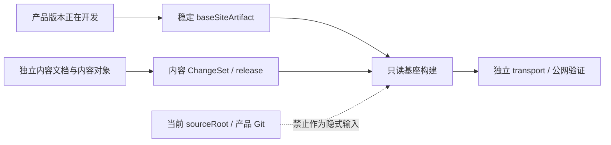
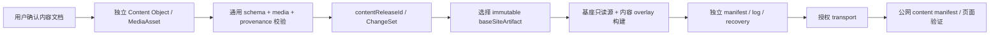

# v0.24.24 内容源与不可变产品基座解耦方案

> 状态：产品/视觉验收后形成的下一版本正式方案
> 方案类型：产品工程能力根修正，不是一次内容发布
> 产品责任：产品与视觉主线
> Engineering 责任：Engineering 主线 `019fc263-abf9-7732-84ef-73914e6e0a85`
> 父版本：`v0.24.23` / `0bbff29fc7fe10e3d617eb76115b7ae0c5aa4b09`

## 1. v0.24.23 验收结论

v0.24.23 的统一 `image|video`、无媒体模块展示、媒体校验和 recovery 能力通过专项验证；但没有满足本项目已经确认的“产品能力与日常内容完全独立”根合同，因此不通过产品/视觉验收，不发布 v0.24.23。

已验证的结构性缺口：

1. `baseSiteArtifact` 目前只保存身份和 hash；`content-release` 的 staging 仍复制当前 `sourceRoot`，所以产品主线存在未提交修改时，内容包可能带入当前产品代码，而不是稳定基座。
2. `content/products/*`、`content/media/*` 和按对象枚举的 `content/registry/content-targets.json` 仍是产品 Git 输入。新增日常媒体或正文仍可能需要产品版本，和“内容不记录产品 Git”冲突。
3. 注册表只登记现有 asset/module ID，不能让内容 task 在不改产品版本的情况下新增已批准 MediaAsset；模块 `mediaId` 还要求非空，不能表达清空绑定后的合法空媒体模块。



## 2. 根本目标

产品提供页面、槽位、媒体合同、校验器和发布能力；内容 task 只管理独立内容文档、正文、媒体、来源、确认、已发布/未发布/待更新和 recovery。产品版本推进不阻断内容发布，内容发布不产生产品版本。

问题分流保持唯一原则：

```text
内容事实/文案/媒体选择 → 内容文档与独立 release
页面能力/媒体合同/工具缺口 → 产品候选 → current → Engineering
来源覆盖/证据缺口 → Ops 候选
```

## 3. 真实 immutable baseSiteArtifact

`baseSiteArtifact` 不再是只有来源证明的 metadata，而是可复现内容构建的**实际只读输入**。descriptor 至少包含：

```text
baseSiteArtifactId
productVersion / productCommit       # 仅来源证明
releaseManifestHash / artifactContentHash
sourceDeploymentId
sourceBundle 或 sourceDirectory       # 完整、不可变、可构建的产品源快照
sourceBundleHash
```

规则：

- 产品 `release:build` 产生可校验的基座 descriptor 与完整源快照/归档；基座身份和内容 hash 必须互相绑定。
- 内容 `prepare/build` 必须显式选择并读取该 descriptor 及其源快照；删除“从当前 `dist/client` 推断基座”的隐式 fallback。
- staging 只能从选定基座复制，再叠加独立内容对象；禁止复制当前 canonical `sourceRoot` 的产品代码或产品内容。
- descriptor、源快照、构建输出任一 hash 漂移立即硬失败；不自动切换到当前 HEAD/tag，不自动修复或重试。
- `transport` 只消费已经构建的独立包，继续不执行产品 Git、版本、业务 QA 或生成器逻辑。

## 4. 独立内容源与文档账本

### 4.1 内容事实源

日常内容对象和媒体对象从产品 Git 输入中移出，进入独立内容工作区/内容根目录（由内容合同登记，默认位于被忽略 `.content-workspace/content/`）：

```text
content-root/
├── documents/       # 计划、已确定、已完成、未完成、待更新
├── objects/         # Observation / Article / Practice / B 端页面内容
├── media/           # MediaAsset 与媒体文件
├── reviews/         # 审核与用户确认
├── releases/        # contentReleaseId 与 recovery 关联
└── logs/            # 工具阶段事实，append-only
```

内容文档记录“做了什么、没做什么、哪个 contentRelease 已上线、哪个待发布或需 recovery”；不写产品 `VERSION`、commit、tag 或产品 history。部署、公网响应和工具失败仍只由独立 manifest/log 记录，不能用自然语言替代。

### 4.2 产品只保留能力合同

产品 Git 只保留页面能力、槽位、通用 schema/校验和**泛化能力注册表**。注册表登记稳定的字段模式和投影路由，不枚举某一次内容的 asset ID 或正文值。

新增媒体、正文、模块绑定只写独立内容根；只要不新增页面/路由/schema/组件/交互/共享视觉能力，就不进入产品 `current.md`。

## 5. 泛化 MediaAsset 与 ChangeSet

- `MediaAsset` 继续使用 `image|video`、实际 ratio、路径、hash、审核、公开状态和 provenance；视频不建立 MP4 特例。
- 内容 ChangeSet 解析独立内容根中的稳定 object ID，可新增已批准 asset、绑定已有模块或把 `mediaId` 清为空；不依赖产品 Git 中预先枚举的 ID。
- 字段级变更仍保存 `targetId / beforeHash / before / after / sourceRefs / boundary / authority / affectedRoutes`；禁止整文件覆盖、数组顺序猜测、伪造审核或跨页面写入。
- 空 `mediaId` 是合法结果：页面保留模块文字，不渲染媒体区域，不生成占位内容；恢复操作必须校验 canonical before/hash 漂移。

## 6. 独立构建闭环



产品主线可以同时有未提交修改；内容发布仍基于明确稳定基座执行。内容失败只保留内容 draft/review/recovery/package/log，不污染产品 `current.md`、VERSION、commit/tag、history 或产品发布状态。

## 7. 本版本范围

- 让 `baseSiteArtifact` 携带并验证实际可构建的 immutable source bundle；内容 staging 不再复制当前 sourceRoot。
- 将内容对象、媒体和发布账本切换到独立 content root；产品 Git 只保留能力合同和产品基座。
- 将 Robotaxi 目标注册表改为稳定字段模式/模板；新增内容 asset 不需新增产品版本。
- 支持新增 image/video、模块绑定和清空 `mediaId` 的独立 ChangeSet/recovery。
- 增加并行性、基座漂移、当前 sourceRoot 污染、新增媒体、空模块、失败恢复和产品 Git clean 专项测试。
- 只同步内容运营、Engineering 架构和迭代发布中与上述边界直接相关的条款，不复制其他规则。

## 8. 明确不做

- 不修改页面 IA、路由、页面组合、视觉系统或 Robotaxi 上游事实。
- 不增加人工 CMS、RBAC、第二套产品版本、第二个 scheduler 或并行 branch/worktree/task。
- 不把内容文档、内容 manifest/log 或内容文件重新写入产品版本历史。
- 不放宽 hash、审批、来源、固定发布目标或公网验证门禁。
- 不在本版本发布 MP4；能力验收通过后再由内容 task 使用独立合同发布。

## 9. 验收合同

### 正向

- canonical 产品 `sourceRoot` 存在未提交修改时，指定稳定基座仍能生成只包含基座源快照 + 内容 overlay 的发布包。
- 新增一个已批准 image 或 video、绑定模块、清空模块媒体，均无需修改产品 registry 值、产品版本或 Git。
- 内容文档可直接回答计划、已完成、未完成、线上 contentRelease 和 recovery；工具日志保存每个阶段事实。
- 发布包、公网 `content-manifest`、页面和基座身份一致；产品 Git 始终 clean，产品版本事实不变。

### 反向

- 缺少 source bundle、descriptor/hash 漂移、隐式当前 sourceRoot、未登记能力模式、非法 type/MIME/path、媒体 hash/审核/来源错误、绑定目标不存在或 recovery baseline 漂移必须硬失败。
- build/deploy/public verify 任一失败，不写完成声明，不回写产品文件，不自动选择其他基座。
- 产品 publish 仍只消费产品自己的 clean HEAD/tag/dist；内容 transport 不能调用产品 publish 或 Git。

## 10. 版本工作流与交接

```text
current v0.24.24
→ Engineering direct-local 实现与自 QA
→ local commit/tag/clean + history
→ 产品/视觉验收
→ 用户明确 publish 产品能力
→ 内容 task 恢复独立日常运营
```

本方案只解决能力边界，不替内容 task 编写或发布本轮具体内容。Engineering 完成后一次性回传：版本、commit/tag、clean、测试、基座 source bundle 证据、独立内容测试、阻断、产品/线上 URL 和下一动作。
