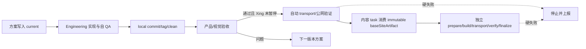

# v0.24.28 持续自动闭环与协作身份治理方案

## 目标

把已确认的协作治理落入项目基线：任务身份可定位、产品与内容责任不混用、已验收版本在 Xing 未暂停时自动完成发布闭环，并保持硬失败即停。

## 本版本范围

1. 以 `docs/rules/task-registry.md` 作为活动 task 的唯一身份登记；交接前核验 `sourceThreadId`、`targetThreadId`、`returnThreadId`，归档或替代时更新登记。
2. 将称呼统一为 Xing；复杂产品、工程、治理和方案输出以图形模型优先，简单事实保持直接文字。
3. 产品/视觉验收通过后，Engineering 在既有持续授权下直接执行产品 transport 和公网验证，不重复询问；Xing 明确暂停、停止、撤销或要求人工接管时立即停止。
4. 内容在既有批次授权且审核为 `Approved` 时，自动完成独立 prepare/build/transport/public verify/finalize；内容身份、审核、hash、网络或公网身份硬失败时停止并保留恢复证据。
5. 继续保持产品版本、独立内容发布、Ops 采集和 task 身份四个边界，不创建并行 task、branch、worktree 或 scheduler。

## 不改变

- 不回写 v0.24.27 或更早版本的 current/history/tag。
- 不改变 UI、IA、schema、上游事实、内容正文或已发布内容证据。
- 不把持续授权写成跳过 clean、tag、身份、公网验证或安全门禁；自动化只减少重复询问，不降低门槛。

## 验收

- 五层规则可从 `AGENTS.md → 00-baseline-index.md` 唯一路由到职责、协作、迭代、产品和工程正文。
- Engineering 可在产品验收通过后无额外确认完成 transport；显式 Xing pause/stop/revoke 可阻断后续动作。
- 内容 task 可在产品版本不变时独立完成内容闭环；失败可恢复且不污染产品版本。
- 注册表能定位四类活动 task；缺失、重复或未核验身份只报告阻断，不猜测或创建替代。
- `npm run check`、`release:prepare`、closeout、preflight、规则/内容专项和 `git diff --check` 通过。

