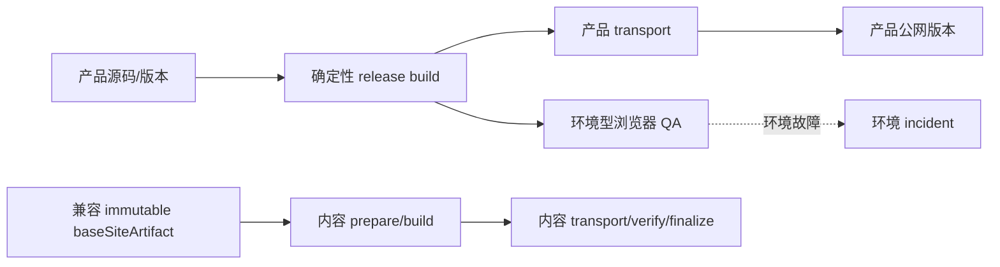

# v0.24.29 产品发布门禁与内容基座解耦方案

## 根因

产品 transport、环境型浏览器 QA 和独立内容发布被串成一条门禁链。macOS Mermaid/Puppeteer I/O 失败被误当成产品代码失败；内容又被错误要求等待最新产品版本，导致两条本应独立的闭环同时停止。

## 本版本目标

1. 产品发布门禁拆为确定性发布门禁与环境型浏览器 QA；不删除 QA，不把环境 I/O 伪装成产品 Bug，也不允许无证据绕过产品身份、clean、manifest 和公网验证。
2. 增加内容基座兼容性判断：内容只消费明确登记且能力兼容的 immutable `baseSiteArtifact`，不等待未上线的最新产品版本。
3. v0.24.28 仅有治理文档变化，内容可复用已在线 v0.24.26 基座；产品 v0.24.28 的环境 QA 单独收口。
4. 内容 task 在现有批次授权和 Approved 证据满足时，直接基于 v0.24.26 artifact 恢复独立发布；失败保留 package/recovery/log，不污染产品版本。

## 明确不做

- 不降低或删除 Mermaid/Puppeteer、桌面/手机和公网验证要求。
- 不移动 v0.24.28 或更早 tag/history，不修改上游事实、内容正文、status 或 publishedAt。
- 不把内容发布写入产品版本，不创建并行 task、branch、worktree 或 scheduler。

## 验收合同

- 确定性产品门禁通过时，环境型浏览器 I/O incident 不再伪装为代码失败；只有产品能力变化且缺少有效 QA 证据时才阻断产品 publish。
- 产品 publish 始终校验 HEAD/tag、clean、manifest、EdgeOne 目标和公网身份。
- 内容可以在产品新版本未上线时，使用已登记兼容基座独立完成 prepare/build/transport/publicVerify/finalize。
- 内容与产品各自回传版本/内容身份、URL、证据、阻断和下一动作。
- 正向与反向专项、check、release:prepare、closeout、preflight、diff-check 通过；既有环境 incident 单独记录。

