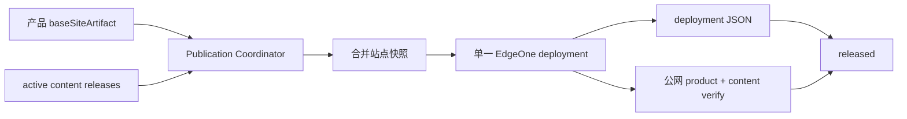

# v0.24.30 统一站点发布快照与内容保留方案

## 根因

产品和内容虽然使用不同身份，但都把独立产物直接部署到同一个 EdgeOne 站点根目录。后部署者会覆盖前者；同时产品 publish 未把 deployment JSON 与公网验证证据作为不可缺少的完成事实。



## 本版本目标

1. 所有站点 transport 先生成统一 `sitePublication` 快照，包含产品基座和当前仍有效的独立内容发布集合；禁止产品包用空 manifest 覆盖已发布内容。
2. 内容发布仍保持独立 `contentReleaseId/contentHash`，但部署时必须合并当前 active 内容，不直接覆盖站点根。
3. 产品与内容均必须保存 EdgeOne `deploymentId`、机器可读 deployment JSON 和公网双重验证；缺一不可报告 released。
4. 同一 publication 的 lease/idempotency/resume 不重复部署；失败保留 package/recovery/log，不覆盖已确认事实。
5. 兼容现有 v0.24.26 immutable base 与已发布内容；不回写旧版本或伪造此前被覆盖的线上内容。

## 验收合同

```text
内容 A → 产品发布 B：A 仍在公网
产品 B → 内容 C：B 与 C 同时在公网
内容 C 重试：复用同一 publication/deployment，不重复部署
缺 deployment JSON：硬失败
缺公网 product/content verify：硬失败
发布失败：保留 recovery/package/log，不写 released
```

## 明确不做

- 不删除 Mermaid/Puppeteer 或其他产品/内容 QA。
- 不修改上游事实、内容正文、status、publishedAt、v0.24.29 及更早 tag/history。
- 不创建并行 task、branch、worktree 或 scheduler。

