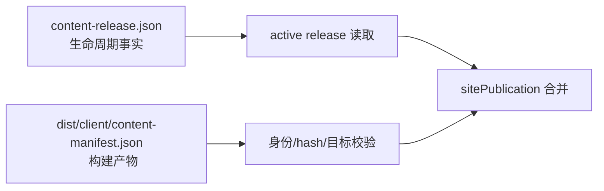

# v0.24.31 内容生命周期事实源读取修正方案

## 根因

v0.24.30 的站点快照读取器从 `dist/client/content-manifest.json` 判断内容生命周期；该文件是构建产物，不是状态事实，导致真实 `content-release.json.state=released` 的 8 个内容包被误判为空。

## 本版本范围

- `content-release.json` 是 `prepared/built/transported/verifying/finalized/released` 的唯一生命周期事实源。
- `dist/client/content-manifest.json` 只作为发布产物身份、hash、target 和 base artifact 证据校验，不决定生命周期状态。
- 兼容并保留已有 8 个真实 `released` content package；不重建、不伪造、不回写旧版本。
- 新增正反向测试，覆盖 `content-release.json=released` 且 dist manifest 状态为构建态时仍正确纳入 active snapshot。

## 明确不做

- 不修改 v0.24.30 或更早 tag/history。
- 不修改内容正文、来源、status、publishedAt 或 deployment 事实。
- 不在 active snapshot 缺失时发布空 manifest。

## 验收

- active release 实测为 8；sitePublication 包含 8 个 contentReleaseId。
- 产品 transport 后 8 条内容仍可公网验证。
- deployment JSON、产品公网证据和内容公网证据缺一硬失败。
- `check`、专项、prepare、closeout、preflight、diff-check 通过。

