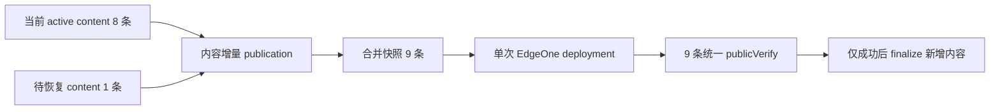

# v0.24.32 内容增量合并发布恢复方案

## 根因

v0.24.31 已能在产品发布时保留 8 个 active content releases，但内容 task 仍把单条 recoverable package 直接部署到站点根。它无法同时携带已有 8 条内容，因此第 9 条无法恢复而不覆盖前 8 条。

## 本版本范围

- 内容 transport 在新增/恢复单条内容时，读取当前 released package 集合并合并待发布 package。
- 生成新的 `sitePublicationId`，不重复部署已确认内容，不覆盖 active 内容。
- 同一 recoverable package 重试复用同一 publication identity/lease；deployment/publicVerify 缺失仍硬失败。
- 成功后只将新增目标 finalize 为 released；已有内容事实不回写、不重建。

## 验收

- 8 条 active + nhtsa-first-responder-requirement 形成 9 条统一快照并公网可见。
- 新增内容失败时 8 条已有内容仍保持公网可见。
- 同一恢复重试不产生重复 deployment。
- 通过后再继续剩余 22 条，每条都基于当时 active 快照增量合并。

## 明确不做

- 不单独部署孤立内容包到站点根。
- 不修改内容正文、来源、status、publishedAt 或既有 released package。
- 不修改 v0.24.31 及更早 tag/history。

