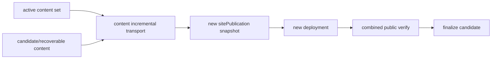

# v0.24.33 内容增量 transport 接口方案

## 根因

v0.24.32 的合并器只接入了产品 publish；内容 `resumeContentRelease()` 仍直接复用旧 deployment，无法把 active 内容集合与新增内容组成新的线上 publication。

## 本版本范围

- 为内容新增/恢复实现正式 incremental transport 接口：读取 active released packages，合并 candidate，生成新的 sitePublicationId 和 deployment。
- 不复用无法代表新合并快照的旧 deployment；同一合并 publication 重试复用自身 lease/idempotency。
- 只有 combined publicVerify 成功后才 finalize candidate；active 内容失败时不得被覆盖。
- 继续使用 v0.24.32 产品基座与 8 条 active 内容，不修改正文或历史事实。

## 验收

- nhtsa-first-responder-requirement 形成 8+1 合并快照并公网验证。
- 新 deployment JSON、sitePublicationId、8 条旧内容和第 9 条全部可证明。
- 失败不 finalize、不丢 active、不重复 deployment。
- 通过后继续剩余 22 条。

