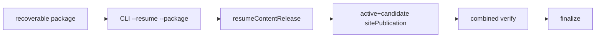

# v0.24.34 内容恢复 CLI 暴露方案

## 根因

v0.24.33 已实现 `resumeContentRelease()` 函数，但 `scripts/content-release.mjs` 的 CLI 只支持 prepare/build/publish，没有 `--resume --package` 入口。内容 task 无法调用已实现的增量合并 transport。

## 本版本范围

- 增加 `--resume --package <packageDirectory>` CLI 入口，调用既有 `resumeContentRelease()`。
- CLI 输出 contentReleaseId、sitePublicationId、deploymentId 和 publicVerify；缺失证据硬失败。
- 增加命令级测试，确认 recoverable package 可生成 8+1 合并快照且不复用旧 deployment。
- EdgeOne transport 使用异步 deployment 状态：提交后持久化 deploymentId，允许超时后 resume 同一 deployment；禁止用固定 30 秒判断失败。
- 上传前执行文件数量、最大单文件和总大小配额预检；超限在上传前硬失败。
- 不改变内容事实、产品版本或已发布 package。

## 验收

- 内容 task 可直接调用标准 CLI 恢复第 9 条。
- 8 条 active 与第 9 条合并部署并公网验证。
- 失败不 finalize、不覆盖 active、不重复 deployment。
- deployment 超过单次执行窗口时可继续查询同一 deployment，最终取得 machine-readable deployment JSON。
- 配额超限给出明确资源阻断，不伪装成网络或业务失败。
