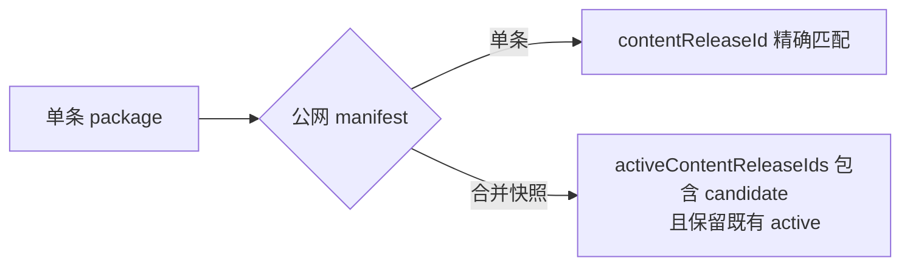

# v0.24.35 合并快照公网验证修正方案

## 根因

v0.24.34 已部署 8+1 合并快照，但 `verifyContentPackageOnce()` 仍要求公网 manifest 的单值 `contentReleaseId` 等于 candidate；合并 manifest 正确使用 `activeContentReleaseIds`，因此 verifier 错误阻断。

## 本版本范围

- 公网验证识别单条 manifest 与 sitePublication 合并 manifest 两种合同。
- 合并 manifest 必须包含 candidate `contentReleaseId`，并保留 expected active release IDs、base artifact、product version/commit。
- 只有 combined verify 成功后 finalize candidate；不降低单条身份、hash、target 和公网页面验证。
- 增加正反向测试：candidate 缺失、active 被覆盖、base/产品身份不一致均硬失败。

## 验收

- 现有 deployment `dp2q08shxqjj` 的 8+1 快照可通过验证并 finalize 第 9 条。
- 继续剩余 22 条时，每次增量快照都能正确验证。
- 失败不 finalize、不丢 active、不重复部署。

