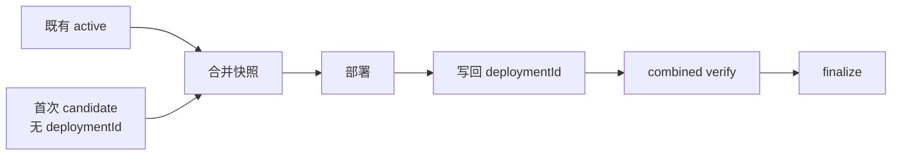

# v0.24.36 首次候选合并快照修正方案

## 根因

`createSitePublication()` 只有在 `additionalContentManifest.deploymentId` 已存在时才加入候选。首次发布候选没有 deploymentId，导致部署快照只含既有 active 内容；部署成功后 verifier 再要求候选存在，形成必然失败。

## 本版本范围

- 合并快照在部署前纳入候选，只以 contentReleaseId、contentHash、target、baseSiteArtifactId 身份校验，不要求 deploymentId。
- 已 released active 继续要求 deploymentId/publicVerify；候选部署后写回 deploymentId，再进入 verifying/finalize。
- sitePublication 的 activeContentReleaseIds、publishedSlugs、baseSiteArtifactId 与产品 version/commit 保持一致。
- 首次 candidate、resume、幂等重试均使用同一 publication identity；失败不 finalize、不丢 active、不重复错误部署。

## 验收

- 第 9 条 `nhtsa-first-responder-requirement` 的新 8+1 快照实际包含 candidate，combined verify 成功后 finalize。
- 已有 8 条仍全部保留；失败时仍保持 8 条 active。
- 剩余 22 条可按同一合同串行发布。
- 现有单条 verifier 与 v0.24.35 合并 verifier 继续通过。

