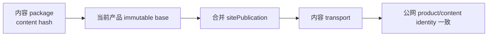

# v0.24.37 内容 transport 当前产品基座绑定方案

## 根因

内容 package 仍绑定 `v0.24.26-70847cdf6df0`，`transportContentRelease()` 又把该 package 的 `dist/client` 当作整站产品输入。于是内容部署生成的合并快照仍是 v0.24.26/70847cd，而线上产品已是 v0.24.36/73c28fc；公网校验失败是身份保护的正确结果。

## 本版本范围

- 内容 package 保留自身 contentReleaseId/hash/review 事实，但 transport 合并输入必须来自当前已上线且可验证的产品 immutable base。
- 运行前硬校验 package base 与当前 product release/artifact 一致；不一致时在部署前停止并要求 `content:prepare → content:build` 重新生成，不创建旧基座部署。
- `createSitePublication` 接收明确的 current product client/base artifact，不从旧 content package 的 dist 推导产品身份。
- 保留 active content、candidate、幂等 lease、deployment JSON、combined publicVerify、失败不 finalize。

## 验收

- 旧 v0.24.26 package 在 v0.24.36 线上基座上被部署前硬阻断，不产生错误 deployment。
- 重新基于当前 v0.24.36 baseSiteArtifact 准备第 9 条后，合并快照 product/content identity 一致，8+1 verify 成功并 finalize。
- 其余 22 条按同一合同串行发布；单条/合并 verifier、失败恢复和 active 保留测试通过。

