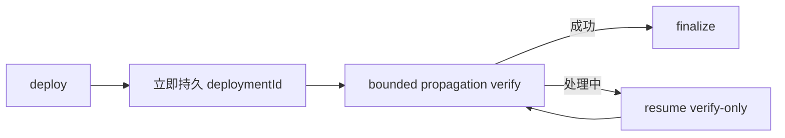

# v0.24.38 内容 deployment 恢复与传播验证方案

## 根因

内容部署最终已传播并出现第 9 条，但 CLI 没有把 deploymentId 持久写入 site-publication descriptor；resume 因而再次创建 deployment。公网传播需要超过当前约 5 秒的 verifier 窗口，过早失败又阻止 finalize。

## 本版本范围

- deployment JSON 与 `site-publication.json` 原子持久化；resume 优先读取同一 deploymentId。
- 增加 verify-only/resume 路径：已有 deployment 只查询和公网验证，不重新上传或创建部署。
- 公网传播验证采用有界退避窗口并记录 attempt/elapsed；超限进入 recoverable，不伪造失败完成或重复部署。
- 只有 combined publicVerify 成功后 finalize；active 内容和 package/recovery/log 保留。

## 验收

- 复用现有第 9 条 deployment，不创建新 deployment；公网 9 条验证后 finalize。
- 传播超过 5 秒时保持 verifying/recoverable，可继续恢复；窗口内成功不误报失败。
- 失败恢复不重复部署、不丢 active；后续 22 条可串行复用同一合同。

