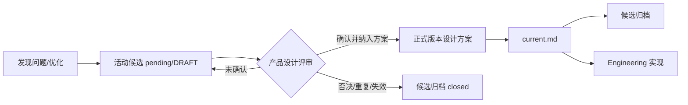

# v0.24.4 候选转产品设计方案与归档治理方案

状态：正式产品治理方案，待 Engineering 实现文档同步、版本记录、本地提交与自 QA。

## 1. 目标

把候选明确限定为“产品设计前输入”。候选一旦被产品设计方案继承，就从活动入口移入历史归档；Engineering 只读取 `current.md` 和正式设计方案，不读取活动候选决定实现范围。

## 2. 生命周期

`confirmed` 只表示产品设计评审瞬时结果，不得作为活动候选的长期状态。

## 3. 本版本范围

- 更新 `AGENTS.md`、迭代与发布规则、产品总案和文档索引。
- 新增 `docs/iterations/history/candidates/` 作为候选历史归档目录。
- 将已被 `v0.24.0`、`v0.24.1` 吸收的候选和已关闭重复候选移入历史归档，保留来源与证据。
- 保留尚未完成产品设计确认的 DRAFT/pending 候选在活动目录。
- 不修改 UI、IA、内容 schema、上游事实、发布脚本或线上状态。

## 4. 责任与门禁

- 产品与视觉：评审候选、形成正式设计方案、写入 `current.md`、归档来源候选。
- Engineering：只实现 `current.md` 已授权范围；不从活动候选自行推导版本。
- 候选归档不是新运营问题清单，也不产生第二套版本身份。
- 本版本完成后，必须报告本地版本、线上版本、本地 URL、线上 URL、候选活动状态、归档证据和下一动作。

## 5. 验收

- 活动 `docs/iterations/candidates/` 不存在已转化或已关闭候选。
- `docs/iterations/history/candidates/` 中每个归档文件包含来源、目标版本/方案路径、归档原因和证据。
- `AGENTS.md`、产品总案、规则、文档索引和 `current.md` 对候选生命周期表述一致。
- Engineering 本地版本具备版本号、名称、说明、commit、annotated tag、history 与 clean 工作区。
