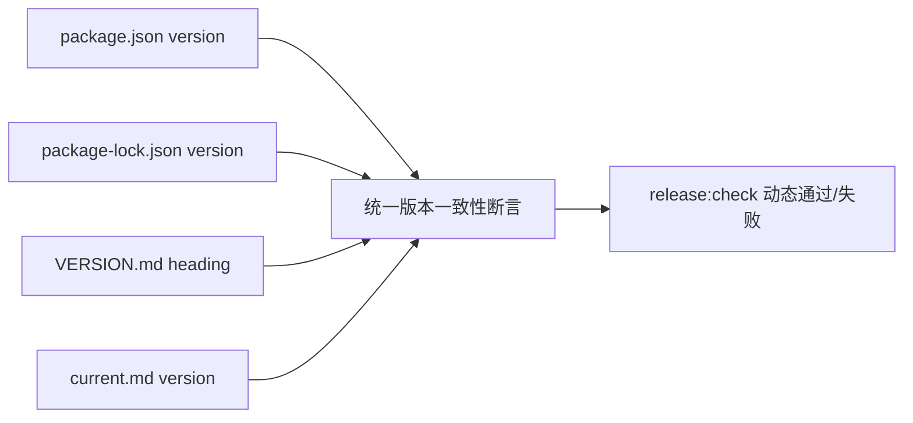

# v0.24.5 统一发布版本动态一致性测试修复方案

状态：正式 current-fix 方案，待 Engineering 实现与本地提交。

## 目标

移除 `tests/practice-release.test.mjs` 中对历史版本 `0.24.2` 的硬编码，使统一发布门禁始终校验当前版本身份，而不是某个旧版本。

## 设计合同

只移除历史硬编码；测试夹具中用于验证发布函数行为的固定版本（如 `v0.21.0`）保持不变。

## 范围

- 修改 `tests/practice-release.test.mjs` 的统一版本同步测试，使其动态读取并校验 `package.json`、`package-lock.json`、`VERSION.md` 与 `current.md`。
- 同步 `package.json`、`package-lock.json`、`VERSION.md`、`current.md`、`docs/iterations/history/v0.24.5.md` 为 `v0.24.5`。
- 不修改 UI、IA、schema、内容、上游事实、发布脚本逻辑或线上状态。

## 验收

- 历史 `0.24.2` 不再作为当前版本断言。
- `npm run check`、相关 Practice/release 测试、`npm run release:closeout-check`、`npm run release:preflight` 通过。
- 本地版本完成 commit/tag 后，产品/视觉复验；线上仍保持原版本，直到用户明确 publish。
