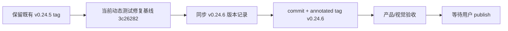

# v0.24.6 版本身份冲突收口方案

状态：正式 current-fix 方案，待 Engineering 完成本地版本收口。

## 决策

既有 annotated tag `v0.24.5` 指向 `4fb92b64257676479ae392f0f32bb42f36e872ae`，属于已存在的版本身份，不移动、不删除、不覆盖。动态版本测试修复提交 `3c26282aeec300c31739a1af4462c5844d5cdc21` 不再冒用 v0.24.5，转入下一 patch `v0.24.6`。

## 闭环

## 范围

- 将 `package.json`、`package-lock.json`、`VERSION.md`、`current.md`、`history/v0.24.6.md` 统一为 `v0.24.6`。
- 保留动态版本测试修复，不重写或删除既有 `v0.24.5` tag。
- 不修改 UI、IA、schema、内容、上游事实或线上状态。

## 验收

- `HEAD` 精确指向 annotated `v0.24.6`；既有 `v0.24.5` 仍指向原提交。
- `npm run check`、相关 Practice/release 测试、`release:closeout-check`、`release:preflight` 通过。
- 本地与线上版本、URL、候选状态和下一动作分别报告。
