# v0.24.8 统一发布消费现有版本与构建纯度治理方案

状态：正式产品/工程治理方案，已授权 Engineering 主线实现与自 QA。

## 1. 根因

旧 `unified-publish.mjs` 将“版本创建”和“线上发布”混成一个动作：自动递增版本、回写版本文件、commit/tag，再在后续检查中发现失败。这会产生 orphan tag、伪完成历史和未授权线上动作。

## 2. 唯一流程

```mermaid
flowchart LR
    A[产品设计方案/current] --> B[Engineering 本地实现]
    B --> C[local commit + annotated tag]
    C --> D[产品/视觉验收]
    D --> E[publish 消费现有 HEAD/tag]
    E --> F[check/build/Sites]
    F --> G[build 后 dirty 检查]
    G --> H[preflight]
    H --> I[明确 publish 授权]
    I --> J[push 同一 HEAD/tag]
    J --> K[deploy 同一构建]
    K --> L[公网 verify]
```

Publish 不是版本创建器，只是已验收本地版本的发布执行器。

## 3. Publish 合同

- 不 `incrementPatch`。
- 不写 `package.json`、`package-lock.json`、`VERSION.md`、`current.md` 或 history。
- 不 `git commit`、不 `git tag`。
- 只接受 `current.md`、package、VERSION、history、HEAD、annotated tag 一致且已完成产品/视觉验收的版本。
- check/build/Sites/preflight/push/deploy/verify 必须围绕同一 HEAD、同一 tag、同一构建产物。
- build 后若 tracked source/generated 文件变化，立即失败并报告精确路径。
- 任一阶段失败，不写“已完成推送/部署/公网验收”声明，不继续后续阶段。
- 每次运行记录 source cwd、内部构建 worktree、HEAD、tag、dirtyPaths，并在结束时清理内部沙箱。
- content/article/practice 只允许目标 slug/id 的精确 finalize；不创建第二套版本身份。

## 4. v0.24.7 异常处理

既有本地 `v0.24.7` tag/commit 保留为未发布异常事实：不移动、不删除、不 push、不部署；不得把其 current/history 的伪完成声明当作线上证据。v0.24.8 只记录纠正事实，不改写 v0.24.7 历史对象。

## 5. 验收

- publish 集成合同覆盖版本、授权、顺序、dirtyPaths、失败短路、同 HEAD 公网校验。
- build 只消费已提交生成物，或在临时构建目录生成；不得污染 tracked source。
- `check`、专项测试、`release:check`、`release:closeout-check`、`release:preflight` 通过。
- 本地版本、线上版本、URL、候选状态和授权边界分别报告。
