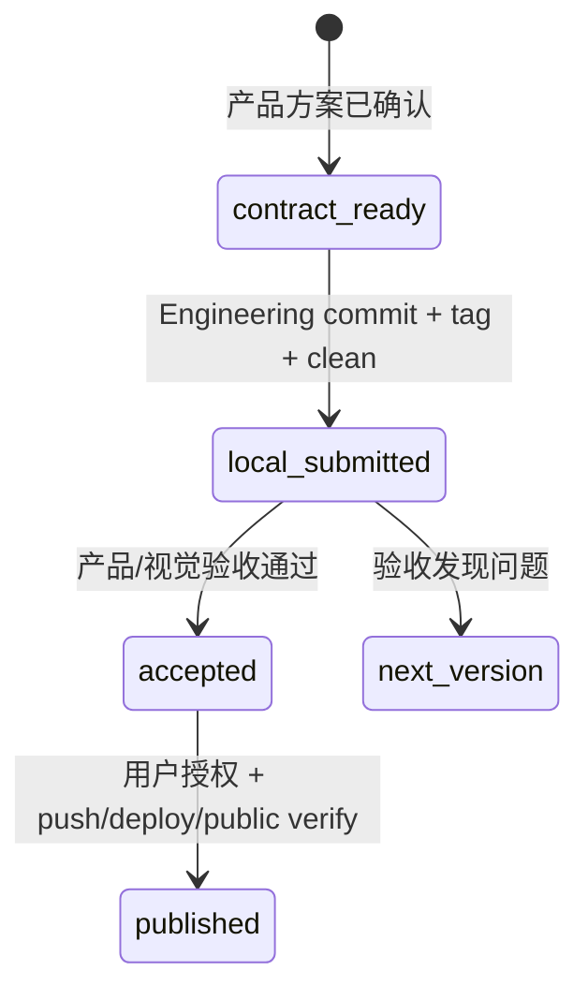

# v0.24.9 版本状态机与收口事实治理方案

状态：正式 current-fix 方案，源于 v0.24.8 产品/视觉验收阻断。

## 根因

v0.24.8 已完成 local commit/tag，但 `current.md` 仍保留“待本地 commit/tag”文本。自然语言状态没有和版本事实同步，说明版本状态缺少可校验的状态机。

## 状态机



current 必须同时记录机器可检验字段：

```text
localSubmission: pending | complete
productVisualAcceptance: pending | passed | rejected
publishAuthorization: pending | confirmed
onlineRelease: pending | complete | partial
```

自然语言状态必须与这些字段和 Git/线上证据一致；不一致时 closeout/preflight/产品验收失败。

## 范围

- 修正 v0.24.8 current/history 的本地提交状态事实。
- 为 current 增加状态机字段与规则；Engineering 收口时必须同步状态。
- 增加状态一致性测试，阻止“已有 commit/tag 仍写待提交”或“未发布却写已部署”。
- 不修改 UI、IA、schema、内容、上游事实或线上状态。
