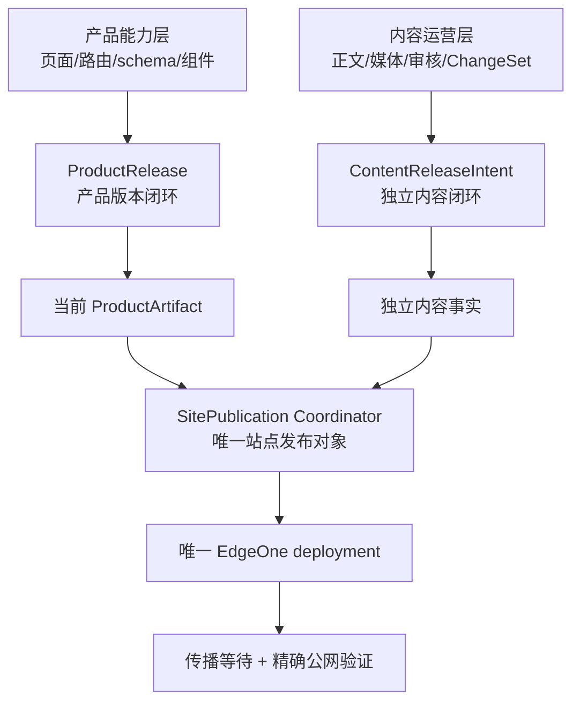
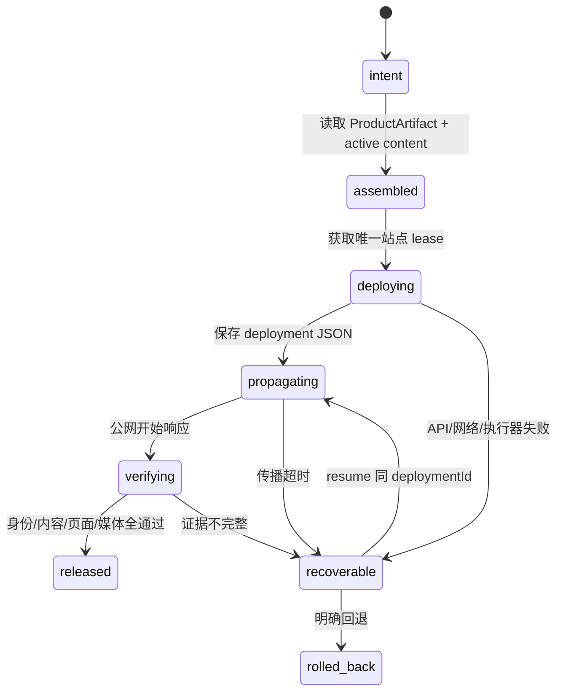
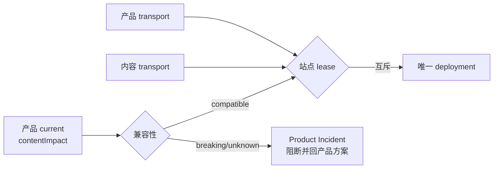

# v0.25.0 产品、内容与站点发布三层架构

## 目标



产品与内容有独立 owner、身份、生命周期和事实源；协调器只处理物理站点的快照、互斥、部署、传播、验证、恢复和 finalize，不包含产品业务或内容业务逻辑。

## 三个对象

| 对象 | 身份与事实 | owner |
| --- | --- | --- |
| `ProductRelease` | `productVersion / commit / annotatedTag / productArtifactId / clean` | Engineering |
| `ContentReleaseIntent` | `contentReleaseId / target / contentHash / sources / approval / requiredCapabilities / ChangeSet` | 内容与发布 |
| `SitePublication` | `sitePublicationId / productArtifactId / activeContentReleaseIds / candidateContentReleaseId / snapshotHash / state / deploymentId / deploymentJson / publicVerify / failure` | Site Publication Coordinator |

## 状态与动作



外部只看到两种结果：

```text
成功：网站内容已精确验证（SitePublication finalized）
失败：工具未完成发布 + Incident + recoveryId
```

`Deploy Success` 是中间事件，不等于网站发布成功；没有 machine-readable deployment JSON、精确 `release.json`、精确 `content-manifest`、目标页面/媒体和 finalize，工具不得返回成功。

## 互斥与兼容性



- 产品新增功能不产生内容版本；内容发布不产生产品版本。
- 产品发布使用当前产品能力和 active 内容的合并快照。
- 内容发布使用当前稳定产品能力和独立内容意图，不要求内容重新 prepare/build。
- 产品方案必须声明 `contentImpact`、`affectedTargets`、`affectedRoutes`、`affectedFields`、`compatibilityEvidence`。
- 兼容性未知或不兼容时，发布前阻断；内容 task 只上报问题，Engineering 修复产品能力并走下一产品版本。

## 迁移与兼容入口

- 线上 v0.24.37 冻结；v0.24.38 不单独发布，v0.25.0 以当前本地工作状态形成新治理版本。
- 既有已发布内容事实不改稿、不重建来源；协调器按精确 `content-release.json` 生命周期和 source overlay 重建站点快照。
- `publish-xingbuild.command` 和 `content-release` 保留为兼容入口，但不能直接调用 EdgeOne；所有 transport 进入协调器。
- `.content-workspace/site-publications/` 为 ignored 持久台账；恢复时复用同一 `sitePublicationId`、lease 和 `deploymentId`，不重复部署。

## 验收

- 产品发布保留所有 active 内容，内容发布不覆盖产品能力。
- 两种 transport 不能并行；站点 lease 可证明互斥。
- 传播延迟和长任务不以固定 30 秒误判；超时保留可恢复事实。
- 失败不 finalize、不改变既有 active；resume 后只补齐未完成证据。
- 只有协调器包含 EdgeOne deploy 动作；兼容入口仅提交意图。
