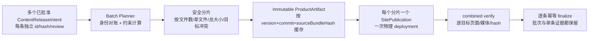
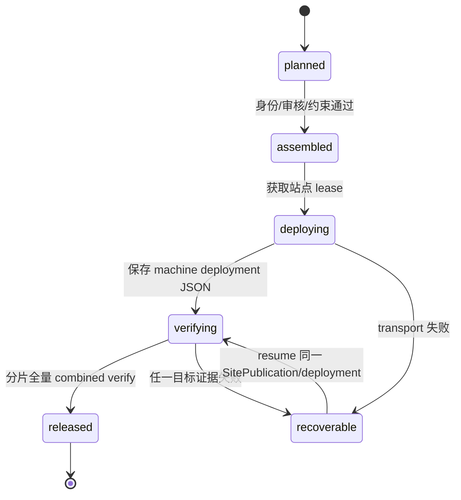

# v0.25.1 内容批次发布与 active 身份一致性能力

## 目标

本版本只建设通用发布工具能力，不改变内容正文、审核事实、页面结构或产品 UI。

解决两个结构性问题：

1. 内容身份逐条管理，但物理站点发布被错误地固定为逐条 deployment，造成重复构建、上传、传播等待、公网验证和 task 使用量。
2. 单条恢复后 `content-release.json` 与包内 `content-manifest.json` 可能出现不同 immutable `baseSiteArtifactId`；后续 active 读取器因此排除已发布内容，造成 active 内容丢失。

## 产品能力模型



### 对象边界

| 对象 | 含义 | 是否产生产品版本 |
| --- | --- | --- |
| `ContentReleaseIntent` | 单条内容的正文、媒体、来源、审核、hash 和 ChangeSet | 否 |
| `ContentBatchPlan` | 一次运营请求的内容集合、约束计算结果和安全分片 | 否 |
| `SitePublication` | 一个物理站点快照及一次 deployment 的事实 | 否 |
| `ProductRelease` | 产品能力、工程 commit/tag 和 immutable artifact | 是 |

批次不合并内容身份；它只是发布编排对象。超过平台或项目约束时，批次自动分片，每个分片拥有独立 `SitePublication`，但仍属于同一批次计划。

## 关键规则

### 1. 先对账，再组装

active 内容的唯一可发布条件必须同时满足：

```text
content-release.json.state = released
+ contentReleaseId / contentHash / target 一致
+ release record 与 package manifest 的 baseSiteArtifactId 一致
+ deploymentId + publicVerify 存在
+ completion/finalize 事实存在
```

发布成功时，release record、包内 manifest、completion 和日志必须以同一 immutable 身份原子收口。不能只更新 release record 而留下旧 manifest。

### 2. 自动计算最大安全批次

Batch Planner 必须从当前发布目标合同读取并计算：

- 文件总数；
- 单文件大小；
- 总上传大小；
- target/slug 冲突；
- 媒体路径冲突；
- 页面和内容类型兼容性。

批次大小不得硬编码为固定条数。约束满足时使用最大安全批次，超限时确定性分片；单条内容保留为低频、紧急和恢复 fallback。

### 3. 分片发布与证据



- 一个分片的 combined verify 必须覆盖该分片每条内容的目标页面、manifest 身份、hash 和媒体。
- 分片未完整验证前，不 finalize 该分片中的任何内容。
- 失败保留每条 recovery；恢复优先复用同一 `SitePublication`/`deploymentId`，不能重复创建物理 deployment。
- 重复执行必须命中 batch/shard 幂等键；成功条目不因后续批次被覆盖或从 active 集合消失。
- finalize 后清除 candidate 标记，并将该条明确进入 active 集合；不能出现 `state=released` 但仍只是 candidate 的矛盾事实。

### 4. 产品与内容解耦

- 内容批次不读取产品 HEAD/tag 作为内容身份，不递增产品版本。
- ProductArtifact 缓存键为 `productVersion + commit + sourceBundleHash`；产品代码不变时，内容批次不重复完整产品构建。
- 产品 transport 与内容 transport 仍受同一站点 lease 串行约束，但内容批次不要求重新设计产品方案。
- 内容 task 只提供已批准的 intents；Engineering 只实现工具能力；Coordinator 仍是唯一 EdgeOne owner。

## 范围

- 新增批次计划、约束计算、确定性分片和批次/分片幂等恢复。
- 修复 active 生命周期与 package manifest 的 immutable 身份原子一致性。
- 保留现有单条内容发布入口和恢复入口。
- 增加 30 条内容量级、超限分片、失败恢复、active 保留和 stale artifact 回归测试。

## 不做

- 不修改任何内容正文、来源、审核、媒体事实或 publishedAt。
- 不修改 UI、IA、路由、schema、组件、CSS 或上游事实。
- 不创建内容版本、产品之外的第二套发布事实；不创建 branch、worktree、task 或 automation。
- 不强制所有日常内容必须批次发布；批次和单条由工具按场景选择。

## 验收标准

1. 30 条已批准内容在约束允许时只产生一次或少量分片 deployment，不再 30 次完整物理发布。
2. 若超出文件/大小/路径约束，工具自动生成确定性分片，所有条目恰好覆盖一次。
3. 每条内容仍可查询独立 `contentReleaseId`、hash、review、deployment、publicVerify 和 finalize。
4. 重新发布任何后续内容不会丢失已 released 的 active 内容；覆盖 stale `baseSiteArtifactId` 回归场景。
5. 分片失败不写完成事实；resume 不创建重复 deployment；既有 active 内容不改变。
6. 产品 version/commit/tag 不因内容批次改变；单条紧急发布继续可用。
7. `npm run check`、`release:prepare`、专项测试、closeout、preflight 和真实公网批次验证通过。

## 责任与工作流

```text
产品/视觉：本方案与验收合同
→ Engineering：CLI/Coordinator/缓存/对账/测试实现
→ local commit + annotated tag + clean
→ history
→ 产品/视觉验收
→ 既有持续授权下 product transport-only publish
→ 内容 task 使用批次工具进行独立运营
```

本版本属于产品工程能力建设，不属于 30 条内容本身的运营版本。
