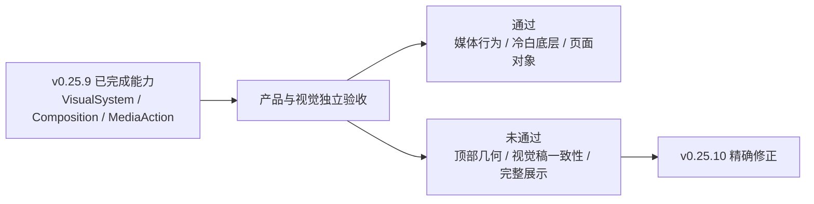
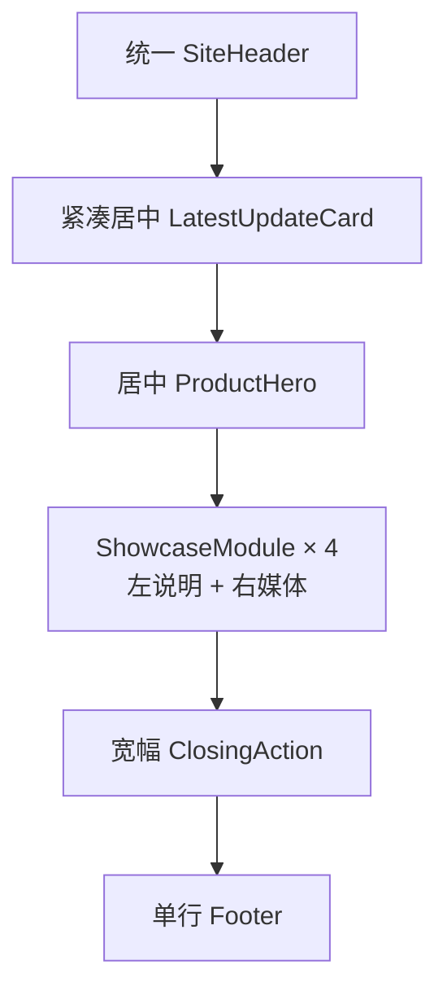

# v0.25.10｜Web 视觉定稿几何与完整展示验收修正方案

状态：正式产品与视觉方案 / confirmed
责任：产品与视觉 task 维护方案与验收；Engineering 只实现 `current.md` 的本版本范围
父版本：`v0.25.9 / 36c98daedde4d73904aac0de9302f0d7af7885a7`
性质：v0.25.9 提交后视觉验收未通过形成的下一版本；不回写或移动 v0.25.9 tag/history

> 本方案不重造 v0.25.9 已完成的 VisualSystem、PageComposition、内容对象或发布架构，只把已确认视觉稿中没有被精确落地的 Web 几何、身份和完整展示验收收口为可测合同。

## 1. 验收结论

v0.25.9 的结构能力、媒体交互、冷白视觉底层、响应式和可访问性实现成立，但 Web 视觉不予通过，因此不得 publish。



### 已通过并冻结的部分

- 唯一冷白、sans、蓝色动作系统；不恢复旧暖白、棕红或 serif-led 风格；
- `PageComposition / ShowcaseFlow / MediaStage / ClosingAction / ResumeActions` 的共享能力边界；
- 视频进入视口后 `autoplay + muted + loop + playsinline`，无 controls；离屏暂停；
- 媒体点击和键盘 Enter 只进入 `https://robotaxi.xingbuild.top/`，不切换播放状态；
- Home、经营观察、短文集合、详情和 About 的对象/路由/内容责任；
- About 的受控 career HTML/PDF 制品及 hash；
- 产品版本、独立内容和 SitePublication 的身份边界。

### 未通过证据

| 项目 | v0.25.9 真实结果 | 已确认目标 | 判定 |
| --- | --- | --- | --- |
| LatestUpdateCard | 1280 视口 `x=32 / width=1201`，公开展示核验 commit 与降级说明 | 标题上方紧凑、居中的可点击更新卡，只表达“最新更新 / 真实版本 / 点击查看最新版” | 未通过 |
| ProductHero | `max-width=724px`、`text-align=start`、整个首屏左对齐 | 标题、说明、边界和双动作组成居中的产品首屏 | 未通过 |
| Header 身份 | 同时显示 `xingbuild` 与 `金星 Xingjin` | 本轮已确认视觉稿只显示网站名和一级菜单 | 未通过 |
| 完整模块效果 | 真实预览 1 个视频 + 3 个 empty fallback | 能力保留 empty，但视觉验收 fixture 必须让四个独立槽位都显示当前同一个批准视频，证明完整产品效果 | 未通过 |

证据入口：`.content-workspace/qa/v0.25.9/` 与 `http://127.0.0.1:4317/products`。自动化测试通过不覆盖上述视觉差异。

## 2. v0.25.10 的唯一目标



把 v0.25.9 已有共享能力按已确认 Web 视觉稿精确排布；不再以“结构存在”替代“视觉一致”。

## 3. Web 视觉几何合同

基线视口：`1600 × 1067`；补充稳健性视口：`1280px`。所有尺寸由共享 token/组件承担，不写入内容字段。

| 区域 | 1600 Web 合同 |
| --- | --- |
| SiteShell | `max-width: 1280px`；居中；两侧最少 32px |
| SiteHeader | 高度 72px；左侧仅 `xingbuild`；右侧 B端产品 / 经营观察 / 关于我；无作者副标、无装饰分割线 |
| LatestUpdateCard | 位于 Hero 上方并水平居中；内容宽度 `fit-content`，最大 440px，最小高度 44px；桌面单行；不铺满 shell |
| 更新卡内容 | `最新更新` → Robotaxi 真实版本 → `点击查看最新版`；整卡或明确动作均进入 Robotaxi；commit/核验状态仅留内部证据，不进入公开卡片 |
| 更新卡到 Hero | 36–40px |
| ProductHero | 水平居中，`max-width: 920px`，`text-align:center`；eyebrow、H1、intro、boundary、ActionGroup 共享中心轴 |
| H1 | `clamp(44px, 3.4vw, 56px)`；行高 1.08–1.12；不得退回当前 34px 左对齐样式 |
| Intro | 最大 840px；18–20px；行高 1.55–1.65 |
| Boundary | 最大 760px；14–16px；弱化但保持可读 |
| 双动作 | 同一行、居中；主动作蓝色，次动作轻描边/浅表面；无纯黑按钮 |
| Hero 到首模块 | 72–88px；不得用超大空白把首模块推离首屏语义 |
| ShowcaseModule | 说明列 240–280px + 48px + 媒体；模块间 96–120px；保留 v0.25.9 共享结构 |
| MediaStage | 8:5；16px 圆角；冷白画布上的轻浮起层级；不得使用可见装饰线 |
| 浮起阴影 | 两层低对比阴影：近层约 `0 2px 8px rgba(15,23,42,.08)`，远层约 `0 20px 56px rgba(15,23,42,.10)`；禁止厚黑阴影 |
| ClosingAction | 与 ShowcaseFlow 主内容边界对齐的宽幅浅表面区；标题、说明、动作属于一个整体，不退化为孤立按钮 |
| Footer | 单行；只保留必要网站/版本/版权事实，不增加第二组菜单 |

### 3.1 首页及其他页面

- 首页仍按已确认内容顺序：个人定位 → 双动作 → 最新 Robotaxi 完整投影 → 最新短文 → Footer；顶部定位区使用与 ProductHero 同源的居中轴和字体节奏，不增加 About 收束。
- `/business-observations` 保持紧凑标题、左长文、右短文；不套用大型 ProductHero，但字体、冷白表面、按钮、间距和浮起层级必须来自同一 VisualSystem。
- `/observations` 与 `/observations/:slug` 保持集合/居中阅读责任，不改内容对象，只统一几何、字体和状态。
- `/about` 保持居中 RichDocument 和 ResumeActions；不增加联系方式、继续阅读或营销收束。

## 4. 四个媒体槽位与内容边界

四个模块未来对应四个不同媒体；当前只有一个批准视频。为了验收完整视觉，Engineering 使用显式 QA fixture，让四个独立 `mediaId` 槽位分别引用同一批准媒体对象：

```text
module-1 ─┐
module-2 ─┼─> robotaxi-evidence-fleet-operations-console-v1
module-3 ─┤
module-4 ─┘
```

- 这是四个独立引用，不是页面自动继承，不复制 MP4，也不宣称为四份证据；
- `empty/loading/failed/revoked` fallback 能力必须保留并用独立状态测试验证；
- 产品完整上线后，内容 task 再通过正式内容 ChangeSet 将当前同一批准媒体绑定到四个独立槽位；以后逐项替换不需要改代码；
- 产品上线前不启动内容 transport，避免产品和内容并行发布。

## 5. Engineering 实现边界

允许修改：现有共享 Header、LatestUpdateCard、ProductHero、ActionGroup、Showcase/Media/Closing 样式与对应视觉回归 fixture。
禁止修改：内容正文、审核、媒体事实、Robotaxi release 事实、路由、IA、内容 schema、SitePublication、产品/内容发布架构。

不新增第二套组件或 CSS 系统；不复制页面 JSX；不重新设计已通过的阅读/集合对象。

## 6. 严格验收

### 阶段 A：Web，未通过不得进入 Mobile 或 publish

- `1600×1067` 和 `1280` 的 `/products` 与已确认视觉稿逐项对照；
- Header 只有 `xingbuild` + 一级菜单；
- 更新卡紧凑居中且公开内容只有最新更新、真实版本和查看最新版；
- ProductHero 中心轴、字号、行高、文本宽度、双动作和首模块距离符合第 3 节；
- 四组 module 在 QA fixture 中均有媒体，且对象归属清楚；另行验证一个 empty fallback；
- MediaStage 浮起可感知但不厚重；全页无装饰线、纯黑大按钮或暖红残留；
- 首页和其他四类页面继续保持各自内容结构，同时共享视觉底层。

### 阶段 B：Mobile 与稳健性

- Web 通过后验收 `390×844`；不改变视觉方向；
- `320/375/768`、200% 等效 reflow 无溢出；
- module 说明在上、媒体在下；同组 20–24px，组间 56–72px；
- 键盘、focus-visible、axe、Reduced Motion、视频可视播放/离屏暂停、点击只跳转和 console error 通过。

### 工程门禁

- `npm run check`、`release:prepare`、`release:build`、全量 Sites、专项视觉/媒体测试、`release:closeout-check`、`release:preflight`、`git diff --check` 全部通过；
- Engineering 形成新的 local commit + annotated tag + clean；不得移动 v0.25.9；
- 产品/视觉重新执行独立截图与真实 DOM 验收；通过后按持续授权直接 product transport-only publish；
- 产品公网完整验证后才通知内容 task 做四槽位正式内容绑定和最终页面核验。
