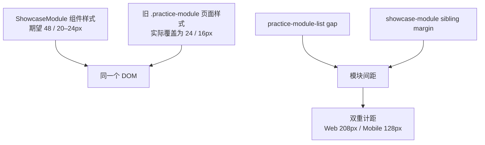
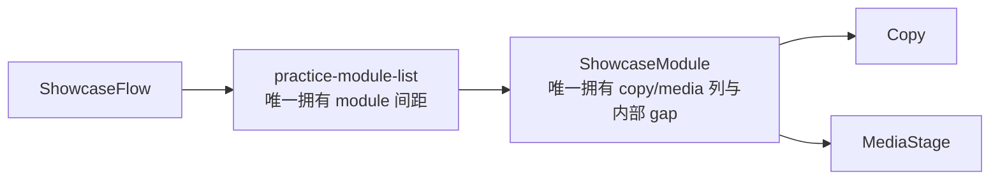

# v0.25.11｜Showcase 间距单一责任与视觉验收收口方案

状态：正式产品与视觉方案 / confirmed
责任：产品与视觉 task 维护方案与验收；Engineering 只实现 `current.md` 范围
父版本：`v0.25.10 / 0c68cc4e1e7077fbfed6a46622fd887dcb25a421`
性质：v0.25.10 提交后独立视觉验收发现的共享样式责任冲突；不回写或移动 v0.25.10

> 本方案不重新设计 v0.25.10。顶部更新卡、居中 Hero、Header、媒体行为、视觉系统和页面组合均已通过；本版本只从根源消除 Showcase 新旧样式同时拥有间距的冲突。

## 1. 验收结论

v0.25.10 的功能门禁和主要视觉方向通过，但精确间距合同未通过，因此不得 publish。



## 2. 真实证据

| 验收项 | 正式合同 | v0.25.10 实测 | 判定 |
| --- | --- | --- | --- |
| Web 说明→媒体列间距 | 48px | 24px | 未通过 |
| Web module→module | 96–120px | 208px | 未通过 |
| Mobile 说明→媒体 | 20–24px | 16px | 未通过 |
| Mobile module→module | 56–72px | 128px | 未通过 |

运行证据来自 `http://127.0.0.1:4317/products` 的 1600×1067 与 390×844 DOM 几何。源码冲突：

- `src/styles/components.css` 的 `.showcase-module` 已声明共享 Showcase 间距；
- `src/styles/pages.css` 的旧 `.practice-module` 后置页面层再次声明 grid/gap，覆盖共享组件；
- `.practice-module-list` 已声明 grid gap，同时 `.showcase-module + .showcase-module` 又声明 margin-top，导致模块间距相加。

## 3. 单一责任模型



固定责任：

| 对象 | 唯一负责 | 不再负责 |
| --- | --- | --- |
| `.practice-module-list` | module 与 module 的纵向间距 | module 内部布局 |
| `.showcase-module` | 说明列、媒体列、列间距、移动重排 | 与前后 module 的外边距 |
| `.showcase-module__copy` | label/title/description 内部节奏 | 页面级 section 间距 |
| `.media-stage` | 比例、圆角、浮起、媒体状态 | module 间距 |

## 4. Engineering 根修正

1. 移除或严格限定不再属于当前 ShowcaseFlow 的旧 `.practice-module` 布局声明，禁止它覆盖 `.showcase-module`。
2. `.showcase-module` 是 module 内部布局唯一 owner：
   - Web：说明列 240–280px；copy→media `48px`；
   - Mobile：单列；copy→media `20–24px`。
3. `.practice-module-list` 是 module 之间唯一 owner：
   - Web：`96–120px`；
   - Mobile：`56–72px`。
4. 删除 `.showcase-module + .showcase-module` 的重复 margin，或让其固定为 0；不得用负 margin/更高 specificity 补丁抵消。
5. 保留 v0.25.10 已通过的所有视觉和功能结果，不改变顶部、内容、媒体、动作、路由或发布架构。

## 5. 自动回归合同

必须在真实布局测试中直接断言 computed geometry，而不只断言 class/token 存在：

```text
Web 1600:
  copy→media = 48px
  module→module ∈ [96,120]px

Mobile 390:
  copy→media ∈ [20,24]px
  module→module ∈ [56,72]px
```

- QA fixture 继续保持 4 个独立槽位引用同一批准视频；正常模式继续 1 video + 3 empty；
- 断言容器 gap 与 item margin 不重复计距；
- 断言 legacy `.practice-module` 不再覆盖 `.showcase-module` 的 grid/gap；
- 1600、1280、390、320、375、768、200% 等效视口无横向溢出。

## 6. 明确不做

- 不改变 v0.25.10 已确认的更新卡、Hero、Header、首页中心轴、按钮、颜色、字体、媒体阴影或 ClosingAction；
- 不改内容正文、审核、媒体事实、四个稳定 module id、路由、IA、schema、ResumeArtifact 或 SitePublication；
- 不让内容 task 处理 CSS 间距；
- 不创建第二套样式系统、页面私有布局、branch、worktree、替代 task 或候选。

## 7. 严格验收与闭环

```text
Engineering 根修正 + computed geometry 回归
→ v0.25.11 commit/tag/clean
→ 产品/视觉复验 Web
→ Web 通过后复验 Mobile
→ 持续授权 product transport-only
→ 公网完整验证
→ 再通知内容 task 正式绑定四槽位并核验
```

- Web/Mobile 四项间距必须全部落入合同区间；
- v0.25.10 其余已通过项目不得回归；
- `npm run check`、`release:prepare`、`release:build`、全量 Sites、closeout、preflight、diff-check 通过；
- 自动测试通过仍不替代产品/视觉真实截图与 DOM 复验。
