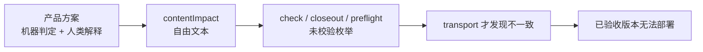
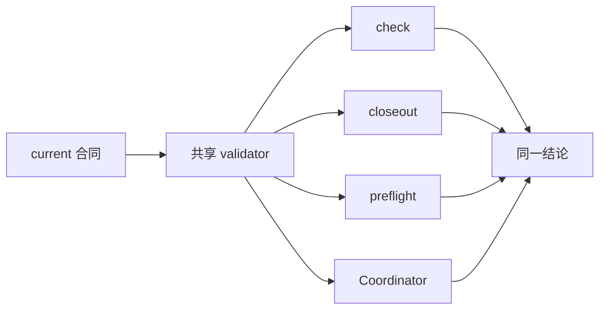

# v0.25.12 产品内容兼容合同单一枚举与前置门禁方案

## 1. 版本定位

父版本：`v0.25.11` / `3237d7fe68688c9c7b6e645d947d3854d9669beb`

来源：v0.25.11 产品/视觉验收通过后，product transport 在任何 EdgeOne deployment 前因 `contentImpact` 自由文本与 Coordinator 枚举不一致而硬停止。v0.25.11 commit/tag/history 保持冻结，不重试、不移动。

本版本只统一产品—内容兼容合同及其门禁，不改变 v0.25.11 已验收的视觉、页面、内容或发布架构。

## 2. 根因



`contentImpact` 被同时用作机器状态和变更说明；规则只描述了部分阻断值，没有定义封闭枚举；工程门禁只在 Coordinator transport 阶段解析。因此，`compatible-style-ownership-correction` 对人可理解，但对机器合同非法。

## 3. 单一合同

```yaml
contentImpact: compatible
contentImpactReason: compatibility-contract-enum-and-gate-unification
affectedTargets: [current-contract, release-gates, site-publication-coordinator]
affectedRoutes: []
affectedFields: [contentImpact, contentImpactReason, compatibilityEvidence]
compatibilityEvidence: v0.25.12-content-impact-contract
```

### 3.1 字段职责

| 字段 | 唯一职责 | 合法值/格式 |
| --- | --- | --- |
| `contentImpact` | 机器判定 | `none`、`compatible`、`migration-required`、`breaking`、`unknown` |
| `contentImpactReason` | 人类可读的变更原因标识 | 非空稳定标识，不参与 allowlist 判定 |
| `affectedTargets/routes/fields` | 影响范围 | 显式数组；无影响写 `[]` |
| `compatibilityEvidence` | 可验证证据标识 | 非空稳定标识 |

- `none`、`compatible`：满足其他证据门禁时允许组装和 transport；
- `migration-required`、`breaking`、`unknown`：形成 Product Incident 并硬停止；
- 缺失字段、未知枚举、自由文本拼接：在 Engineering 提交前即失败；
- 历史 current/history 不回写，旧版本不参与当前 publish 判定。

## 4. Engineering 合同

1. `readContentImpact` 读取并返回 `contentImpactReason`，不从 reason 推断机器状态。
2. 建立唯一兼容合同 validator，`npm run check`、`release:closeout-check`、`release:preflight` 与 Coordinator 复用同一实现，禁止四处复制枚举。
3. closeout/preflight 对未知枚举、缺字段、空证据立即失败；不能等到 transport。
4. Coordinator 继续只允许 `none` / `compatible`，继续保留 active 内容、lease、snapshot、deployment 和 public verify 门禁。
5. 为五个枚举、未知值、自由文本值、缺失 reason/evidence 和 v0.25.12 合法合同增加专项测试。
6. v0.25.11 已 assembled 未部署的 SitePublication 只保留 Incident 证据；v0.25.12 形成新的 ProductArtifact/SitePublication，不复用旧版本 publication。

## 5. 明确不做

- 不修改 v0.25.11 的 commit、tag、history 或已验收视觉；
- 不放宽 Coordinator、内容 identity、active receipt 或公网验证门禁；
- 不修改 UI、IA、路由、schema、正文、审核、媒体或 ContentReleaseIntent；
- 不运行内容发布，不通知内容 task；
- 不创建 branch、worktree、替代 task 或普通候选。

## 6. 验收



- 合法 `none` / `compatible` 在四个门禁得到相同通过结论；
- `migration-required` / `breaking` / `unknown` 在发布前得到相同硬停止结论；
- 任意未登记值在 `npm run check` 和 closeout 即失败；
- v0.25.11 全站视觉、Web/Mobile 几何、视频行为和五路由回归全部保持；
- 34 个 active 内容、33 个 published slugs、Robotaxi Practice/media 在产品 SitePublication 中完整保留；
- check、release:prepare、release:build、全量 Sites、closeout、preflight、diff-check 全部通过；
- 产品/视觉验收通过后按持续授权自动 product transport，deployment JSON、双 manifest、五路由和媒体公网证据完整。
