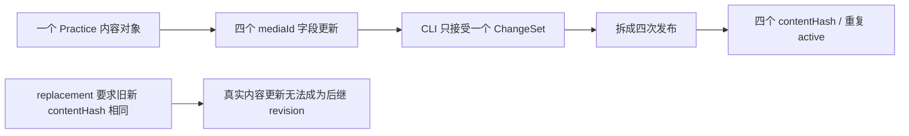
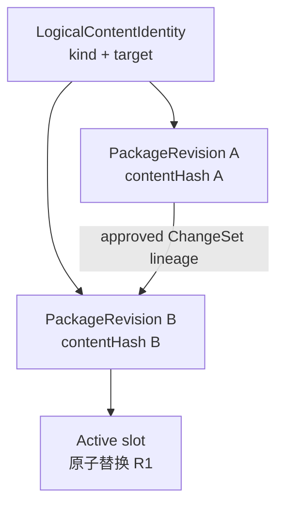

# v0.25.13 多字段内容变更与稳定逻辑身份方案

## 1. 版本定位

父版本：`v0.25.12` / `2e76e026aaa1997b669195a450b0e5d7d3f55a35`

来源：产品 v0.25.12 完整上线后，内容 task 按已确认目标为 Robotaxi 四个独立 `mediaId` 槽位绑定同一已审核视频；现有工具只能处理一个字段，并要求 replacement 的 `contentHash` 与 active 完全相同，无法表达“同一内容对象发生经过审核的真实更新”。

Incident：`CONTENT-BLOCK-ROBOTAXI-FOUR-MEDIA-CHANGESET-001`。

## 2. 根因



根因有两层：

1. `ChangeSet` 被实现成单字段命令，而不是一个内容对象的一次原子变更；
2. logical identity、内容快照 hash 和物理 package revision 没有分层，replacement 用 `contentHash` 判定身份，错误地把“内容改变”当成“对象改变”。

## 3. 三层身份



| 对象 | 唯一职责 | 稳定性 |
| --- | --- | --- |
| `logicalContentId` | 标识唯一内容对象，例如 `practice:robotaxi` | 内容更新时不变 |
| `contentHash` | 标识某次完整内容快照 | 内容变化时必须变化 |
| `packageRevisionId` | 标识一次可恢复的发布修订 | 每个后继修订独立 |
| `contentReleaseId` | 保留现有外部兼容身份 | 不作为 active slot 或内容相等判定的唯一依据 |

- active 唯一槽位由 `logicalContentId` 决定；
- replacement 允许 `contentHash` 变化，但必须由完整、已审核的 ChangeSet lineage 证明；
- finalize 时新 revision 原子替换旧 revision，不能同时形成两个 active Practice。

## 4. 原子多字段 ChangeSet

```json
{
  "changeSetId": "changeset-...",
  "logicalContentId": "practice:robotaxi",
  "operations": [
    {
      "targetId": "robotaxi.module.fleet-operations.mediaId",
      "beforeHash": "...",
      "afterValue": "robotaxi-evidence-fleet-operations-console-v1",
      "afterHash": "..."
    }
  ]
}
```

合同：

1. `operations` 是确定性有序数组；每个 `targetId` 在同一 ChangeSet 中只能出现一次。
2. 每项必须命中 registry 的同一 `logicalContentId`，并逐项验证 `beforeHash`、value type、范围、媒体审批与 provenance。
3. 全部 operation 在 staging 中一次应用；任一失败则整组失败，canonical、active receipt 和公网不变。
4. `changeSetId` 由规范化完整 operations 生成；receipt 保存完整 `changedTargets`、before/after hash 与 revision lineage。
5. rollback 以 reverse operations 生成原子逆向 ChangeSet；目标发生漂移时硬停止，不覆盖。
6. 现有单字段 ChangeSet 兼容读取为一个 operation，但所有新 receipt 使用统一数组结构。

## 5. Robotaxi 本次内容目标

- 四个 module 保持四个独立 `mediaId` 字段；
- 初始内容更新允许四个字段共同引用现有已审核媒体 `robotaxi-evidence-fleet-operations-console-v1`；
- 只复用同一媒体资产及其 hash/review，不复制四份文件；
- 未来内容 task 可用同一能力逐字段替换为四个不同媒体；
- 空媒体 fallback 继续是合法产品状态，不因本次填充删除。

## 6. Engineering 合同

1. 内容 registry/target 定位支持同一 logical content 的多目标选择，不允许跨对象 ChangeSet。
2. `content-release` 的 prepare/build/reconcile/recovery 接受一个原子 multi-operation ChangeSet。
3. receipt、completion、package manifest、public projection 保存 `logicalContentId`、`packageRevisionId`、`contentHash`、`changeSetId`、完整 `changedTargets`。
4. replacement resolver 按 `logicalContentId + lineage` 选择唯一 active slot；允许经过批准的 hash 更新，拒绝无 lineage、错误 before hash、目标/类型/base 漂移。
5. Coordinator 组装时一个 logical slot 恰好一个 active revision；失败不污染旧 active，成功 public verify 后原子替换。
6. 同一 package/revision resume 复用 lease、SitePublication 和 deploymentId，不产生重复 deployment。
7. 测试至少覆盖四字段原子成功、第 2/4 项失败全回滚、重复 target、跨 logical target、stale before、未审核媒体、hash 更新 replacement、旧 revision 保留、幂等 resume 与单字段兼容。

## 7. 产品—内容兼容声明

```yaml
contentImpact: compatible
contentImpactReason: multi-operation-changeset-and-logical-revision-identity
affectedTargets: [content-change-set, content-package-revision, active-content-set, site-publication-coordinator]
affectedRoutes: [/products]
affectedFields: [logicalContentId, operations, changedTargets, contentHash, packageRevisionId]
compatibilityEvidence: v0.25.13-atomic-multi-field-content-contract
```

## 8. 明确不做

- 不改变四个 module 的正文、顺序、UI、布局、视觉、路由或 schema；
- 不修改已审核视频本体、hash、review 或 provenance；
- 不重发 33 条 Observation 或其他 active 内容；
- 不让内容 task 手工修改 manifest/receipt 绕过工具；
- 不回写或移动 v0.25.12 及更早 commit/tag/history；
- 不创建 branch、worktree、替代 task 或第二个发布器。

## 9. 验收

- Engineering 使用真实 Robotaxi fixture 生成一个 ChangeSet，包含四个独立 `targetId`，一次 prepare/build/reconcile 成功；
- 四字段共享一个 logical content、一个 revision、一个 contentHash 和一个原子 rollback；
- 任一 operation 失败时零字段进入 canonical/package active/publication；
- replacement 后 active 总数仍为 34，Practice logical slot 仍恰好一个，33 个 Observation 保持；
- v0.25.12 全站视觉与几何保持，`/products` 正常模式最终为 4 个视频槽位；
- check、release:prepare/build、全量 Sites、closeout、preflight、diff-check 通过；
- 产品/视觉按正式合同与 `xingbuild-visual-ux-review` 完成保持性验收；
- 产品上线后内容 task 才使用正式工具完成四槽内容发布，公网验证 4 个 video、4 个安全链接、自动播放/离屏暂停和全部 active 内容保留。
