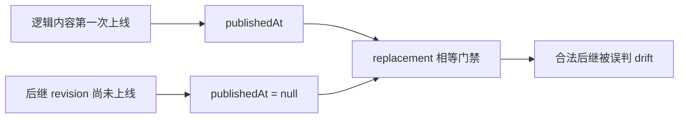
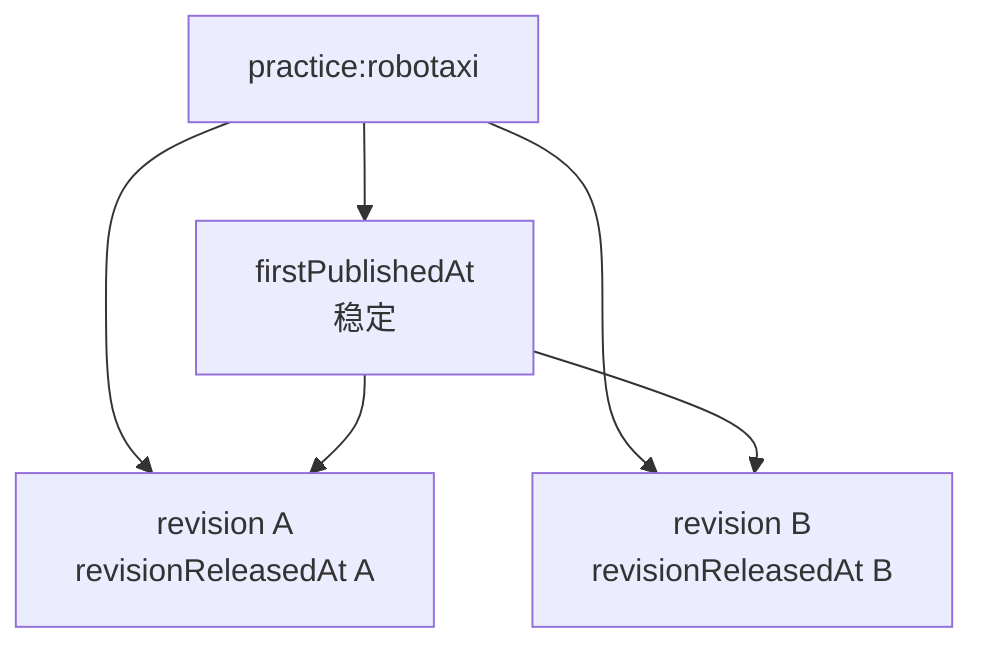

# v0.25.14 内容首次发布与修订发布时间分层方案

## 1. 版本定位

父版本：`v0.25.13` / `e63ff943d4d17b2a8fdf61c4bd59dd070d9904e3`

来源：v0.25.13 产品能力上线后，内容 task 已用一个原子 ChangeSet 完成 Robotaxi 四媒体槽位 prepare/build；transport replacement 因候选 `publishedAt=null`、旧 active `publishedAt=2026-08-04T13:46:03.884Z` 被判为 drift。

Incident：`CONTENT-BLOCK-ROBOTAXI-REPLACEMENT-PUBLISHEDAT-001`。

本版本修复内容生命周期时间语义，不重建现有四槽 package，不修改正文、媒体或审核事实。

## 2. 根因



一个字段承担了两个不同生命周期事实：

- logical content 的第一次公开时间；
- package revision 的本次发布完成时间。

候选 revision 在 finalize 前本来就没有本次发布时间，因此不能要求它与已发布 active 的时间相等，也不能让运营人员手工复制历史时间。

## 3. 时间事实分层

| 字段 | owner | 语义 | replacement 行为 |
| --- | --- | --- | --- |
| `firstPublishedAt` | logical content | 该内容对象第一次公开上线时间 | 后继 revision 自动继承，不可改写 |
| `revisionReleasedAt` | package revision | 本 revision 完成公网验证并 finalize 的时间 | 每次 revision 独立生成 |
| `publishedAt` | 兼容投影 | 对外继续投影 `firstPublishedAt` | 不再作为候选输入的相等条件 |



规则：

1. 新 logical content 首次 finalize 时，同时确定 `firstPublishedAt` 与该 revision 的 `revisionReleasedAt`。
2. replacement candidate 在 prepared/built/recoverable 阶段允许 `revisionReleasedAt=null`。
3. replacement resolver 从唯一 active logical slot 继承 `firstPublishedAt`；candidate 若显式提供不同非空值则硬失败。
4. replacement 完成 public verify/finalize 时只生成新的 `revisionReleasedAt`，不得改变 `firstPublishedAt`。
5. receipt/completion/package/public projection 保存两项事实；旧 `publishedAt` 兼容读取为 `firstPublishedAt`。
6. 内容 task 不填写、复制或修正系统时间。

## 4. Engineering 合同

1. 将 receipt/replacement/Coordinator 中的时间读取收敛为一个 lifecycle time resolver。
2. 兼容旧 active receipt：`firstPublishedAt = publishedAt`；已有历史事实不迁移、不回写。
3. replacement validation 先确认 logicalContentId/lineage，再继承 active 的 firstPublishedAt；不把 candidate 的空 revision 时间判为 drift。
4. finalize 原子写入 revisionReleasedAt，并在 completion/public projection 中保持一致。
5. resume recoverable package 时复用原 packageRevisionId、ChangeSet、contentHash、SitePublication/lease/deployment（若已存在），不重新 prepare/build。
6. 测试覆盖首次发布、后继继承、候选 null、显式篡改、旧 publishedAt 兼容、finalize 时间、失败不污染 active 与幂等 resume。

## 5. 产品—内容兼容声明

```yaml
contentImpact: compatible
contentImpactReason: logical-first-published-and-revision-release-time-separation
affectedTargets: [content-release-receipt, content-replacement, site-publication-finalize]
affectedRoutes: [/products]
affectedFields: [firstPublishedAt, revisionReleasedAt, publishedAt]
compatibilityEvidence: v0.25.14-content-publication-time-contract
```

## 6. 明确不做

- 不修改 v0.25.13 或更早 commit/tag/history；
- 不让内容 task 手工补 `publishedAt`；
- 不重建 `practice-robotaxi-604214b3bfddf09f` 或四槽 ChangeSet；
- 不改 UI、视觉、IA、schema、正文、媒体、hash、review 或 provenance；
- 不重发其他 33 个 active 内容；
- 不创建 branch、worktree、task、候选或第二套时间线。

## 7. 验收

- 旧 active `practice-robotaxi-d67fcedd760acc5a` 的历史 `publishedAt` 被只读解释为 `firstPublishedAt`；
- recoverable 四槽 package 的空时间不再构成 drift，且继承同一 firstPublishedAt；
- 显式不同 firstPublishedAt 必须硬失败；
- 新 revision finalize 后拥有独立 revisionReleasedAt，旧 firstPublishedAt 不变；
- replacement 后 active=34、Practice logical slot=1、Observation=33；
- v0.25.13 全站视觉、四槽能力、五路由和媒体回归保持；
- check、release:prepare/build、全量 Sites、closeout、preflight、diff-check 通过；
- 产品上线后内容 task 复用现有 recoverable package 完成 transport/finalize/public verify。
