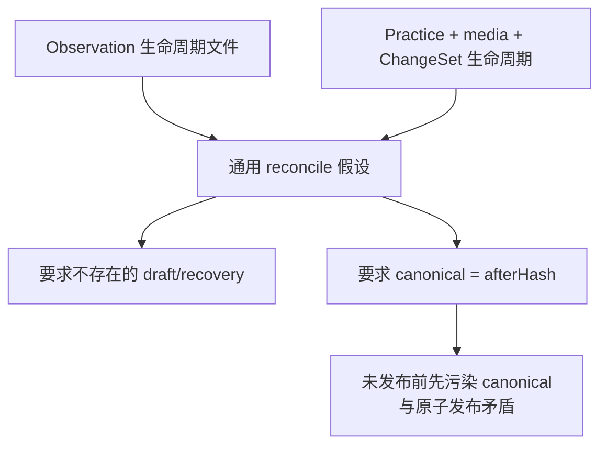

# v0.25.15 内容类型生命周期适配与 Package 证明式 Reconcile 方案

## 1. 版本定位

父版本：`v0.25.14` / `b0bb49dcebb0b5b888ac844115f59695be0cf4cb`

来源：Robotaxi 四槽 package 已完成原子 prepare/build，升级到 v0.25.14 ProductArtifact 时，reconcile 强制寻找不存在的通用 `drafts/robotaxi.json`、`recoveries/robotaxi.json`，并要求尚未 finalize 的 canonical 已等于 ChangeSet after hash。

Incident：`CONTENT-BLOCK-ROBOTAXI-RECONCILE-LIFECYCLE-001`。

## 2. 根因



当前 reconcile 混合了三种不同事实：

- canonical 当前已发布内容；
- candidate package 中经过审核的 after 快照；
- 不同 content kind 的 draft/review/recovery 证据形态。

因此它错误地要求所有 kind 拥有同名文件，并要求 candidate 发布前 canonical 已经变成 after 状态。

## 3. 正确对象关系

```mermaid
flowchart LR
    C["Canonical before"] -->|"beforeHash"] CS["Immutable ChangeSet"]
    CS -->|"deterministic apply"] A["Package after snapshot"]
    R["Kind-specific review evidence"] --> A
    A -->|"reconcile only rebinds ProductArtifact"] PR["PackageRevision"]
    PR --> SP["SitePublication"]
    SP -->|"public verify + finalize"] N["Canonical after"]
```

- package 的内容快照、ChangeSet、review lineage 是不可变发布候选事实；
- reconcile 只把同一候选 package 绑定到新的 ProductArtifact，不改稿、不重新审核；
- canonical 在发布成功前保持 before；只有 public verify/finalize 后才原子推进为 after；
- 失败时 canonical、active receipt 和公网保持旧状态。

## 4. ContentLifecycleAdapter

建立唯一 adapter 接口，由 `kind` 选择生命周期证据，不允许 reconcile 猜文件：

```text
resolveCanonical(logicalContentId)
resolveReviewEvidence(package)
resolveRecoveryEvidence(package)
validateBefore(package, canonical)
validateAfter(package, changeSet)
finalizeCanonical(package, publicEvidence)
```

### Practice

- canonical：`.content-workspace/content/products/robotaxi.json` + media manifest；
- review：现有 Practice review 与 media approval/provenance；
- candidate after：package 内 immutable source snapshot + ChangeSet operations；
- recovery：package/recovery 中的 before snapshot 与逆向 ChangeSet，不要求通用 `recoveries/robotaxi.json`；
- finalize：公网验证成功后原子写 canonical after，并保留 before recovery。

Observation、Article、Profile、BusinessObservation 继续使用各自已登记生命周期文件；adapter 不能把一种 kind 的文件命名强加给另一种 kind。

## 5. Package 证明式 Reconcile

reconcile 必须验证：

1. package 的 `logicalContentId`、kind、target、ChangeSet、contentHash、review/media provenance 不变；
2. canonical 当前 hash 等于 package/ChangeSet 的 beforeHash，而不是 afterHash；
3. 对 canonical before 确定性应用全部 operations 后得到 package after snapshot/contentHash；
4. review evidence 覆盖 logicalContentId、changeSetId、after contentHash 和媒体审批；
5. 新 ProductArtifact 兼容当前 kind/target；
6. 只生成或复用新的 package revision wrapper，package 内容事实不变；同 tuple 幂等复用。

禁止：

- 要求内容 task 手工把 canonical 改成 after；
- 要求 Practice 伪造 Observation 风格 draft/recovery；
- 修改 package contentHash、ChangeSet 或 media review 来适配新基座。

## 6. Engineering 合同

1. 新增共享 `ContentLifecycleAdapter` registry，并让 prepare/reconcile/finalize 使用同一 kind 路由。
2. immutable package 保存可验证的 before snapshot/hash、after snapshot/hash、ChangeSet、review envelope 与 recovery envelope。
3. 对现有 `practice-robotaxi-604214b3bfddf09f` 提供兼容读取：从 package 与 ChangeSet 已有事实构造只读 envelope，不改 package 内容/hash。
4. reconcile 接受 current canonical=before，验证 apply(operations)=after/contentHash，并绑定 v0.25.15 ProductArtifact。
5. public verify/finalize 后，先原子完成 active receipt/package，再原子推进 canonical after；任一步失败保留 recovery，可用同一 publication resume。
6. finalize 重入必须幂等；canonical 已是 after 时验证 hash 后复用，不重复改写。
7. 测试覆盖 Practice 无通用 draft/recovery、before→after、review/media provenance、错误 before、错误 after、跨 kind、ProductArtifact 漂移、finalize 原子写回、失败保留 before、resume 幂等和旧 Observation 合同不回归。

## 7. 产品—内容兼容声明

```yaml
contentImpact: compatible
contentImpactReason: kind-specific-lifecycle-adapter-and-package-proven-reconcile
affectedTargets: [content-lifecycle-adapter, content-package-reconcile, content-finalize]
affectedRoutes: [/products]
affectedFields: [beforeHash, afterHash, reviewEnvelope, recoveryEnvelope, logicalContentId]
compatibilityEvidence: v0.25.15-package-proven-reconcile-contract
```

## 8. 明确不做

- 不修改或重建 `practice-robotaxi-604214b3bfddf09f`、ChangeSet、媒体或审核事实；
- 不让内容 task 手造 draft/recovery/canonical/hash；
- 不改 UI、视觉、IA、schema、正文或媒体文件；
- 不重发其他 33 个 active 内容；
- 不回写/移动 v0.25.14 或更早 commit/tag/history；
- 不创建 branch、worktree、task、候选或第二个 reconcile 流程。

## 9. 验收

- Practice 在没有通用 `drafts/robotaxi.json` / `recoveries/robotaxi.json` 时仍能通过合法 adapter 验证；
- current canonical 旧 hash + 四操作 ChangeSet 确定性生成 package contentHash `604214b3...`；
- review/media provenance 覆盖完整 after 快照；错误 before/after/provenance 均硬失败；
- reconcile 复用现有 package/ChangeSet，生成同一内容的 v0.25.15 revision，不改内容事实；
- 产品版本上线后内容 task resume，成功时 canonical after、active receipt 和公网一次收敛；失败时三者保持旧状态；
- active=34、Practice slot=1、Observation=33；`/products` 最终 4 个视频槽；
- v0.25.14 视觉、五路由、媒体和可访问性保持；
- check、release:prepare/build、全量 Sites、closeout、preflight、diff-check 通过。
