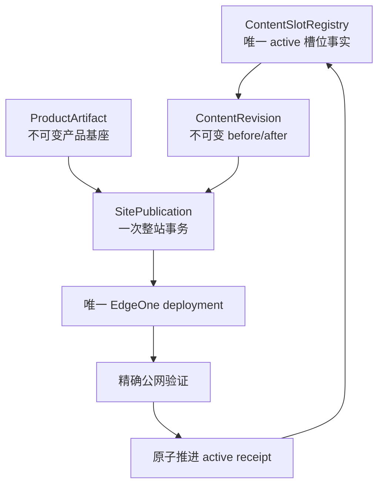
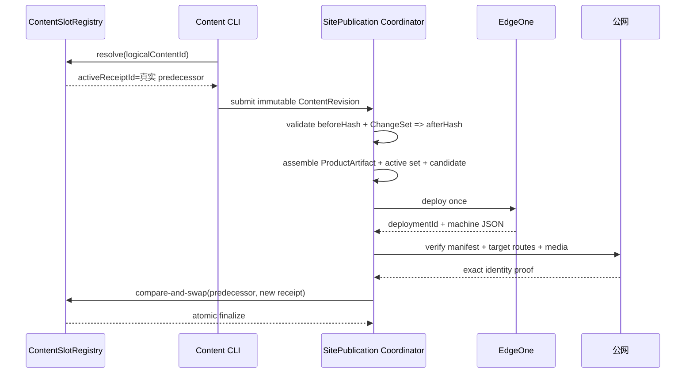
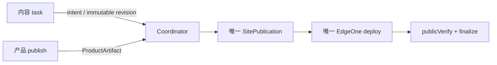

# v0.25.16 内容活动槽位注册表与原子替换发布架构方案

## 1. 版本定位

父版本：`v0.25.15` / `084148068860dad6ddb7288fed51b15f618521bd`

来源 Incident：`CONTENT-BLOCK-ROBOTAXI-REPLACEMENT-SLOT-001`。

v0.25.15 已完成产品基座上线与 kind-specific `ContentLifecycleAdapter`，但四槽 Practice package 在替换阶段仍无法从真实 active legacy receipt 解析 predecessor：candidate 的 `supersedesPackageId` 指向自身，而 active receipt 是 `practice-robotaxi-d67fcedd760acc5a`。这不是内容、媒体、审核或网络问题，而是活动槽位与 lineage 没有唯一事实源。

本版本不是 Incident 字段修补，而是统一内容发布领域模型、legacy 迁移和替换事务边界。v0.25.15 保持冻结；既有内容包、正文、媒体、审核和产品版本事实不可回写。

## 2. 根本目标

让“已审核内容是否成为线上 active 内容”只有一条可证明路径：



产品与内容在业务生命周期上独立；由于它们共享同一物理站点，部署在基础设施层由 Coordinator 串行执行。产品版本变化不要求内容重新改稿或重新审核；只有能力合同不兼容时，产品发布前才阻断并形成 Product Incident。

## 3. 唯一对象边界

### 3.1 ProductArtifact

产品 Engineering 生成的不可变产物：

```text
productVersion
productCommit
annotatedTag
baseSiteArtifactId
sourceBundleHash
capabilityContract
```

产品发布不读取内容工作区作为业务事实，不写入内容 active 状态。

### 3.2 ContentSlotRegistry（新增唯一活动槽位事实）

每个 `logicalContentId` 只有一个活动槽位：

```text
logicalContentId
kind
target
activeReceiptId
activeContentHash
predecessorReceiptId
firstPublishedAt
registryRevision
```

规则：

1. 一个 logical content 只能有一个 active receipt。
2. predecessor 必须由 registry 解析，candidate 不得自行填写真实 predecessor。
3. 同一 logical content 存在两个已发布 active 且无法确定唯一 predecessor 时，硬失败并形成 Incident，不猜测、不覆盖。
4. registry 是唯一活动状态输入；manifest、package projection、页面索引只能是输出。

### 3.3 ContentRevision

内容 task 创建的不可变候选事实：

```text
logicalContentId
packageRevisionId
contentReleaseId
predecessorReceiptId
beforeHash
afterHash
changeSetId
operations[]
reviewEnvelope
mediaProvenance
recoveryEnvelope
baseSiteArtifactId
```

revision 不修改 canonical，不修改 active receipt，不直接调用 EdgeOne。

### 3.4 SitePublication

唯一站点发布事务：

```text
sitePublicationId
productArtifactId
activeReceiptSetHash
candidateRevisionId
snapshotHash
state
deploymentId
deploymentJson
publicVerify
failure
```

`content-manifest.json`、`release.json`、页面索引和 projection 由此事务生成，不能反向作为事实源。

## 4. 生命周期与原子替换

### 4.1 内容替换



### 4.2 失败与恢复

- prepare/reconcile 失败：不写 active，不创建 deployment。
- deploy 失败：保留同一 SitePublication 和 recovery，不产生第二个 publication。
- 公网传播延迟：保留同一 deploymentId，bounded resume；不重复部署。
- publicVerify 失败：active 保持旧 receipt，candidate 保持 recoverable。
- finalize 前 registry active 已变化：CAS 硬失败，必须创建新的 revision/publication，不覆盖新 active。
- 已 finalized 的同一 publication 再次 resume：幂等返回成功，不重复写入、不重复部署。

## 5. Legacy 迁移合同

Engineering 必须提供只读扫描与一次性迁移器：

1. 扫描现有 finalized receipt、released package、publicVerify 和 logical identity。
2. 对每个 logical content 生成 `ContentSlotRegistry` 初始记录。
3. 仅存在一个完整 active proof 时登记为 active。
4. 若存在多个冲突 active、缺少完整 proof 或 identity 无法确定，硬失败并报告清单，不自动选择。
5. 迁移不得修改旧正文、媒体、审核、contentHash、publishedAt、package 或旧 tag/history。
6. 迁移记录必须保存 source paths、输入 hash、选择依据和 registryRevision。

当前 Practice 的确定迁移事实：

```text
logicalContentId: practice:robotaxi
activeReceiptId: practice-robotaxi-d67fcedd760acc5a
candidate package: practice-robotaxi-604214b3bfddf09f
candidate revision: revision-9bb22df0f30845e8
```

candidate revision 只能由 resolver 自动生成 `predecessorReceiptId=practice-robotaxi-d67fcedd760acc5a`，不得把自身 package 当 predecessor，也不得手改现有文件绕过门禁。

## 6. ProductArtifact 兼容合同

ProductArtifact 必须声明当前内容运行所需的稳定能力集合：

```text
capabilityContractVersion
contentKinds
registeredTargets
mediaContract
routeContract
fieldContract
```

发布前由 Coordinator 对 active receipt set 和 candidate revision 做兼容性预检：

- compatible：可正常组装；
- incompatible：产品发布前阻断，形成 Product Incident；
- unknown：硬失败，不由内容 task 猜测。

产品版本与内容版本仍分别管理；兼容性检查只证明“当前产品能否承载内容”，不把内容变成产品版本。

## 7. 工具责任



- 内容 CLI：读取/生成 revision，不能写 registry active、manifest 或公网状态。
- 产品 publish CLI：提交 ProductArtifact，不能读取或改写内容业务事实。
- Coordinator：唯一能组装站点、调用 EdgeOne、写 SitePublication、推进 active registry 的组件。
- 任何 derived projection 不得作为下一阶段输入。

## 8. Engineering 实现范围

1. 建立 `ContentSlotRegistry` schema、repository 和版本化 migration contract。
2. 建立 active receipt resolver，统一 initial/replacement/reconcile/resume。
3. 删除 candidate 自填 `supersedesPackageId` 作为权威输入；改为 resolver 生成 predecessor。
4. SitePublication finalize 使用 registry compare-and-swap，保证 active 不被覆盖。
5. 统一从 registry + immutable revision + ProductArtifact 生成所有 manifest/projection。
6. 保留 v0.25.15 ContentLifecycleAdapter，adapter 只负责 kind-specific source/review/recovery，不负责跨 kind lineage。
7. 对现有 `practice-robotaxi-604214b3bfddf09f` 和 `revision-9bb22df0f30845e8` 提供兼容恢复，不重建内容、媒体、ChangeSet 或 logical identity。
8. 不改 UI、IA、schema、页面视觉、正文、审核和媒体事实。

## 9. 强制契约测试

必须使用真实历史 package corpus 与故障注入，而非只使用新 fixture：

- 首次发布与首次 finalize；
- legacy active → replacement；
- 多 operation ChangeSet；
- 同一 publication 重复 resume；
- deploy 成功但公网延迟；
- stale lease；
- active 并发变化；
- manifest/projection 缺失或漂移；
- 多个冲突 active；
- ProductArtifact 能力不兼容；
- 失败后 active receipt、canonical、公网完全不变。

不变量必须自动验证：

```text
count(activeReceipt(logicalContentId)) <= 1
predecessorReceiptId 必须存在且不是 candidate 自身
finalize 只能发生在 exact publicVerify 之后
同一 publication 不产生第二个 deployment
projection 只能由 snapshot 生成
```

## 10. 验收顺序

```text
Engineering 实现与真实历史 corpus QA
→ local commit/tag/clean
→ 产品/视觉合同验收（仅确认产品能力不破坏既有页面）
→ ProductArtifact transport
→ 公网完整验证
→ content task resume 既有四槽 package
→ 四个媒体槽逐项公网验证
```

完成标准：现有四槽 package 在不重建、不手改事实的情况下完成替换；失败可恢复且不污染 34 条 active；产品版本与内容版本仍独立。

## 11. 明确不做

- 不继续添加单一 Incident 字段门禁作为临时修补；
- 不创建第二个 Coordinator、第二套 lifecycle 或第二个活动注册表；
- 不把本项目升级为 CMS、微服务、消息总线或通用云发布平台；
- 不改变现有产品视觉、页面结构、内容正文、媒体事实或独立运营规则；
- 不创建 branch、worktree、task、scheduler；
- 不在 v0.25.15 上继续尝试四槽内容 transport。

## 12. 产品—内容兼容声明

```yaml
contentImpact: compatible
contentImpactReason: canonical-active-slot-registry-and-atomic-replacement
affectedTargets: [content-slot-registry, content-lineage, site-publication-coordinator, legacy-migration]
affectedRoutes: [/products]
affectedFields: [logicalContentId, activeReceiptId, predecessorReceiptId, packageRevisionId, snapshotHash]
compatibilityEvidence: v0.25.16-active-slot-registry-contract
```
