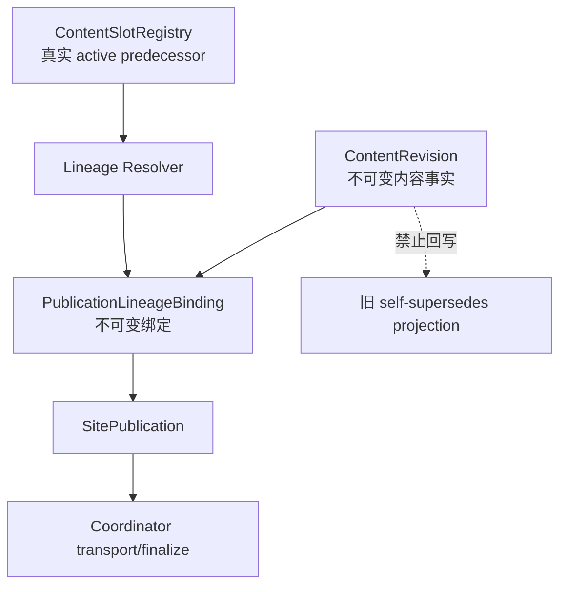
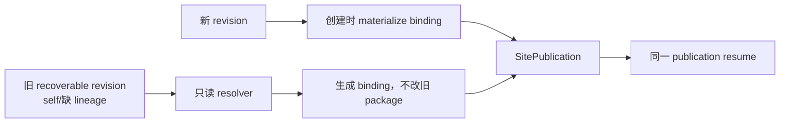

# v0.25.17 不可变 Revision 与 Registry Lineage Binding 完成方案

## 1. 版本定位

父版本：`v0.25.16` / `20b6c5fb49b007b7655c6c4f113af81b5bb5dfdc`

来源 Incident：`CONTENT-BLOCK-ROBOTAXI-SLOT-RESUME-001`。

v0.25.16 已将 `ContentSlotRegistry` 设为活动槽位事实源，但既有 revision resume 时，resolver 只在内存返回真实 predecessor，持久化 revision 仍保留旧的 self-reference；后续 Coordinator 再读取旧 projection，导致部署前停止。

本版本不是新领域模型，也不是字段补丁，而是完成 v0.25.16 的 authority boundary：不可变 revision 不回写；Registry 是 lineage 唯一权威；Coordinator 使用一次性不可变 `PublicationLineageBinding`，消除内存解析与持久化事实分裂。

## 2. 根因模型



错误路径是：

```text
Registry 得到 predecessor
→ 仅内存使用
→ revision/package 旧 projection 继续被 resume 读取
→ self-supersedes 门禁失败
```

正确路径是：

```text
Registry + immutable revision
→ 一次性生成 LineageBinding
→ SitePublication 只消费 binding
→ resume 复用同一 binding
```

## 3. 对象合同

### 3.1 ContentRevision

保持不可变，禁止因为恢复而修改：

```text
logicalContentId
packageRevisionId
contentReleaseId
contentHash
ChangeSet
beforeHash / afterHash
review / media provenance
原始 source 与 recovery
```

### 3.2 PublicationLineageBinding（新增发布运行对象）

```text
lineageBindingId
sitePublicationId
logicalContentId
packageRevisionId
candidateContentReleaseId
predecessorReceiptId
predecessorPackageId
registryRevision
bindingHash
createdAt
```

规则：

1. `predecessorReceiptId` 只能由 Registry resolver 生成。
2. binding 生成后不可修改。
3. 同一 `sitePublicationId + packageRevisionId + registryRevision` 幂等复用同一 binding。
4. 旧 revision 的 self-reference 只作为历史兼容输入，不能作为权威 predecessor。
5. binding 与 Registry active 不一致时，CAS 硬失败，不覆盖 active。

### 3.3 SitePublication

SitePublication 必须保存并消费 binding：

```text
candidateRevisionId
lineageBindingId
predecessorReceiptId
snapshotHash
deploymentId
publicVerify
```

Coordinator 不再从 package projection 猜测 predecessor。

## 4. 新旧 revision 兼容路径



当前确定事实：

```text
logicalContentId: practice:robotaxi
activeReceiptId: practice-robotaxi-d67fcedd760acc5a
candidate revision: revision-9bb22df0f30845e8
candidate package: practice-robotaxi-604214b3bfddf09f
```

该 revision、package、正文、媒体、ChangeSet 和 hash 均不得修改；Coordinator 必须从 Registry 生成绑定并消费绑定。

## 5. 生命周期与幂等

```text
resolve Registry active
→ create/reuse PublicationLineageBinding
→ assemble SitePublication
→ deploy once
→ bounded public verify
→ CAS(activeReceiptId = predecessorReceiptId)
→ finalize
```

- binding 创建失败：不部署。
- binding 已存在：必须校验 hash/identity 后复用。
- deployment 已存在：resume 不得创建第二个 deployment。
- public verify 失败：保留 binding/recovery，active 不变。
- active receipt 已变化：CAS 硬失败，必须新建后继 publication，不覆盖。
- 已 finalized：重复 resume 返回同一成功事实。

## 6. Engineering 实现范围

1. 新增 `PublicationLineageBinding` schema、持久化和 hash。
2. 统一所有 initial/replacement/reconcile/resume 的 lineage resolver。
3. 既有 revision 恢复时只读 Registry，生成/复用 binding，不修改旧 revision manifest。
4. Coordinator、SitePublication、receipt/completion projection 统一读取 binding；禁止从旧 `supersedesPackageId` 直接判定 predecessor。
5. finalize 使用 binding.predecessorReceiptId 与 Registry 做 compare-and-swap。
6. 绑定、publication、deployment、publicVerify 全部幂等。
7. 兼容 v0.25.16 已上线 ProductArtifact，不改变 UI、IA、schema、视觉、正文、审核、媒体或其他 active 内容。

## 7. 必须测试

- 旧 self-supersedes revision 自动绑定真实 legacy predecessor；
- 绑定生成不修改 package/revision/contentHash；
- 同一 revision 重复 resume 复用同一 binding；
- 同一 publication 不产生第二 deployment；
- binding identity drift 硬失败；
- Registry active 变化时 CAS 拒绝；
- 部分 projection 不覆盖 binding；
- deploy 成功、公网延迟、失败恢复；
- finalize 后重复执行幂等；
- 多 logical content 并行准备但站点部署串行；
- 真实 v0.25.16 historical corpus，不仅新 fixture。

核心不变量：

```text
不可变 revision 不被 resume 改写
predecessor 只来自 Registry
SitePublication 只消费 binding
activeReceipt 每个 logicalContentId 最多一个
失败不改变旧 active
同一 publication 最多一个 deployment
```

## 8. 验收与后续流程

```text
Engineering 实现/历史 corpus QA
→ local commit/tag/clean
→ 产品/视觉能力验收
→ v0.25.17 product transport
→ 公网完整验证
→ 内容 task resume revision-9bb22df0f30845e8
→ 四媒体槽逐项公网验证
```

## 9. 明确不做

- 不移动或回写 v0.25.16 tag/history；
- 不修改既有 package、revision、正文、媒体、审核、ChangeSet、hash；
- 不手改 manifest、lineage 或 `supersedesPackageId`；
- 不创建第二套 Registry、Coordinator、lifecycle、task、branch、worktree；
- 不改变 UI、IA、schema、视觉和内容独立运营合同；
- 不继续在 v0.25.16 上重试内容 transport。

## 10. 产品—内容兼容声明

```yaml
contentImpact: compatible
contentImpactReason: immutable-revision-runtime-lineage-binding
affectedTargets: [publication-lineage-binding, content-slot-registry, site-publication-coordinator, content-resume]
affectedRoutes: [/products]
affectedFields: [lineageBindingId, predecessorReceiptId, packageRevisionId, snapshotHash]
compatibilityEvidence: v0.25.17-immutable-revision-lineage-binding-contract
```
