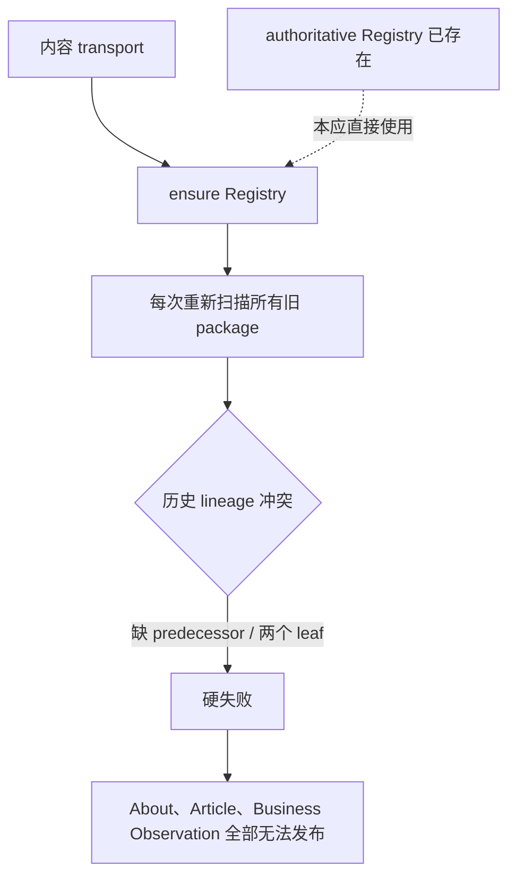
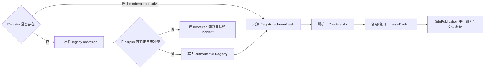

# v0.25.18 ContentSlotRegistry 权威边界与一次性 Legacy 迁移方案

## 1. 版本定位

父版本：`v0.25.17` / `e1cdc09182e91ca49d6dc2e6353e775837b15caf`

来源 Incident：`CONTENT-BLOCK-CONTENT-SLOT-REGISTRY-LEGACY-MIGRATION-001`。

本版本不是为 About、Article 或 Business Observation 增加临时门禁，也不是修改内容事实。它完成 `ContentSlotRegistry` 的运行时权威边界：旧 package corpus 只承担一次性初始化证据，权威 Registry 建立后不再参与日常 active-slot 判定。

## 2. 根因模型

当前错误路径：



正确边界：



结构性根因不是“历史 package 有冲突”，而是**已经存在的权威事实仍被旧推断器覆盖**：迁移扫描和日常运行没有分层，导致不可变历史证据继续拥有 active 决策权。

## 3. 权威层级

```text
ContentSlotRegistry（authoritative）
→ active slot / predecessorReceiptId
→ PublicationLineageBinding
→ SitePublication snapshot
→ 唯一 deployment / publicVerify / CAS finalize
```

| 对象 | 责任 | 是否参与日常 active 判定 |
| --- | --- | --- |
| `content-slot-registry/registry.json`，`mode=authoritative` | 每个 `logicalContentId` 的唯一 active slot | 是，唯一权威 |
| immutable `content-release.json`、`completion.json`、旧 package | 不可变内容、审核、来源、历史 lineage 证据 | 只读校验，不单独决定 active |
| legacy migration scan | 首次生成 Registry 的初始化输入 | 仅 bootstrap 或明确迁移动作 |
| `PublicationLineageBinding` | 将 Registry predecessor 绑定到本次 SitePublication | 是，绑定后不可变 |
| SitePublication | 整站快照、deployment、公网验证和 finalize | 是，执行事务 |

## 4. 必须实现的合同

### 4.1 Registry 读取

1. Registry 已存在且 `mode=authoritative` 时，日常 `ensure/read` 只验证 Registry schema、registry hash、slot 唯一性和 CAS 版本；不得调用 legacy corpus scan。
2. 历史 package 的缺 predecessor、self-reference、多个 migration leaf 不得覆盖 authoritative Registry，也不得阻断新的内容 target。
3. Registry 缺失或仍为 `mode=legacy` 时，才允许执行一次 legacy bootstrap；发现冲突必须硬失败、保留证据、禁止猜测 active slot。
4. 需要重新解释旧 corpus 时，必须是显式、受控的 migration 动作；不得由普通 `prepare`、`build`、`transport` 或 `resume` 隐式触发。
5. authoritative Registry 的 schema/hash/CAS 漂移仍是硬失败；不得静默刷新、删除或改写旧 Registry。

### 4.2 新内容与旧内容

- 新的 `profile`、`article`、`businessObservation`、`content`、`practice` 只通过 Registry 的 initial/replacement CAS 注册或替换一个 logical slot。
- 已存在的 `practice:robotaxi` active slot 继续以 Registry 当前记录为准；历史 `revision-9bb22df0f30845e8` 的绑定恢复不能再次触发旧 corpus migration。
- `profile-about-93ea5608339c4973` 已生成的 recoverable package 必须可直接复用；不重建正文、hash、审核、媒体或 package identity。
- 33 条已 released observation 与当前 Robotaxi practice 不重发、不重建、不改变 active。

### 4.3 失败与恢复

```text
authoritative Registry 校验失败
→ 只读 Incident / recovery
→ 不部署、不 finalize、不改变 active

SitePublication / publicVerify 失败
→ 复用同一 package、binding、publication、lease/deployment
→ 不创建第二个 logical identity 或 deployment
```

历史 migration 冲突只有在 bootstrap 阶段才是 migration 阻断；进入 authoritative 模式后必须从运行时路径移除，而不是放宽 active 数据校验。

## 5. Engineering 实现范围

1. 将 `ensureContentSlotRegistry` 或等价读取入口拆分为“authoritative read”和“explicit legacy bootstrap”两个明确路径。
2. authoritative read 不调用 `scanLegacyContentSlotRegistry`；保留原函数作为一次性 bootstrap/显式 migration 使用。
3. 所有 Coordinator、ContentLifecycleAdapter、reconcile、resume、SitePublication active projection 统一依赖 Registry authoritative read。
4. 对现有 legacy conflict 只保留不可变历史证据和必要诊断，不把它们重新解释为 active slot。
5. 保留现有 `PublicationLineageBinding`、CAS、lease、bounded publicVerify、atomic finalize 和失败恢复合同；不创建第二套 Registry/Coordinator/lifecycle。
6. 不改 UI、IA、schema、视觉、正文、审核、媒体、33 条 observation、Robotaxi practice 或既有 contentReleaseId。

## 6. 验收标准

### 6.1 历史 corpus 与 Registry

- 使用真实 v0.25.17 corpus：authoritative Registry 已存在、旧 Robotaxi package 同时存在且含两个 legacy conflict 时，新的 profile/article/businessObservation prepare/transport 不再被 migration scan 阻断。
- 删除/缺失 Registry 的 isolated fixture 仍执行 bootstrap；同样的 legacy conflict 仍硬失败，证明没有放宽首次迁移安全门。
- authoritative Registry schema/hash drift、slot 重复、CAS 竞争仍硬失败。

### 6.2 三类内容恢复

- `profile-about-93ea5608339c4973` 可复用并完成 independent release；
- `businessObservation:enterprise-operating-framework` 和 `article:enterprise-operating-system` 可分别形成独立 package/receipt；
- 每个 logical slot 只有一个 active receipt；33 条 observation 与 Robotaxi practice 的 active 身份、hash、publishedAt、媒体和公网证据不变；
- 失败可 resume，同一 SitePublication/lease/deployment 不重复部署。

### 6.3 产品与内容边界

- 产品版本仍只记录产品能力；三类内容不生成产品版本事实；
- 内容 task 不修改 `src/`、`current.md`、`VERSION.md`、产品 history、tag；
- Coordinator 仍是唯一站点 transport owner。

## 7. 验证顺序

```text
Engineering 实现 + 真实历史 corpus / registry 回归
→ local commit/tag/clean
→ 产品/视觉能力验收
→ v0.25.18 product transport
→ 公网完整验证
→ 内容 task 复用 About package
→ Article / Business Observation 串行发布与逐项公网验证
```

## 8. 明确不做

- 不手改 `registry.json`、旧 release manifest、lineage、publishedAt 或 contentHash；
- 不把 migration conflict 改成无条件忽略；只有 authoritative Registry 存在时才从运行路径隔离历史冲突；
- 不为三类内容创建产品候选、第二套发布工具、并行 task、branch、worktree 或 scheduler；
- 不重发 33 条 observations 或 Robotaxi practice；
- 不将产品 `dist/client` 的空内容列表误判为线上内容状态；线上以 SitePublication combined manifest 与公网验证为准。

## 9. 产品—内容兼容声明

```yaml
contentImpact: compatible
contentImpactReason: authoritative-registry-runtime-boundary
affectedTargets: [content-slot-registry, legacy-bootstrap, content-lifecycle-adapter, site-publication-coordinator, content-resume]
affectedRoutes: [/, /about, /business-observations, /observations, /products]
affectedFields: [registryMode, migrationSourceHash, logicalContentId, predecessorReceiptId, lineageBindingId, registryRevision]
compatibilityEvidence: v0.25.18-authoritative-registry-runtime-contract
```
