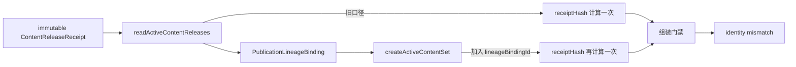
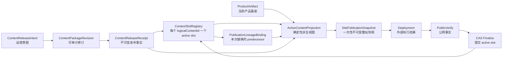
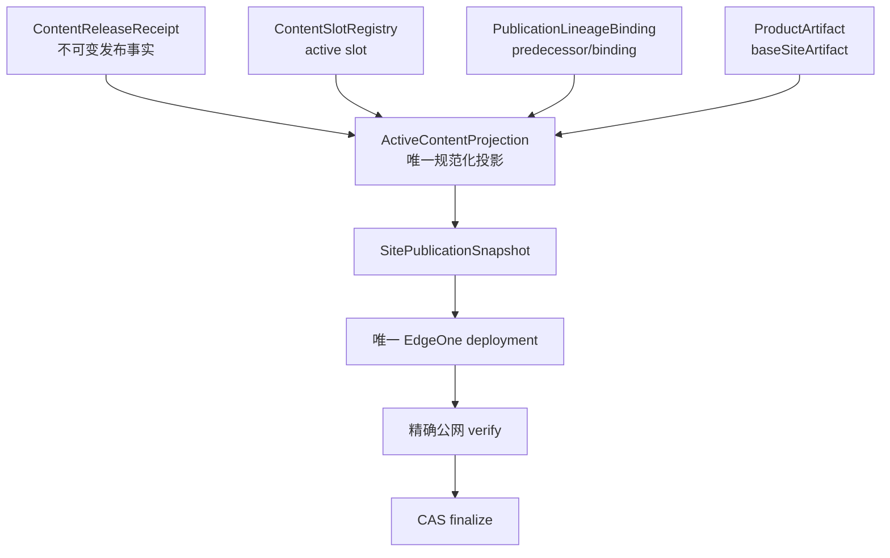
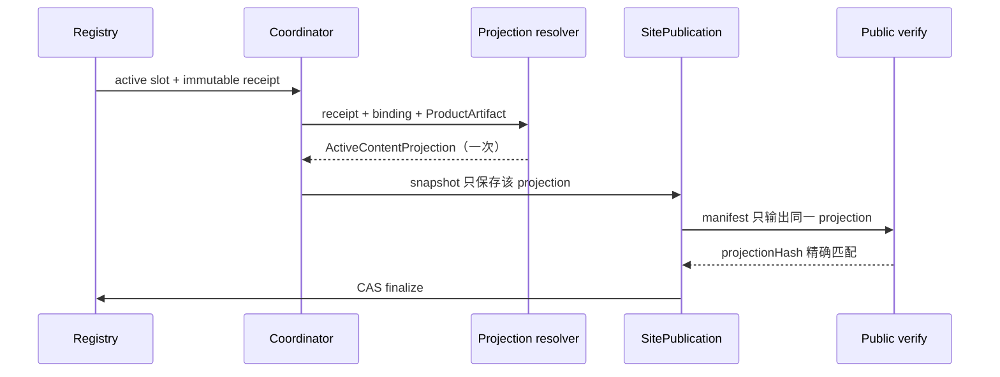
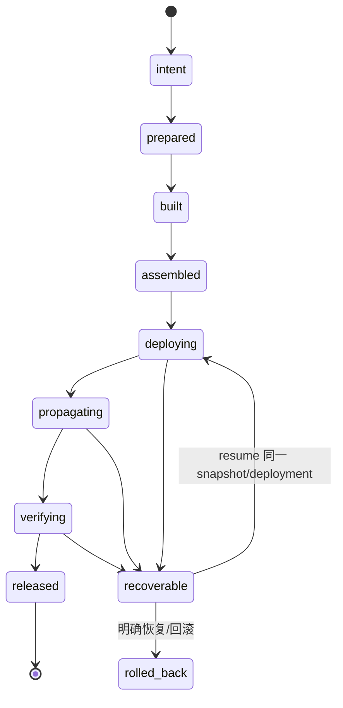
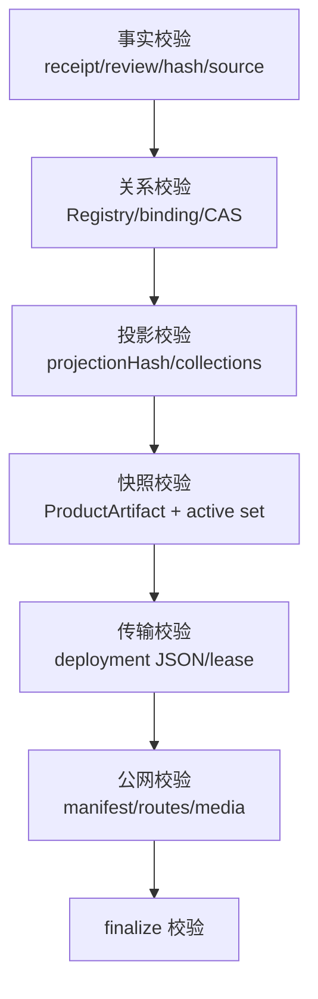
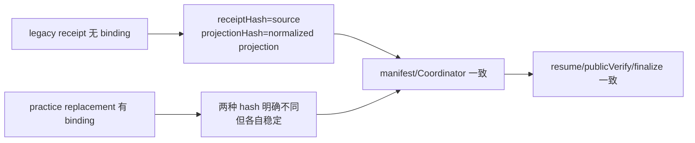

# v0.25.19 内容收据与活动站点投影单一身份方案

状态：产品/视觉正式方案，源自 v0.25.18 transport Incident。
目标：消除同一 active 内容在 Registry、SitePublication 组装和公网验证之间的双重哈希口径；不修改内容正文、审核、媒体、页面或独立运营身份。

## 一、根因结论



问题不是内容 hash、Registry active slot 或网络失败，而是缺少一个明确的“活动内容投影”对象：

1. `ContentReleaseReceipt.receiptHash` 被同时当作 immutable package receipt 身份和 active site projection 身份；
2. lineage binding 是运行时解析事实，却在不同调用点以不同顺序叠加；
3. `readActiveContentReleases()`、`createActiveContentSet()`、Coordinator/publicVerify 各自重新计算投影；
4. 因此同一 `contentReleaseId` 在同一次 SitePublication 中可能产生两个合法但不同的哈希。

这属于对象边界和闭环不变量缺失，不是某个调用点的条件判断错误。修复必须覆盖“事实 → 解析 → 投影 → 快照 → 部署 → 公网证据 → CAS finalize”整条链，不能只让本次 `practice:robotaxi` 通过。

## 二、系统对象与权威关系



### 权威性分层

| 层 | 对象 | 是否可变 | 唯一职责 |
| --- | --- | --- | --- |
| 事实层 | `ContentReleaseIntent`、`ContentPackageRevision`、`ContentReleaseReceipt` | 各自按生命周期推进；已 released receipt 不可变 | 记录运营输入、修订和已验证内容事实 |
| 关系层 | `ContentSlotRegistry`、`PublicationLineageBinding` | Registry 以 CAS 推进；binding 对 SitePublication 不可变 | 记录 logical slot 当前 active 与 predecessor |
| 投影层 | `ActiveContentProjection` | 由纯函数确定性生成 | 将事实和关系投影到当前 ProductArtifact |
| 发布层 | `SitePublicationSnapshot`、`Deployment`、`PublicVerify` | 快照/证据追加；外部 deployment 不回写事实 | 记录一次物理站点发布及公网结果 |

任何下游都不能反向修改上游事实；恢复只能读取既有对象并重建同一投影/快照，不能手写 lineage、hash 或 active。

### 核心不变量

1. 一个 `logicalContentId` 在 Registry 中最多且必须有一个 active slot；替换只能通过 predecessor 明确的 CAS 完成。
2. 一个 released `ContentReleaseReceipt` 的 `receiptHash`、正文、来源、审核、媒体和生命周期事实不可变。
3. `ActiveContentProjection` 只由 `(ProductArtifact, Registry, Receipt, Binding)` 决定；同一输入永远得到同一输出和 `projectionHash`。
4. `SitePublicationSnapshot` 只保存已生成投影；组装后不再重新读取或重新推导 active 集合。
5. `SitePublication` 的 idempotency key 由产品身份、active projection 集合和 snapshotHash 决定；相同 tuple 不得创建第二次 deployment。
6. Deploy Success 不是成功；必须同时有 deployment JSON、整站/目标页面/manifest 的精确公网证据，才允许 finalize。
7. 任一阶段失败只产生 `failed`/`recoverable` 证据，旧 active 不变；resume 只能复用同一 revision、snapshot、lease/deployment 身份。
8. 产品版本变化不重建内容事实；内容变化不创建产品版本；只有能力合同不兼容才阻断并形成产品版本。

## 三、稳定对象边界



### 1. `ContentReleaseReceipt`：不可变事实

- `receiptHash` 永远只表示 package 根 `content-release.json + completion.json` 的不可变身份；
- 不因 Registry predecessor、lineage binding、当前 ProductArtifact 或 SitePublication 改写；
- 旧 receipt、正文、来源、审核、媒体、`contentReleaseId` 和 `contentHash` 不回写。

### 2. `ActiveContentProjection`：活动站点投影

由一个唯一纯函数在进入 SitePublication 前生成，输入固定为：

```text
immutable receipt
+ authoritative ContentSlotRegistry active slot
+ PublicationLineageBinding（如有）
+ current ProductArtifact/baseSiteArtifactId
```

输出固定为：

```text
contentReleaseId
logicalContentId
packageRevisionId
receiptHash                 # immutable receipt identity
projectionHash              # active projection identity
predecessorReceiptId
supersedesPackageId
lineageBindingId
baseSiteArtifactId
target/kind/changedTargets/collections/mediaPaths
```

`projectionHash` 是唯一由 SitePublication、content-manifest、publicVerify 和 finalize 比较的活动投影身份；不得再把带 binding 的投影哈希写回 `receiptHash`。

### 3. 单一生成与消费链



所有下游只能消费 `ActiveContentProjection`，不得再次从 receipt 自己拼接 predecessor、binding 或 hash。

## 四、生命周期与失败恢复



规则：

- `prepared/built` 只属于内容包；`assembled` 以后属于 SitePublication；不能用内容包状态冒充线上状态；
- `recoverable` 保留失败阶段、expected/observed identity、deployment JSON（如已有）和 recoveryId；
- resume 先验证所有输入对象未漂移，再复用同一 SitePublication；禁止“重建一个看起来相同的新包”；
- finalize 是唯一写 Registry active slot 的动作，且必须在精确公网 verify 后执行；
- 任何补偿失败都保留旧 active 和完整 Incident，不删除历史证据。

## 五、分层校验与测试策略



Engineering 必须提供四类证据，而不是只提供一组单元测试：

1. **对象契约测试**：receipt、binding、projection 的字段、hash 和不可变边界；
2. **真实 corpus 测试**：34 active（含 Robotaxi replacement、legacy About package）完整组装，不使用只覆盖一个 slug 的夹具；
3. **故障注入测试**：projection 漂移、binding 漂移、旧 manifest、传播延迟、重复 resume、CAS 竞争、deployment JSON 缺失；
4. **真实闭环测试**：accepted HEAD/tag → 产物身份 → 一次 deployment → 公网双 manifest/目标页/媒体 → atomic finalize。

每层失败必须证明：没有进入下一层、没有重复 deployment、没有污染旧 active、可以用同一 recovery 继续。

## 六、Engineering 实现合同

1. 在现有 `content-release-receipt` 模块内增加规范化投影 resolver；不创建第二套 Registry、lifecycle 或 Coordinator。
2. `readActiveContentReleases()` 解析并缓存每个 active slot 的 `ActiveContentProjection`；`receiptHash` 从 immutable receipt 保留，`projectionHash` 由 resolver 生成。
3. `createActiveContentSet()`、SitePublication assembly、manifest writer、Coordinator publicVerify、finalize 和 resume 全部消费同一投影对象。
4. 新 projection schema 明确区分 `receiptHash` 与 `projectionHash`；旧无 `projectionHash` 的 legacy manifest 只能在读取兼容层中被解释，不能与新投影混合组装。
5. 投影输入、输出和 hash 必须确定性序列化；同一 tuple 重跑必须得到同一 `projectionHash`、SitePublication snapshotHash 和 idempotency key。
6. Registry、binding、ProductArtifact 任一身份漂移、缺失或 CAS 竞争仍硬失败；不得放宽门禁、手改 receipt、手改 manifest 或重建内容包。
7. 失败不改变旧 active；同一 SitePublication resume 复用原 publication/deployment，不重复部署。

## 七、验收合同



- 34 active corpus（含 Robotaxi practice replacement）组装时不再出现 receipt identity mismatch；
- immutable `receiptHash` 在 Registry、package、projection、manifest 中保持一致；
- 带 lineage binding 的 `projectionHash` 在组装、部署、传播、resume、publicVerify、finalize 中保持一致；
- 旧 legacy receipt 可读取，但不会触发每次运行的重新迁移，也不会与新 projection 混用；
- 同一 package/revision/publication 重跑不产生新 deployment；
- projection、binding、ProductArtifact、manifest 任一漂移均在 deployment 前硬失败；
- `profile-about-93ea5608339c4973` 等既有 recoverable package 可复用，不重建正文、媒体或 ChangeSet；
- `npm run check`、`release:prepare/build/check`、专项、closeout、preflight、diff-check 和真实产品公网验证通过后，才恢复内容 task。

## 八、范围与非目标

### 本版本必须改变

- receipt 与 active projection 的对象边界；
- hash 命名与生成责任；
- SitePublication/manifest/publicVerify/finalize 的统一消费路径；
- 相关 schema、回归测试和 capability contract。

### 本版本不得改变

- UI、IA、页面 schema、视觉、路由；
- 内容正文、来源、审核、发布时间、媒体和既有 logical identity；
- 既有 33 条 observation、Robotaxi practice 或 About package 的运营事实；
- EdgeOne 目标、唯一 Coordinator、Registry、CAS、lease 和独立内容生命周期原则。

## 九、版本闭环

```text
v0.25.18 transport incident
→ v0.25.19 当前正式方案
→ Engineering 实现/QA
→ local commit + annotated tag + clean
→ 产品/视觉独立验收
→ product transport/public verify
→ 内容 task 复用既有 About package，再串行处理 Article/Business Observation
```

既有 v0.25.18 tag/history 不回写；内容 task 在 v0.25.19 产品公网完整验证前保持停止。
