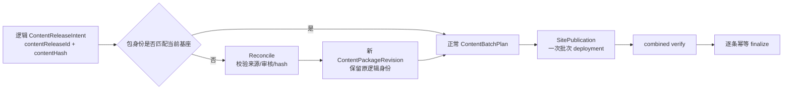

# v0.25.2 内容发布包身份重建与幂等恢复能力

## 根因

v0.25.1 已能批次规划和拒绝身份不一致的包，但没有把“逻辑内容身份”和“物理发布包身份”分开。旧包因此只能被拒绝，不能在不改变内容事实的前提下安全重建。



## 正式对象

| 对象 | 作用 | 身份规则 |
| --- | --- | --- |
| `ContentReleaseIntent` | 内容事实、目标、审核和 hash | `contentReleaseId` 不因包重建改变 |
| `ContentPackageRevision` | 某一 immutable `baseSiteArtifact` 的物理包 | 由 `contentReleaseId + contentHash + sourceHash + baseSiteArtifactId + contractVersion` 确定 |
| `ContentPackageLineage` | 新旧包的 supersedes/recovery 关系 | 旧包只保留事实，不覆盖、不删除 |
| `SitePublication` | 一个物理站点快照及 deployment | 以批次身份和 package revision 建立幂等键 |

## 正式工具入口

保留现有 `content-release` CLI，增加明确的 reconcile 子命令，不创建第二套发布工具：

```bash
node scripts/content-release.mjs \
  --reconcile \
  --release <contentReleaseId> \
  --base-site-artifact <immutableBaseSiteArtifactId>
```

工具必须：

1. 从 canonical/draft/recovery 读取同一内容源，重新计算 `sourceHash`，并与原 `contentHash`、target、review=approved 完全一致；不一致立即硬失败。
2. 生成新的 immutable `ContentPackageRevision`，保留原 `contentReleaseId`、contentHash、审核和内容正文，不生成重复逻辑内容身份。
3. 记录 `supersedesPackageId`、旧身份、失败原因和 recovery；旧包不可变保留。
4. 对相同 reconcile 幂等返回已有 package/sitePublication，不重复 prepare、deployment 或 finalize。
5. 将 reconciled intent 交给既有 `ContentBatchPlan`，沿用分片、lease、combined verify 和逐条 finalize。
6. 只有完整公网证据成立后，才把新 revision 作为该 `contentReleaseId` 的 active package；失败保持原 active 集合不变。

## 当前 nhtsa 场景

`nhtsa-first-responder-requirement` 的 canonical、draft、recovery 和 approved review 一致，属于可重建包，不是内容缺陷。当前旧包的 package manifest 身份过期；应由上述入口以当前 immutable 基座重建后，再进入批次发布。不得重发其余已 active 内容。

## 内容运营台账边界

每日可变的内容数量、package、deployment、publicVerify、draft/review/recovery、失败和恢复事实统一写入被 Git 忽略的 `.content-workspace/operations/content-publishing-ledger.md`。tracked `docs/operations/内容发布运营台账.md` 只保留稳定规则与入口，不再承载运营运行明细，避免内容日常变更污染产品版本 clean 门禁。

## 边界

- 这是产品发布能力版本，不是内容版本；内容 task 只提供已审核 intent 并调用工具。
- 不修改正文、来源、审核事实、publishedAt、UI、IA、路由、schema、组件或上游事实。
- 内容 transport 不递增产品版本；产品版本只承载本能力实现。
- 只有站点协调器调用 EdgeOne；不能直接 transport 旧包。
- 不创建 branch、worktree、task 或 automation。

## 验收合同

1. nhtsa 场景可从旧身份包生成一个新 revision，逻辑 `contentReleaseId` 不变，旧包和 recovery 保留。
2. reconcile 重复执行只返回同一 revision/sitePublication，不产生重复 deployment。
3. 30 条 active 内容场景中，29 条保持不变，nhtsa 通过公网验证后成为第 30 条。
4. source/hash/target/review/base artifact 任一漂移均在 prepare 前硬失败。
5. transport、combined verify、finalize 任一步失败都不污染既有 active，resume 复用同一 publication/deployment。
6. 产品版本、Git tag 和独立内容事实保持分离；`npm run check`、`release:prepare`、专项测试、closeout、preflight 和真实公网恢复验证通过。

## 责任 task

- 产品/视觉主线：`019fc260-e14e-7211-97f1-44e075d0cc0f`
- Engineering 主线：`019fcbf2-20e3-7d51-a4de-87ad7c94b190`
- 内容及发布主线：`019fa166-9645-7532-87f6-99ae4cf9508a`
