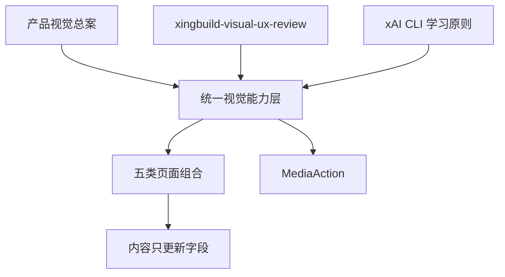
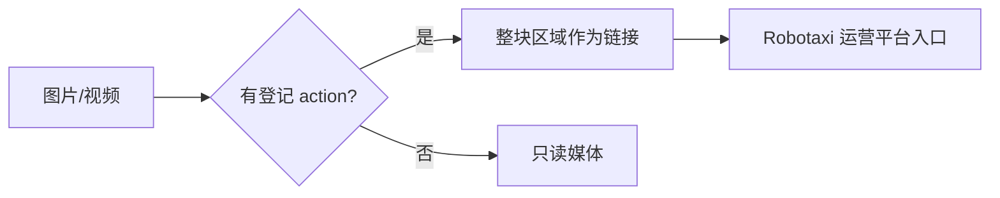

# v0.25.4 全站视觉结构与媒体交互方案

## 目标

把 xingbuild 从“内容与页面局部样式组合”提升为统一的证据驱动编辑型产品作品集。视觉能力负责结构、层级、字体、段落、留白、媒体和交互；内容 task 只更新已登记内容字段。



## 设计权威与学习对象

- 唯一视觉权威：`docs/product/xingbuild 网站产品架构与视觉系统总案.md`。
- 唯一专业评审方法：`xingbuild-visual-ux-review` 六域（Accessibility、Layout、Writing、Typography、Color、UI polish）。
- 唯一外部学习对象：xAI CLI 官网；只学习核心价值先行、能力模块化、工作流阶段化、动作清晰和复杂能力可解释，不复制品牌、终端风格或装饰。
- 视觉方向固定为“证据驱动的编辑型产品作品集”：暖白、编辑式字体、真实证据、克制强调和清晰阅读层级。

## 全站视觉结构

统一 `SiteShell → PageComposition → Visual primitives`，覆盖：

```text
HomeComposition
ShowcaseComposition（/products）
ReadingComposition（/business-observations、/about）
CollectionComposition（/observations）
```

所有组合统一：

- `Identity → Proposition → Proof → Action → Detail` 阅读顺序；
- 字体角色、字号层级、最大阅读宽度、段落节奏和留白；
- 媒体比例、边界、焦点、加载/错误/空状态；
- 桌面、窄屏、390px 移动和 200% 缩放投影；
- 内容缺失时的合法降级，不以假内容或空白舞台填充。

内容 task 不负责字体、段落、换行、间距、卡片、CSS 或媒体布局；新增内容不需要重新设计页面。

## MediaAction 交互合同

复用现有 `media` 与已登记 `action.href`，不新增业务 schema：



- 目标使用已登记的 `https://robotaxi.xingbuild.top/`；不拼接未知登录路径。
- 有 action 时，整个图片/视频区域点击只跳转，不播放、不暂停、不打开原生播放器控制。
- 视频始终不 `autoplay`；有 action 时不显示 `controls`；使用 `preload="metadata"` 或等价策略。
- 链接可键盘聚焦和触发，具有明确 accessible name、`focus-visible` 和安全外链属性。
- 无 action 时只读展示，不制造死链接或无效控件。
- 媒体缺失/失败时显示同源、可读的 fallback。

主要实现面：`SystemStage`、`PracticePage`、`practiceAction`、共享媒体样式/tokens 与现有页面组合渲染。

## 实施边界

- 不新增页面、路由、业务 schema 或第二套样式系统。
- 不修改内容正文、审核、媒体事实、独立 content release、上游事实或产品/内容身份边界。
- 不创建 branch、worktree、替代 task 或并行发布。
- 不引入 Storybook、BackstopJS 等额外平台作为本版本前置；先使用现有浏览器能力、Playwright 截图/DOM 回归和 axe-core 辅助检查。

## 验收合同

1. 五类页面组合视觉层级一致，首屏主角和首要动作明确。
2. 内容字段增长不破坏字体、段落、留白、阅读宽度和响应式结构。
3. `/products` 带 action 媒体点击只跳转 Robotaxi，不播放、不暂停、无原生 controls。
4. 视频 `autoplay=false`，媒体链接、键盘路径、焦点和 accessible name 正确。
5. `/`、`/products`、`/business-observations`、`/about`、`/observations` 覆盖桌面、窄屏、390px、200% 缩放，无横向溢出。
6. 空内容、媒体缺失、加载失败和 Reduced Motion 均有合法状态。
7. Playwright 截图/DOM、键盘、控制台、axe-core 辅助检查通过。
8. `npm run check`、`release:prepare`、专项测试、closeout、preflight、diff-check 和真实页面验收通过。
9. 30 条 active 内容、独立发布能力和产品/内容边界保持不变。

## 责任与后续

- 产品/视觉：维护本方案、验收视觉方向和真实页面。
- Engineering：只按 `current.md` 实现共享视觉能力和 MediaAction，完成自 QA、commit/tag/clean、发布。
- 内容 task：产品上线后只核验既有内容，不重发内容，不修改产品文件。
