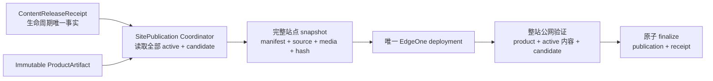
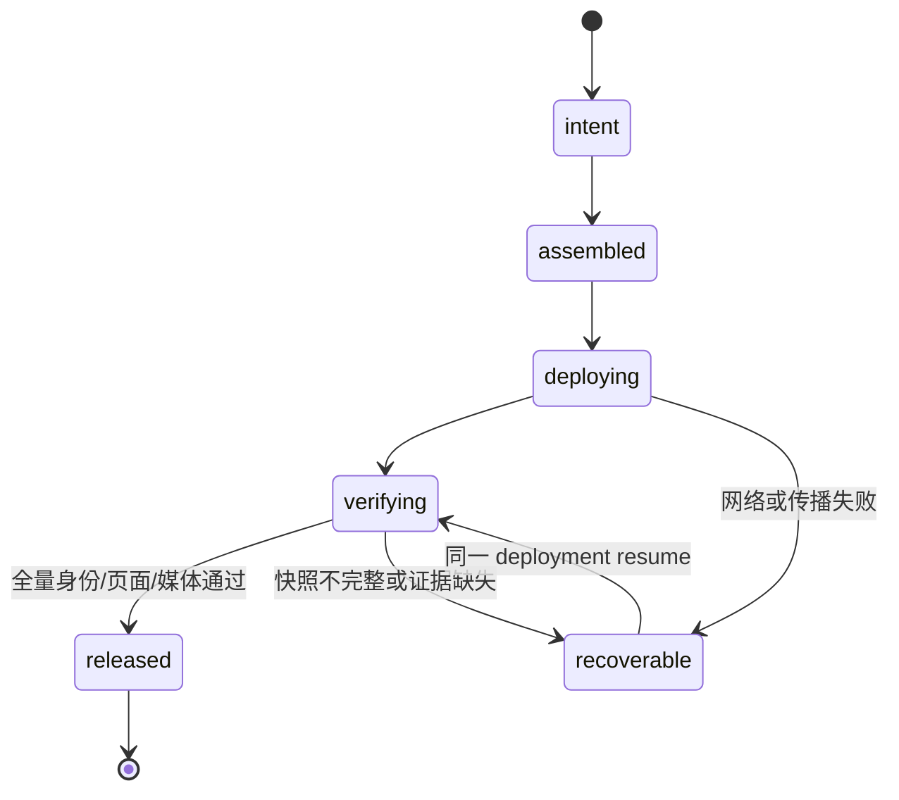

# v0.25.5 内容发布站点快照身份与可恢复发布方案

状态：正式产品方案，来源候选：`XBUILD-CONTENT-RELEASE-003`。

## 1. 用户目标

内容运营必须能够独立、低成本、可重复地发布内容。内容事实、审核、正文和媒体不因产品版本变化而重做；发布工具只有在整站快照已经被公网精确验证并完成收口后，才能报告成功。

本版本只修复内容发布工具与站点快照的产品能力，不修改内容正文、来源、审核、媒体事实、产品视觉或页面结构。

## 2. 已确认根因

2026-08-05 三个新 Brief 的 transport 曾分别返回 deployment/publicVerify，但后续快照没有持续保留它们：

- `content-release.json` 在 transport 后拥有 `baseSiteArtifactId=v0.25.4-99dcd94b08f8`；
- 同一包的 `dist/client/content-manifest.json` 仍为 `baseSiteArtifactId=null`；
- `readActiveContentReleases()` 以两份文件身份一致作为 active 门禁，因此后续快照排除这些包；
- 状态写入还覆盖了 `publishedSlugs`，形成 `activeContentReleaseIds=31` 但 `publishedSlugs=29`。

这不是内容、审核、EdgeOne 账号或网络问题，而是“生命周期事实”和“构建投影”没有原子绑定，导致一次成功的部署不能证明下一次快照仍会保留该内容。

## 3. 目标架构



### 3.1 生命周期事实

`content-release.json` 与 `completion.json` 形成不可变的 `ContentReleaseReceipt`，至少保留：

```text
contentReleaseId / packageRevisionId / contentHash
kind / target / publishedSlugs / publishedArticleSlugs / practiceIds / mediaPaths
baseSiteArtifactId / productVersion / productCommit
sitePublicationId / deploymentId / deploymentJson / publicVerify
state / failure / recoveryId
```

包内 `dist/client/content-manifest.json` 是构建投影，只能做身份一致性校验，不能决定一个 release 是否 active；快照读取不再因旧投影缺字段而静默排除已完成的 receipt。

### 3.2 快照与发布

每次产品或内容发布都由 Coordinator 从当前 `ProductArtifact`、全部 released receipt 和本次 candidate 重新组装完整快照。快照的 `sitePublicationId`、`snapshotHash`、全部 active IDs、slug 列表、媒体路径和基座身份必须在部署前一次性写入。

- 一个站点 lease 内只能存在一个部署中的快照；
- 同一 `sitePublicationId`、`snapshotHash` 和 deployment 只能 resume，不得重复创建部署；
- 公网验证必须同时证明产品身份、全部 active 内容、candidate 目标、页面和媒体；
- verify 未完成不得写 released；验证失败不改变既有 active 集合。

### 3.3 恢复

现有三个 Brief 包保留原 `contentReleaseId`、正文、审核、hash、deployment 和 recovery 证据。能力上线后只能通过 reconcile 重新组装完整快照，不创建新的内容身份，不改正文，不手工改 manifest，不直接重发单包覆盖站点。

## 4. 明确不做

- 不修改 v0.25.4 tag/history、产品 UI/IA/schema/视觉或内容正文；
- 不让产品 build 读取独立内容根；
- 不让内容 task 直接调用 EdgeOne；
- 不以单次 HTTP 200、单次 Deploy Success 或单次页面可见替代整站快照验证；
- 不新增第二个候选、第二套发布 CLI 或后台 CMS。

## 5. Engineering 实现合同

Engineering 只实现本方案，必须覆盖：

1. receipt 作为 active 生命周期唯一事实源；旧 dist 投影缺字段时不能静默丢失 active；
2. snapshot manifest 原子生成，slug/ID/media/hash 与 receipt 完整一致；
3. 单一站点 lease、publication idempotency、deployment resume；
4. transport、传播、verify、finalize 任一阶段失败均保留 recovery，不污染既有 active；
5. 正向验证：历史 active + 三个待恢复 Brief 一次完整快照发布；
6. 反向验证：身份漂移、旧投影、部分 manifest、重复 resume、部署成功但公网未传播均硬失败或可恢复；
7. 产品发布仍只消费 ProductArtifact，内容发布仍不产生产品版本。

## 6. 验收合同



- 公网 `activeContentReleaseIds` 与 `publishedSlugs` 必须由同一份完整快照生成并完全对应；
- 三个新 slug 必须同时出现在 active IDs、slug 列表、目标页面和对应内容证据中；
- 任何一个 active receipt 身份不一致，发布前硬停止，不得隐式丢弃；
- 同一失败恢复不得产生第二个 contentReleaseId 或重复 deployment；
- 旧 active 内容、产品版本、产品发布证据保持不变；
- `npm run check`、release/内容专项、closeout、preflight、真实公网整站验证全部通过。

## 7. 责任与下一步

- 产品/视觉：维护本方案并执行提交后验收；
- Engineering：在 current 纳入后实现、自 QA、commit/tag/clean，并按既有持续授权发布产品能力；
- 内容及发布：保留现有三个 package/recovery/log，能力验收前不重发；验收后按 reconcile 合同恢复；
- Ops：不参与发布恢复。
