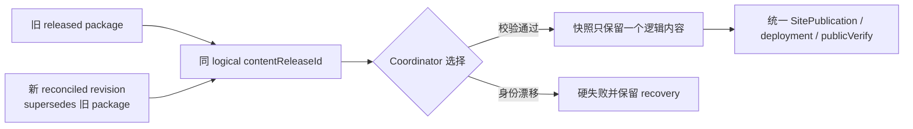
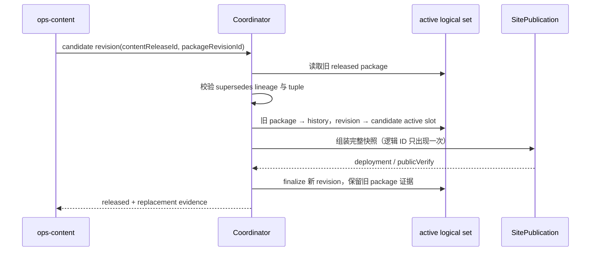

# v0.25.6 内容发布替换 revision 与 active 生命周期方案

状态：正式产品能力方案。父版本：`v0.25.5` / `554526b93e62d589b132308b185d8e40b90e89a0`。

## 1. Xing 的目标

内容事实、审核和原有 `contentReleaseId` 不变；当内容包因产品基座或构建投影变化需要 reconcile 时，新 revision 必须能够替换旧 released 包并继续独立发布，不被“同逻辑身份已 active”错误阻断。



## 2. 已确认根因

`scripts/lib/site-publication.mjs` 在组装 candidate 时只按 `contentReleaseId` 判断是否已 active：

```text
旧 package state=released
+ 新 revision state=recoverable/prepared
+ 同一 contentReleaseId
→ candidate already active
→ transport 未启动
```

这把“同逻辑内容的合法 replacement”误判为“重复内容”。旧包、新 revision、reconcile 事实均未损坏；缺口在 Coordinator 没有消费 `supersedesPackageId`/revision lineage。

## 3. 目标生命周期语义

### 3.1 逻辑身份与物理 revision 分离

```text
logical identity = contentReleaseId + kind + target + contentHash
physical revision = packageRevisionId + revisionHash + baseSiteArtifactId
```

- 一个逻辑内容在同一 SitePublication 中最多出现一次；
- 新 revision 可以 supersede 旧 package；
- 旧 package/recovery/发布证据保留，不覆盖、不删除；
- active reader 选择该逻辑内容当前可用的最高优先级 revision；
- 失败或漂移的 revision 不得替换原 active。

### 3.2 replacement 规则

候选 revision 只有同时满足以下条件才可替换旧 active：

1. `contentReleaseId`、`kind`、`target`、正文 `contentHash` 与旧 active 一致；
2. `supersedesPackageId` 指向旧 `packageRevisionId` 或旧逻辑 `contentReleaseId`；
3. canonical/draft/recovery/review、source hash、target 和 base artifact 通过既有门禁；
4. revision state 属于 `prepared`、`built`、`recoverable`、`transported` 或 `verifying`；
5. 不存在同一 tuple 的身份冲突。

不满足时必须硬失败，不能删除旧 active、不能手工改 manifest、不能创建新的内容身份。

## 4. Coordinator 行为



Coordinator 必须：

- 在 `createSitePublication` 入口统一解析 active 与 candidate replacement；
- 不再用简单 `activeContentReleases.some(id)` 拒绝合法 supersedes；
- 对同一已选 revision 的重复 resume 返回幂等结果，不创建第二个 deployment；
- 生成的 `activeContentReleaseIds`、slug、media、receipt projection 与逻辑内容集合严格一一对应；
- finalize 前失败保持旧 active；finalize 后新 revision 成为 active，旧 package 仅保留 lineage/history；
- 继续由 Coordinator 独占 EdgeOne transport，内容 task 不直接部署。

## 5. 范围与非目标

本版本只修复独立内容发布的 replacement/active 选择能力。

- 不修改内容正文、来源、审核、发布时间、媒体事实或既有 `contentReleaseId`；
- 不修改产品 UI、IA、schema、路由、视觉或产品构建隔离；
- 不移动 `v0.25.5` tag/history，不回写已发布版本；
- 不新增第二套内容 CLI、CMS、候选、branch、worktree 或 scheduler；
- 不让 ops-content 绕过 Coordinator 或手工改 release manifest。

## 6. Engineering 实现合同

1. 新增/调整 active-replacement resolver，按 logical identity 分组并消费 `supersedesPackageId` 与 revision tuple；
2. 旧 released package 与新 revision 同时存在时，快照只选择一个 revision，不报 `candidate already active`；
3. replacement 任何 hash/kind/target/source/review/base 漂移均硬失败；
4. 同 revision 重跑复用既有 publication/deployment，不产生重复部署；
5. 失败 revision 不污染旧 active，recovery 可从原 revision resume；
6. finalize 保留旧 package/recovery/lineage 证据，并使新 revision 成为唯一 active projection；
7. 三个既有 Brief 可以在 v0.25.5 ProductArtifact 上按同一完整 snapshot 串行或批次恢复；
8. 既有产品内容隔离和 SitePublication 全量公网验证合同保持不变。

## 7. 验收合同

- Didi：旧 released + `revision-ace50f5aea5235ee` 可组装，不再在前置门禁停止；
- Ojai：`revision-2bb55e82e07fe0a4` 可按同一 replacement 规则进入快照；
- Waymo service：`revision-d7506767085cfd37` 可按同一 replacement 规则进入快照；
- 三条内容最终同时存在于同一公网 snapshot，active 数量、slug、目标正文、hash、publicVerify、finalize 完整对应；
- 旧 active 内容在任一中断时保持不变；
- 同一 revision resume 不产生第二个 deployment；
- replacement 身份漂移、缺 lineage、旧投影、部分 manifest 均硬失败并保留 recovery；
- `npm run check`、release/内容专项、closeout、preflight、diff-check 和真实公网整站验证通过。

## 8. 责任与下一步

- 产品/视觉：维护本方案并验收 v0.25.6；
- Engineering 主线：实现、自 QA、commit/tag/clean，并按持续授权完成产品能力发布；
- ops-content：在 v0.25.6 能力上线后，从现有三条 revision resume，不改正文、不创建新身份；
- Ops 采集：不参与发布恢复。
