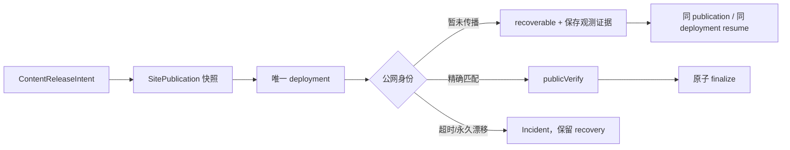

# v0.25.7 SitePublication 传播恢复与内容决策边界方案

## 目标

修复 v0.25.6 真实内容恢复中暴露的发布能力缺口：EdgeOne deployment 已成功，公网快照在传播窗口内暂时与本地 `SitePublication` 身份不一致，Coordinator 过早终止，未能复用同一 deployment 完成 `resume → publicVerify → finalize`。

本版本只修复产品发布能力，不改变内容事实、内容审核结论、`contentReleaseId`、正文、媒体或产品页面能力。

## 产品能力合同

### 1. 传播与身份

- `sitePublicationId`、`snapshotHash`、ProductArtifact、active content receipts 和 candidate 必须来自同一不可变快照。
- HTTP 200 但 `sitePublicationId` 或 `snapshotHash` 暂时不一致，属于传播中的 `recoverable`，不得立即判定为永久失败。
- 每次观测保存 expected identity、public observed identity、时间、attempt 和 deploymentId；不能用自然语言覆盖机器事实。
- 传播窗口结束仍不匹配时才形成 Publish Incident；Incident 必须包含最后一次公网身份和恢复入口。

### 2. 幂等恢复

- `resume` 只能复用原 `sitePublicationId`、snapshot、lease 和 `deploymentId`。
- resume 不重新上传、不创建第二个 deployment、不新建内容身份、不改变 active 内容。
- 公网精确匹配后，Coordinator 执行 `publicVerify` 和原子 `finalize`；在此之前 candidate 保持 recoverable/prepared 事实。
- 既有 active 内容必须在失败、传播等待和恢复期间保持不变。

### 3. 内容与产品边界

- 内容 task 的“待 Xing 决定、发布、删除、暂缓”属于独立运营流程，不写入产品版本状态。
- Coordinator 只执行已确认的 `ContentReleaseIntent`，不决定内容是否可信、不替代 Xing 做编辑决策。
- 产品 publish 与内容 publish 仍由同一 SitePublication Coordinator 串行部署，但身份、生命周期和 owner 分离。

## 明确不做

- 不回写 v0.25.6 tag/history，不修改三条 Brief 的正文、hash、来源、审核或 `contentReleaseId`。
- 不创建新的内容候选、重复 package、替代 task、branch、worktree 或 scheduler。
- 不把内容运营状态并入产品版本，不新增 CMS、第二套发布 CLI 或页面业务逻辑。

## Engineering 实现边界

只修改 Coordinator、内容发布恢复所需的状态投影、机器日志和回归测试；不修改 `src/` 页面、IA、schema、视觉、内容正文和上游事实。实现必须消费当前 ProductArtifact 与既有 active receipts，并支持当前三条 revision 的原 deployment 恢复。

## 验收合同

- 模拟公网传播延迟：首次 identity mismatch 进入 recoverable，不产生第二个 deployment。
- 传播收敛后 resume 使用同一 deployment，精确 publicVerify 并 finalize。
- 永久 mismatch、receipt 缺失、hash/base/target 漂移仍硬失败并保留 recovery。
- Didi、Ojai、Waymo 三条既有 revision 可逐条恢复；active 内容不减少、不重复。
- 工具只有在 `SitePublication=finalized` 且公网身份、目标页面和媒体证据全部匹配时报告成功。
- 产品版本、内容事实、内容运营决定和现有公网 active 内容互不污染。
