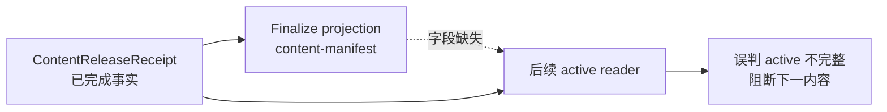
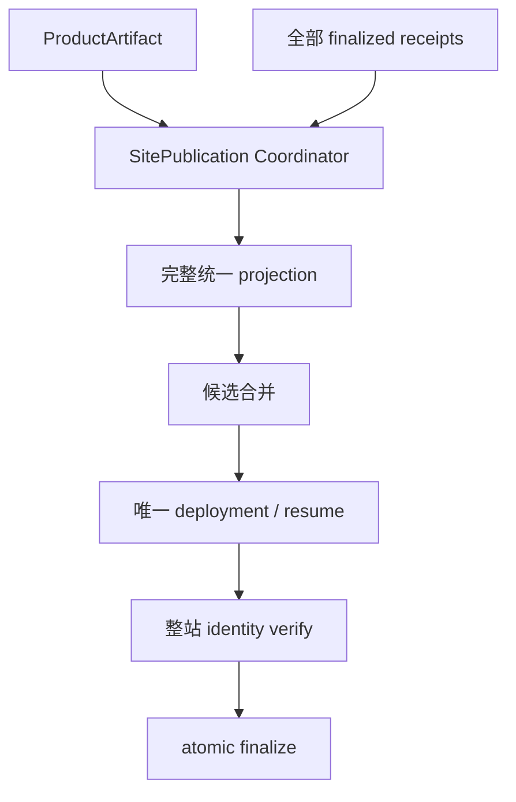

# v0.25.8 ContentReleaseReceipt 投影一致性与 active 快照方案

## 根因

v0.25.7 的传播恢复已经能够在公网身份暂时滞后时复用同一 deployment 并完成 finalize。新的阻断发生在更早的 active 快照组装阶段：Didi 的 finalized `ContentReleaseReceipt` 已完整记录 `publishedSlugs`，但同一 finalized package 的 `dist/client/content-manifest.json` 投影缺少该字段。下一条 Ojai revision 读取 active package 时同时依赖 receipt 与投影，于是把一个合法已完成包判为不完整并停止。



这不是内容正文、审核、hash、账号或传播问题；更深层是把“单条内容包的派生投影”误当成了“整站 active 内容集合”的事实源。

## 目标

让任意已 finalized 的内容包都能作为后续站点快照的稳定 active 输入：



## 正式规则

1. `content-release.json` + `completion.json` 组成不可变 `ContentReleaseReceipt`，是单条 logical content release 的唯一生命周期事实源。
2. 单条 package 的 manifest 只能描述该 package；不得再把它当作全局 active 集合。`dist/client/content-manifest.json` 的全局版本只能由 Coordinator 从全部 active receipts + candidate 一次性组装。
3. Coordinator 生成唯一规范化 `ActiveContentSet`，再生成唯一整站 `SitePublicationSnapshot`；`publishedSlugs`、`activeContentReleaseIds`、`practiceIds`、`mediaPaths` 等全局字段只允许在该整站快照中产生。
4. active reader 读取 receipts/ActiveContentSet；单条 package 的投影只做该 package 的 identity 校验。字段缺失、值不一致或部分全局快照一律阻断，不得静默丢弃已 finalized receipt。
5. 组装新快照必须读取全部 active receipts，再合并 candidate；同一 logical identity 只保留唯一 lineage slot。任何单个旧包不得覆盖或清空前序 active 集合。
6. receipt、ActiveContentSet、SitePublicationSnapshot、finalize 的写入必须原子；失败时保留原 active、candidate、recovery 和 Incident，不得把半成品标为 released。
7. 同一 `sitePublicationId`、snapshot identity 和 lease 可 resume；不得因投影重建重复 deployment。成功仍以 deployment JSON、完整整站 publicVerify 和 atomic finalize 三者同时成立为准。

## 范围与非目标

- 修改 Coordinator 的 receipt registry、规范化 `ActiveContentSet`、整站 snapshot projection、active reader、finalize 和回归测试。
- 保留 Didi 当前 finalized receipt；不改正文、来源、审核、发布时间、contentReleaseId 或 hash。
- Ojai `revision-7e65a94afb3333fa` 保持 recoverable；Waymo service 保持 prepared；能力修复并验收后从原 revision 顺序恢复。
- 不修改产品 UI、IA、schema、视觉、产品版本语义或独立内容运营流程。
- 不手工改 release manifest，不新建内容身份，不重复部署旧 package，不创建 branch/worktree/task。

## Engineering 交接合同

```yaml
productVersion: v0.25.8
parent: v0.25.7/5a983e3aca7ce7cb1cab153b50ee0789d698ea76
contentImpact: compatible
affectedTargets: [content-receipt-projection, active-snapshot-reader, site-publication-finalize]
requiredEvidence:
  - finalized receipt 是单条内容事实；整站 snapshot projection 与全部 active receipts 完全一致
  - Didi finalized 后 Ojai/Waymo 仍能读取全部 active 并只占一个 logical slot
  - 同一 publication resume 不产生第二个 deployment
  - 失败不污染 active，投影漂移硬失败并保留 recovery
```

## 验收

- 用现有 Didi finalized receipt 组装快照，`publishedSlugs` 不为空且与 receipt 精确一致；
- 以 Ojai、Waymo service 原 revision 依次作为 candidate，active 集合始终完整，三条内容各自只产生一个最终 receipt；
- 缺字段、旧投影、部分 manifest、identity 漂移分别触发明确硬门禁；
- Deploy Success 后传播延迟仍可复用同一 SitePublication/deployment；
- `npm run check`、release/内容专项、closeout、preflight 与真实公网整站验证通过；
- 产品 Git 版本与内容运营事实保持独立。

## 当前状态

- Didi：`revision-988ae19646556ba9` 已 `released`，公网验证通过；保留为基线事实。
- Ojai：`revision-7e65a94afb3333fa` `recoverable`，未创建新 deployment。
- Waymo service：既有 revision `prepared`，未 transport。
- 当前不重试内容，待 v0.25.8 能力完成并验收后恢复原 revision。
