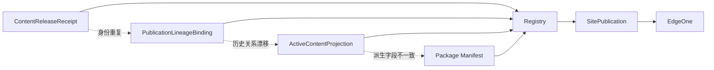
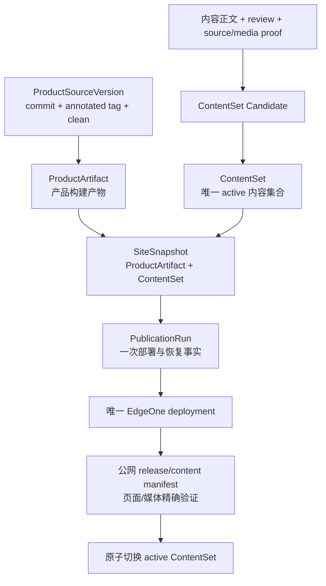
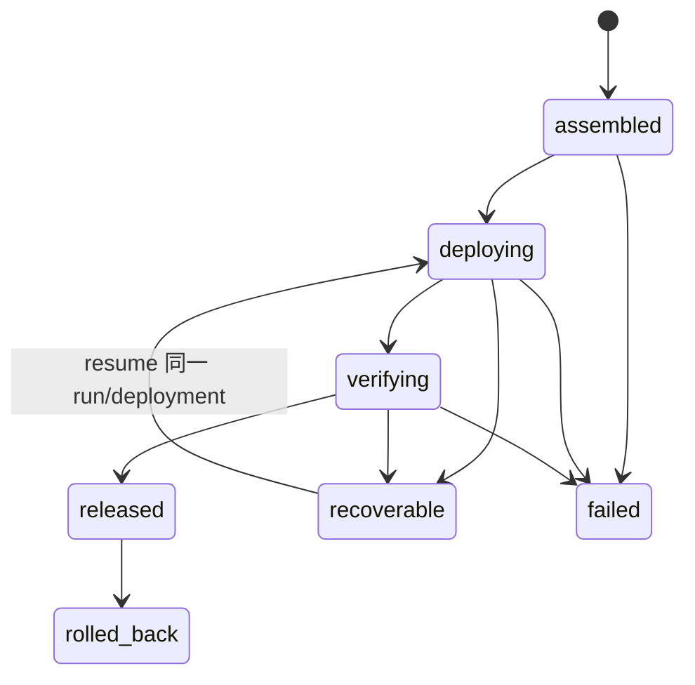
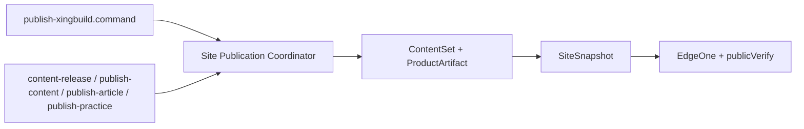

# v0.26.0 发布内核与 ContentSet 架构重构方案

状态：产品/视觉正式方案，Engineering 实现入口。

父版本：`v0.25.19` / `43ab99bea9b3221c3a912bc66102b6491f024284`

## 一、目标与根因

### 目标

在不重写网站页面、视觉系统和内容事实的前提下，把产品发布与独立内容发布收敛为一个简单、可证明、可恢复的站点发布内核：

- 产品版本和内容运营身份继续完全独立；
- 产品更新复用当前内容集合；
- 内容更新复用当前产品产物；
- 每次物理上线只组装一个整站快照、执行一次 deployment、完成一次精确公网验证；
- 失败只保留一个恢复对象，不再通过多条内容历史关系推导当前状态。

### 根因

近期的阻断不是孤立 Bug，而是运行时存在多套 active 权威：



这些对象同时承担事实、active 集合、替换关系、投影和部署状态，导致每次修复只消除一个表象，新的冲突仍会在下一阶段暴露。

另一个独立缺口是 ProductArtifact 曾在最终 commit/tag 前生成，`release:preflight` 又只校验 Git/版本，导致过期产物延迟到 transport 才被发现。本版本一并收口最终构建与产物身份门禁。

## 二、正式架构



### 运行时唯一对象

| 对象 | 唯一职责 | 运行权威 | 不负责什么 |
|---|---|---|---|
| `ProductArtifact` | 最终产品构建和版本身份 | 产品构建产物 | 不保存内容 active 状态 |
| `ContentSet` | 全部可公开内容的不可变集合 | `contentSetId`、`contentSetHash` | 不保存 deployment 状态 |
| `SiteSnapshot` | 产品产物与内容集合的物理站点快照 | `siteSnapshotId`、`snapshotHash` | 不推导历史 lineage |
| `PublicationRun` | 一次部署、传播、验证、恢复和回滚 | `publicationRunId` | 不修改内容正文事实 |
| `AuditLog` | 追加式操作审计 | 事件记录 | 不参与 active 判定 |

### ContentSet 合同

```json
{
  "schemaVersion": "content-set-v1",
  "contentSetId": "content-set-<hash>",
  "contentSetHash": "<sha256>",
  "previousContentSetId": "<id|null>",
  "entries": [
    {
      "entryId": "<stable-id>",
      "kind": "home|profile|product|article|businessObservation|practice|observation",
      "target": "<target>",
      "sourcePath": "<canonical content path>",
      "route": "<public route>",
      "contentHash": "<sha256>",
      "sourceProof": ["<source id>"],
      "reviewProof": {"reviewId": "<id>", "reviewedAt": "<timestamp>"},
      "mediaProof": ["<approved media id/hash>"],
      "legacyAuditId": "<old contentReleaseId|null>"
    }
  ],
  "createdAt": "<timestamp>",
  "migration": {"source": "public-and-local-reconciled|normal-operation"}
}
```

规则：

- `ContentSet` 覆盖所有公开内容类型：Home、Profile、B 端产品、Article、Business Observation、Practice、Observations 和媒体；
- `home` 是首页内容入口，首批迁移 `src/content/siteContent.js` 中的 `description`、`homeTitle` 和空内容文案；`site.name`、导航标签和页面结构仍是产品身份/页面能力，不作为日常内容字段；首页的 B 端产品、经营观察和简讯区继续通过对应 ContentSet entry 引用，不在 Home entry 复制正文；
- 首页迁移完成后，内容 task 修改首页公开文案只生成 ContentSet Candidate，不再修改 `src/content/siteContent.js`；
- active 集合由集合成员关系决定，不再维护每条内容的 active slot、predecessor 或 projection 状态；
- `legacyAuditId` 只为迁移和追溯保留，不参与运行时发布判定；
- 内容 Draft、Review、Recovery 仍由内容运营文档管理，不进入产品版本；
- 已审核但尚未上线的内容只能进入 Candidate，不自动进入 active。

存储：

```text
.content-workspace/content-state/
├── sets/<contentSetId>/content-set.json   # 不可变集合
└── active.json                            # 原子切换指针
```

## 三、生命周期与失败合同

### 内容闭环

```text
Draft → Review → Xing 确认 → ContentSet Candidate
      → SiteSnapshot → 一次 deployment → 公网验证
      → active 指针原子切换
```

### 产品闭环

```text
current → Engineering QA
→ commit + annotated tag + clean
→ final release:build
→ ProductArtifact preflight
→ 产品/视觉验收同一 ProductArtifact
→ 复用 active ContentSet
→ SiteSnapshot → deployment → 公网验证
```

### PublicationRun 状态



硬规则：

- 一个 `SiteSnapshot` 只允许一个 deployment；
- EdgeOne CLI 超时或传播延迟时，保留同一 `PublicationRun`，只能 resume，不新建 deployment；
- 只有 deployment JSON、`release.json`、`content-manifest.json`、目标页面/媒体和 snapshot identity 全部匹配，才允许 `released`；
- 失败不改变旧 active ContentSet；
- 回滚只恢复上一份已验证整站 `SiteSnapshot`，不支持运行时单条内容回滚；
- `AuditLog` 只记录事实，不作为下一次运行的状态输入。

## 四、统一入口与兼容边界

现有命令保留为兼容入口，但不得保留第二条执行路径：



建议内部接口：

```bash
site-publication plan
site-publication publish --snapshot <id> --authorize-publish
site-publication resume --publication <id>
site-publication verify --publication <id>
site-publication rollback --publication <id>
```

- `content:prepare` / `content:build` 只生成和验证 ContentSet Candidate；
- `content-release` 不再创建运行时 content package lineage 状态机；
- 任一兼容入口都不能直接调用 EdgeOne；
- 产品与内容可以独立准备，但 physical transport 始终由一个 Coordinator 串行完成。

## 五、页面能力边界

本次只重构发布内核，不重写页面、视觉、IA 或 React/Vite。

```text
PageDefinition
    ↓
PageComposition
    ↓
共享 Capability Components
    ↓
Visual Tokens / Responsive Rules
    ↓
Content Slots ← ContentSet entries
```

- 文案、媒体、已登记字段变化：只更新 ContentSet；
- 字体、间距、排版、布局变化：属于产品视觉能力，内容工具不变；
- 新增页面空间、模块类型、交互、字段或 schema：进入产品版本并更新 capability contract；
- 组件组合变化但已有 content slot 保持兼容：内容不需要重新发布；
- 删除被内容使用的必需 slot：产品版本必须声明 breaking compatibility，并在发布前提供保留、迁移或合法 fallback；禁止静默丢内容。

## 六、一次性迁移

1. 冻结 v0.25.19 及所有历史 tag/history；不回写旧事实。
2. 暂停内容 transport，保留现有 Draft/Review/Recovery。
3. 双向核对本地 active 内容与公网 `content-manifest.json`：target、hash、路由、媒体、数量和 ProductArtifact identity。
4. 不一致时只生成迁移 Incident，停止，不猜测、不重发。
5. 只把当前公网已验证内容导入首个 active ContentSet。
6. 已审核但未上线内容保留为 Candidate，不自动发布。
7. 旧 receipt、Registry、lineage 和 package 原样保留为只读审计证据；完成迁移后退出正常运行路径。
8. v0.26.0 产品上线并完成公网验证后，再通知内容 task 按 ContentSet Candidate 恢复运营。

## 七、Engineering 实现范围

1. 实现 ContentSet schema、确定性构建、hash、active 指针和 CAS 切换。
2. 实现一次性本地/公网双向迁移检查与导入命令。
3. 重写 Coordinator 的 active 内容读取、SiteSnapshot 组装、PublicationRun、resume、verify、finalize、rollback。
4. 让所有旧入口委托 Coordinator，移除旧 Registry/lineage/projection 的运行时读取；保留只读迁移/审计解释器。
5. 收口 ProductArtifact：最终 commit/tag 后执行 final build，`release:preflight` 精确校验产物身份。
6. 不改变 UI、IA、schema、内容正文、审核、媒体事实和既有页面能力。

## 八、验收标准

- 本地 active 与公网 manifest 一致才能生成首个 ContentSet；不一致硬失败；
- 当前全部 active 内容可生成确定性集合；
- 产品更新复用 active ContentSet；内容更新复用 ProductArtifact；
- 一批内容只生成一个 SiteSnapshot 和一个 deployment；
- Deployment Success 但公网未传播不能返回成功；
- resume 不创建第二个 deployment；
- 失败不改变旧 active；rollback 恢复上一份完整快照；
- 旧 Registry/lineage/release package 不再进入正常运行路径；
- 所有兼容入口最终调用同一 Coordinator；
- 页面组合、视觉、Web/Mobile、空内容和媒体回归全部通过；
- v0.26.0 产品公网完整验证后，才恢复独立内容运营。

## 九、明确不做

- 不继续增加 ContentSlotRegistry、PublicationLineageBinding、receipt/projection resolver 补丁；
- 不创建数据库、微服务、事件总线或第二套后台；
- 不重写历史正文、媒体、审核或旧版本；
- 不把已审核未上线内容自动发布；
- 不创建并行 task、branch、worktree、scheduler 或第二套 Coordinator。
