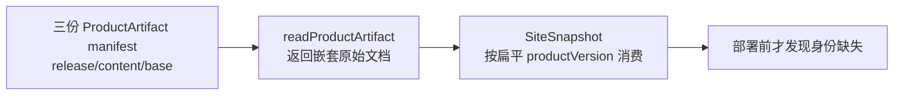
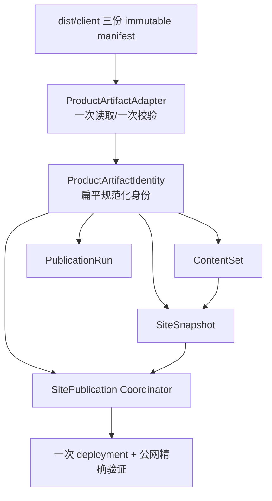

# v0.26.1 ProductArtifact 规范化身份与 SiteSnapshot 契约方案

## 根因结论

v0.26.0 的首次产品 transport 在部署前被门禁阻断，错误不是网络、内容事实或视觉问题，而是发布对象的边界没有被统一：



`readProductArtifact()` 已经验证了三份 manifest 的身份，但返回值仍以 `release`、`contentManifest`、`baseSiteArtifact` 嵌套保存；`createSiteSnapshot()` 需要 `productVersion/productCommit` 的规范化身份。验证与消费使用了两个对象形状，导致同一个 ProductArtifact 在系统内部出现两个解释。

这不是在调用处补一个字段即可长期解决的问题。真正要固定的是：ProductArtifact 只有一个运行时身份对象，所有下游只消费这个对象，原始 manifest 只能由一个边界适配器读取。

## 唯一推荐架构



### 运行时唯一对象

所有产品与内容发布代码只接收：

```yaml
productArtifactId: v0.26.1-<commit-prefix>
productVersion: v0.26.1
productCommit: <40-char-commit>
baseSiteArtifactId: v0.26.1-<commit-prefix>
productArtifactHash: <sha256>
releaseManifestHash: <sha256>
contentManifestHash: <sha256>
sourceBundleHash: <sha256>
```

原始文档保留在适配器内部或 `documents` 只读字段中，禁止任何下游从 `release.version`、`baseSiteArtifact.productVersion` 等嵌套路径自行推导身份。

## 产品能力边界

1. `readProductArtifact()` 负责一次读取、一次身份校验，并返回规范化 `ProductArtifactIdentity` 与只读文档引用。
2. `createSiteSnapshot()` 只接受规范化身份；传入未规范化或缺字段对象必须在组装入口立即失败。
3. ContentSet、SiteSnapshot、PublicationRun、SitePublication 和 Coordinator 复用同一身份对象，不复制版本解析逻辑。
4. `product-artifact-v1` 持久化 manifest 保持可读；适配器是唯一兼容边界，不增加第二套 artifact 生命周期。
5. v0.26.0 已生成的 ContentSet active 指针和 35-entry 迁移事实只读复用，不重新迁移、不重新审核、不重建内容。
6. transport 继续只消费最终 accepted HEAD/tag 的预生成 ProductArtifact；不得在 publish 阶段 build、修改 tracked 文件、改版本或改内容。

## 非目标

- 不移动或回写 `v0.26.0` tag/history；
- 不修改内容正文、审核、媒体、ContentSet entry 或 active 内容集合；
- 不改变页面、IA、schema、视觉合同；
- 不新增第二个 Coordinator、第二条 EdgeOne 路径或新的内容版本；
- 不把网络重试、缓存传播或 deployment 结果伪装成身份修复。

## Engineering 实现合同

### 代码落点

- 在 `scripts/lib/product-artifact.mjs` 增加唯一规范化 resolver/adapter，并让 `readProductArtifact()` 输出稳定身份对象；
- `scripts/lib/site-snapshot.mjs`、`content-set.mjs`、`site-publication.mjs`、`publication-run.mjs`、Coordinator 全部改用同一 resolver 输出；
- 删除下游对嵌套 manifest 身份字段的隐式读取；保留原始文档只用于生成/验证 manifest，不作为身份来源；
- 让 `SiteSnapshot` 在组装入口校验 `productArtifactId/productVersion/productCommit/baseSiteArtifactId` 四元组与 ProductArtifact 完全一致。

### 必须覆盖的测试

```text
三份 manifest → resolver → 规范化身份
规范化身份 → SiteSnapshot → PublicationRun → Coordinator
旧 v0.26.0 artifact 适配可读但不产生第二种运行时形状
缺字段、嵌套字段漂移、四元组不一致在组装前硬失败
同一 ProductArtifact/ContentSet 重复 assemble/resume identity 不变
网络/传播失败只进入 recovery，不污染身份或 active ContentSet
```

## 验收与发布顺序

```text
Engineering 实现与专项 QA
→ v0.26.1 commit/tag/clean
→ exact HEAD release:build + ProductArtifact preflight
→ 产品/视觉验收（视觉无回归、身份链完整）
→ Coordinator product transport
→ deployment JSON + 双 manifest + 页面公网验证
→ SitePublication finalize
→ 才通知内容 task
```

### 通过标准

- `createContentSetSitePublication` 不再出现 `SiteSnapshot productVersion is required`；
- 组装前即可证明 ProductArtifact 四元组，不依赖部署阶段发现；
- 产品发布仍保留 35-entry ContentSet（34 active + home），不丢失已上线内容；
- 失败可恢复、重复 resume 不重复 deployment；
- 产品与内容生命周期仍完全独立，内容 task 不参与本次产品能力修复；
- `npm run check`、`release:prepare/build`、发布专项、closeout、preflight、diff-check 与真实公网双证据全部通过。

## 版本关系

`v0.26.0` 保持冻结：它完成了 ContentSet 内核与一次性迁移，但未形成线上 ProductArtifact。`v0.26.1` 只承载规范化身份与发布闭环修复，不重新设计页面、不重建内容、不回写旧版本。
