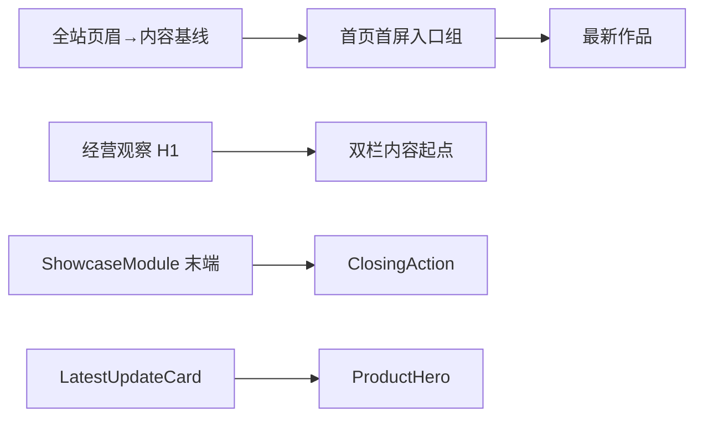

# xingbuild v0.26.10 全站垂直节奏与 ProductHero 密度方案

状态：产品/视觉正式方案，待 Engineering 实现
父版本：`v0.26.9` / `13119436d2a6f0a07f2a3316c3a81c23efd28c4c`
来源：`.content-workspace/design-reserve/XBUILD-VISUAL-ACCEPTANCE-LEDGER-001.md` 的 V-01、V-02、V-03、V-01-A、V-02-A、LatestUpdateCard 与首屏光学居中确认。

## 1. 目标与边界

本版本只收口已经确认的全站空间节奏和 `/products` 产品入口密度，目标是让页面层级连续、间距有单一责任、视觉关系可重复验证：



保持 v0.26.9 的冷白视觉、页面独立 IA、Robotaxi 内容能力、媒体交互、ContentSet 和发布协调器不变。这里只改变页面空间和密度，不改变任何内容事实。

### 明确不做

- 不改全局页眉到普通页面内容的结构基线：Web `48px`、Mobile `32px`。
- 不把首页或任一页面改成 `100vh` 垂直居中。
- 不新增页面、路由、schema、内容字段、媒体字段或发布命令。
- 不共享 Home 与 `/products` 的页面投影、IA、CTA、ClosingAction 生命周期；只共享必要的 spacing primitive/token。
- 不删除或改写 ContentSet、正文、审核、来源、媒体、ContentReleaseId、ProductArtifact、SiteSnapshot、SitePublication 或 Coordinator。
- 不运行内容 prepare/build/transport/finalize，不通知或重发 `ops-content` 内容。

## 2. 正式空间合同

### 2.1 首页 `/`：首屏内容带内的光学居中

首页的有效入口组为：

```text
定位说明 → 两个 CTA → 最新作品标签/Robotaxi 标题
```

全局页眉→普通页面内容起点继续使用 Web `48px`、Mobile `32px`；首页自己的 `Home Hero Focus Group` 采用光学内缩，形成有效上方呼吸 Web `64px`、Mobile `40px`，并与 CTA→最新作品的下方关系对称。

| 关系 | Web | Mobile（390/320） |
|---|---:|---:|
| 定位说明→CTA | `40px` | `24px` |
| CTA→最新作品 | `64px` | `40px` |
| 首页有效上方呼吸 | `64px` | `40px` |
| 最新作品→Robotaxi 标题 | `4px` | `4px` |

`最新作品` 继续是产品内容区左上标签；Robotaxi 标题和说明继续居中。上方和下方的关系必须由一个首页入口节奏 owner 产生，不能再叠加 page composition gap、定位块 margin 和负 margin。

### 2.2 `/business-observations`：页面标题到内容起点

页面 H1 `经营观察` 保持整行居中；下方左侧 `最新经营观察` 与右侧 `最新简讯` 保持同基线、同字号；`企业经营体系` 是更小的文章标题。

| 关系 | Web | Mobile（390/320） |
|---|---:|---:|
| H1→首内容行 | `64px` | `48px` |
| 最新经营观察→企业经营体系 | `16px` | `16px` |
| 最新简讯→第一张简讯卡片 | `16px` | `16px` |

H1→首内容行只能有一个页面入口节奏 owner。保持 S-10/S-11：摘要和架构图暂不投影，但源字段、图片文件和正文 block 保留；关闭后不留空白。

### 2.3 Home 与 `/products`：ClosingAction 上游节奏

Home 和 `/products` 仍是独立页面组合、标题、说明、CTA 和生命周期。只对“完整 ShowcaseModule 结束→ClosingAction 开始”使用同一 spacing primitive，并与相邻完整 ShowcaseModule 间距相等：

| 关系 | Web | Mobile（390/320） |
|---|---:|---:|
| ShowcaseModule→ClosingAction | `96px` | `56px` |
| 相邻 ShowcaseModule→ShowcaseModule | `96px` | `56px` |

Engineering 应移除路由 selector 造成的偶然差异；不得因此把两个页面合并为共享投影，也不得改变 ClosingAction 内部 padding、标题、说明或 CTA 目标。

### 2.4 `/products` ProductHero 与 LatestUpdateCard

`LatestUpdateCard` 是轻量版本标记，不是第二个 Hero 或第二个 CTA：

| 关系/属性 | Web | Mobile |
|---|---:|---:|
| 版本号与“查看最新版”字号 | `13px` | `13px` |
| 卡片高度 | `40px` | `40px` |
| 卡片上下 padding | `8px` | `8px` |
| 卡片底部→Robotaxi 标题 | `24px` | `24px` |
| Robotaxi 标题→说明 | `16px` | `16px` |
| 说明→CTA | `24px` | `24px` |

保留真实 Robotaxi release 版本、`NEW`、`查看最新版` 外链和既有安全属性。40px 触控目标必须保持可聚焦、可点击、文字不换行，并在移动端复验。

## 3. 工程化责任与最小实现面

空间关系遵循“父级 flow 负责同级对象，子对象只负责内部结构”。Engineering 可在现有 tokens、PageComposition、HomeProductProjection、ProductsShowcase、Business Observation composition、LatestUpdateCard、ClosingAction 和 ShowcaseModule/PracticeModuleList 中调整；不得新建第二套样式系统或页面私有补丁。

优先复用已有 `--space-*`、`--showcase-module-gap` 和页面 flow token；只有现有 token 无法表达确认关系时，才新增最小语义 token。每个关系只能有一个 owner，并以 DOM 几何证据证明：

- Home 的定位→CTA→最新作品由一个入口节奏 owner 控制；
- Business H1→首行和两栏内容起点各自只有明确 owner；
- ClosingAction 上游只由共享 spacing primitive 控制，页面投影仍独立；
- LatestUpdateCard 内部密度与卡片→ProductHero 关系不通过额外补偿 margin 实现。

## 4. 内容与发布兼容声明

```yaml
contentImpact: compatible
contentImpactReason: visual-spacing-and-product-entry-density-only
affectedTargets: [home, products, business-observations]
affectedRoutes: [/, /products, /business-observations]
affectedFields: []
compatibilityEvidence: v0.26.9-content-slot-contract-unchanged
```

本版本不改变内容 slot、ContentSet schema、正文、审核、来源、媒体 hash、内容身份或发布工具。现有 active 内容在产品 build 和 Site Publication 组装中保持原样；内容 task 可继续独立运营，不需因本版本重建或重发内容。

## 5. 验收合同

### 5.1 页面与视口

- 路由：`/`、`/products`、`/business-observations`、`/observations`、`/about`。
- Web：`1600×1067`、`1280×1067`；Mobile：`390×844`、`320×844`；必要时等效 200% CSS 视口。
- 五路由 `main=1`、`h1=1`、无横向溢出、无 console/page error。

### 5.2 精确几何与页面语义

- 首页四组间距分别为 `64/40`、`40/24`、`64/40`、`4/4`（按 Web/Mobile 对应），误差 `≤1px`；Hero 与 CTA 主轴对齐。
- `/business-observations` H1→首内容行 `64/48`；左右内容起点 `16/16`；H1 居中、栏目平齐、文章标题层级保持。
- Home 与 `/products` ClosingAction 上游均为 `96/56`，且与相邻 ShowcaseModule 节奏相等；页面 IA、标题、说明、CTA 仍独立。
- LatestUpdateCard 字号 `13px`、高度 `40px`、上下 padding `8px`；卡片→ProductHero `24px`、标题→说明 `16px`、说明→CTA `24px`；真实版本和外链不变。

### 5.3 功能、无障碍与内容边界

- 既有四个 Robotaxi 视频 autoplay/muted/loop、controls=false、离屏暂停、安全外链、键盘 focus 和 Reduced Motion 回归通过。
- `axe` 无新增 violation；文本增长、空内容、媒体失败状态合法；About/Observations 无意外结构变化。
- `npm run check`、`release:prepare`、相关 content/article/practice checks、视觉几何/交互 QA、`release:build`、`release:closeout-check`、`release:preflight`、`git diff --check` 通过；既有环境或 retained fixture 失败分层报告，不得隐藏。
- exact HEAD 上 ProductArtifact 三份 manifest 身份一致；产品/视觉本地 Approve 后才可 transport；产品公网完成后 design-ui 以同一路由/视口独立验收。

## 6. 工作流与下一步

1. Engineering 主线按本方案实现并自 QA，形成 local commit、annotated tag、clean 和 exact ProductArtifact。
2. 产品/视觉主线使用 `xingbuild-visual-ux-review` 做 Web→Mobile 本地独立验收；有 HIGH 差异则定义下一版本，不回写本版本。
3. 本地 Approve 后按既有持续授权执行 product transport；Site Publication Coordinator 是唯一 EdgeOne owner。
4. 公网传播稳定并精确验证后，design-ui 做公网视觉验收；若通过，版本闭环完成。
5. 内容及发布主线与 Ops 不因本版本启动，不重建、不重发既有内容；内容能力和独立生命周期保持可用。
