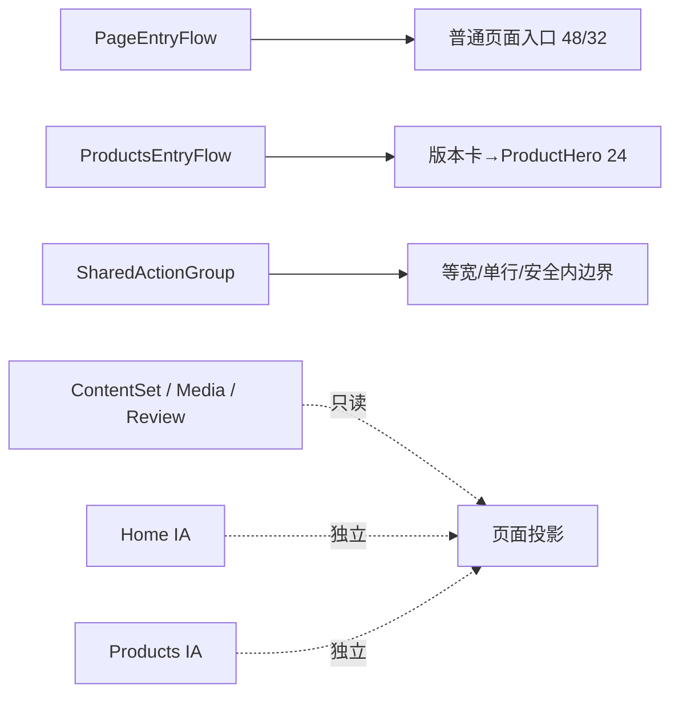

# v0.26.11 公网视觉差异收口方案

## 版本与来源

- 父版本：`v0.26.10` / `253d1d964338bb6f0bb9a53ac272a955f2e2ecb8`
- 变更来源：design-ui 公网独立验收报告 `public-v02610-acceptance/REPORT.md`
- 阻断：`V02610-PUBLIC-01`、`V02610-PUBLIC-02`、`V02610-PUBLIC-03`
- 目标：只收口上一版本已确认视觉契约在公网跨视口投影中的三处偏差；不回写 v0.26.10。

## 方案判断

这不是内容丢失、内容发布失败或页面 IA 重新设计，而是三个关系的 owner 没有在最终 CSS 组合中保持单一：

1. `/products` 的版本卡与 ProductHero 同时贡献了上边距，移动端产生双重间距。
2. 普通页面入口使用了流式/窄屏覆盖值，未兑现已确认的固定 `48/32px` 全局基线。
3. 共享 `ActionGroup` 在 `320px` 的可用宽度下没有为最长 CTA 文案保留安全内边界。

修复必须继续保持 Home 与 `/products` 的页面投影、IA、CTA、ClosingAction 和生命周期独立；只共享 tokens、基础组件和关系测量规则。

## 正式工程合同

### V11-01｜版本卡到 ProductHero 的单一关系 owner

页面：`/products`；组件关系：`LatestUpdateCard → ProductHero h1`。

- `LatestUpdateCard` 底部到 `Robotaxi运营平台` 标题顶部：Web/Mobile/窄屏均为 `24px ±1px`。
- 移动端不得把 `LatestUpdateCard` 的 `24px` 与 ProductHero 的标题上内边距叠加为 `56px`。
- 版本卡、标题、说明和 CTA 的语义与顺序不变。
- 关系由一个明确的 Products entry-flow owner 计算；不得用页面私有 selector 叠加或抵消 margin。
- Home 的独立 Hero 入口与其他 ProductHero 使用不受影响。

验收必须同时测量 card bottom、h1 top 与中间实际间距，不以 wrapper 顶部代替标题位置。

### V11-02｜普通页面入口固定基线

页面：`/products`、`/business-observations`、`/observations`、`/about`。

- 全局页眉底部到普通页面第一可见内容锚点：Web `48px ±1px`，包括 `1280px`；Mobile/窄屏 `32px ±1px`，包括 `390px/320px`。
- 首页继续使用已确认的独立光学入口 `64px Web / 40px Mobile`，不得被普通页面 token 改写。
- 入口关系必须由共享 `PageEntryFlow`/token owner 控制，不能由各页面私有 margin 覆盖。
- “第一可见内容锚点”按页面真实首个 H1、版本卡或页面首段内容测量，不能测空 wrapper。

### V11-03｜共享 ActionGroup 窄屏文案安全边界

页面：`/products`，重点视口 `320×844`。

- 两个 CTA 继续等宽、单行、保持现有语义与安全外链。
- 最长 CTA `进入 Robotaxi运营平台` 的实际文字 Range 必须完整落在按钮内容边界内，左右各保留至少 `4px` 安全内边距；不得出现文字越过按钮边框。
- 共享 `ActionGroup` 负责窄屏适配；不得为 `/products` 创建私有缩放、换行或负 margin 补丁。
- 允许通过共享 action typography/padding token 调整窄屏密度。推荐默认：窄屏 action label `14px`、水平 padding `8px`；若 Engineering 采用等价实现，必须以 DOM Range 证据证明安全边界。
- `390px`、首页 `320px` 以及桌面等宽行为必须回归；页面不能产生横向溢出。

## 架构与边界



- 共享：tokens、基础 primitives、ContentResolver、MediaStage、ActionGroup、测量/QA helper。
- 独立：Home 与 Products 的 composition、布局、CTA、ClosingAction、生命周期和内容投影。
- 本版本不新增页面、路由、schema、内容字段或第二套样式系统。

## 内容兼容声明

```yaml
contentImpact: compatible
contentImpactReason: public-visual-spacing-contract-only
affectedTargets: []
affectedRoutes: [/, /products, /business-observations, /observations, /about]
affectedFields: []
contentSetMigration: false
contentPublish: false
```

禁止修改 ContentSet、正文、来源、审核、媒体事实、ContentReleaseId、content CLI、Coordinator、ProductArtifact/SiteSnapshot/SitePublication 语义；禁止运行 content prepare/build/transport/finalize。

## 验收合同

### 本地 Engineering/产品视觉验收

- 五路由 × `1600×1067`、`1280×1067`、`390×844`、`320×844`；Observations/About 的 `1280px` 必须本轮补齐，不得沿用上一轮 coverage gap。
- V11-01/V11-02 所有间距 DOM 误差 `≤1px`；V11-03 记录按钮 rect、文字 Range、左右安全内边距。
- `overflow=false`、`main=1`、`h1=1`、console/page errors=0。
- Home 既有 `64/40`、`40/24`、`64/40`、`4/4` 和 Home/Products ClosingAction `96/56` 不回归。
- 四视频 autoplay/muted/loop/no-controls、外链、键盘 focus、Reduced Motion、axe 无新增 violation。
- `npm run check`、`release:prepare`、视觉/交互 QA、`release:build`、`release:closeout-check`、`release:preflight`、`git diff --check` 通过；既有 retained failures 分层报告。

### 线上产品/视觉验收

产品 transport 后由 design-ui 对同一 deployment 做五路由四视口公网复验，必须覆盖本方案三项和上一版本全部保持性合同。发现新差异只进入下一版本，不回写 v0.26.11。

## 责任与下一动作

- 产品/视觉主线：本方案与 `current.md` 的唯一 owner，负责本地验收与 publish 授权。
- Engineering：只按本正式合同实现，完成 commit/tag/clean、ProductArtifact/preflight 和 transport。
- design-ui：产品上线后执行独立公网视觉验收。
- 内容/ops-content：本版本完全不参与，保持现有 ContentSet 与发布状态。
