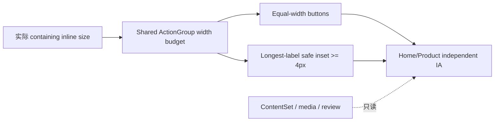

# v0.26.12 共享 ActionGroup 可用宽度与窄屏安全边界方案

## 版本与来源

- 父版本：`v0.26.11` / `cba8406d707a5ec8c8e2a83096965973c3d47766`
- 来源：design-ui v0.26.11 公网独立验收报告 `public-v02611-acceptance/REPORT.md`
- 唯一阻断：`V02611-PUBLIC-01`
- 目标：修复共享 `ActionGroup` 在经典滚动条造成的有效内容宽度缩小时，最长 CTA 文案安全内边界失效的问题；不回写 v0.26.11。

## 根因判断

v0.26.11 本地 overlay scrollbar 下，`/products` 320px ActionGroup 可用宽度较大，文字左右余量约 `4.2px`；公网经典 scrollbar 下，页面 `clientWidth` 少于 `innerWidth`，同一 `width: 100%` 组合被进一步压缩，按钮从 `140px` 收缩为 `132.5px`，文字余量只剩约 `0.45px`。

因此根因是：

1. `ActionGroup` 只消费父容器的表观百分比宽度，没有把滚动条后的实际可用 inline width 作为共享布局预算。
2. 本地 QA 只覆盖了 overlay scrollbar，未覆盖经典 scrollbar 的真实可用宽度。
3. “等宽、单行、文字安全边界”没有被建模为同一组件的可验证能力。

本版本不改变文案、不修改页面 gutter、不创建 `/products` 私有 CSS 补丁，也不通过继续缩小文字来掩盖可用宽度问题。

## 正式工程合同

### V12-01｜共享 ActionGroup 可用宽度预算

- `ActionGroup equalWidth` 必须基于实际可用的 containing inline size（等价于 `clientWidth` 约束后的内容宽度）计算，而不是基于 `innerWidth`/viewport 宽度假设。
- 在 overlay scrollbar 与 classic scrollbar 两种环境下，组件必须得到相同的安全结果：不越出视口、不产生横向溢出、保留页面既定 gutter 语义。
- 组件可用共享 token/安全轨道（safe rail）为窄屏等宽按钮提供额外预算；该能力必须属于共享 `ActionGroup`，不能由 Home 或 `/products` 页面私有 selector 实现。
- 桌面与 `390px` 既有按钮尺寸、等宽关系和文字层级保持不变；只在实际可用宽度不足时进入共享窄屏安全模式。

### V12-02｜最长 CTA 安全内边界

页面：`/products`；视口：`320×844`。

- 两个 CTA 继续等宽、单行，语义和 Robotaxi 安全外链不变。
- “进入 Robotaxi运营平台”文字 Range 左右距按钮内容边界各 `≥4px`，目标在 overlay/classic scrollbar 下均成立，允许误差 `≤0.5px`。
- 按钮不得通过 `overflow:hidden`、裁切、负文字偏移或缩放伪造通过；文字必须真实位于按钮内。
- `/products` 320 的 ActionGroup 不能产生正向 horizontal overflow；按钮可用宽度不能依赖当前浏览器是否绘制滚动条。

### V12-03｜可复现测量与回归矩阵

Engineering 必须同时生成两种布局环境的证据：

1. overlay scrollbar/默认本地浏览器；
2. classic scrollbar/强制 `clientWidth < innerWidth` 的浏览器运行。

每种环境均测量：`innerWidth`、`clientWidth`、ActionGroup rect、两个 button rect、最长文案 Range、左右安全内边距、`scrollWidth`。不得只报告一个环境的 PNG 或只报告 `overflow=false`。

## 架构边界



- 共享：`ActionGroup`、tokens、可用宽度预算、测量 helper、QA runner。
- 独立：Home 与 Products 的 composition、CTA 语义、ClosingAction、生命周期。
- 不新增页面、路由、schema、内容字段或第二套样式系统。

## 内容兼容声明

```yaml
contentImpact: compatible
contentImpactReason: shared-action-layout-runtime-only
affectedTargets: []
affectedRoutes: [/, /products]
affectedFields: []
contentSetMigration: false
contentPublish: false
```

禁止修改 ContentSet、正文、来源、审核、媒体事实、ContentReleaseId、content CLI、Coordinator、ProductArtifact/SiteSnapshot/SitePublication 语义；禁止运行 content prepare/build/transport/finalize。

## 验收门禁

- 五路由 × `1600×1067`、`1280×1067`、`390×844`、`320×844`，overlay/classic 两种滚动条环境均采集。
- `/products` 320 CTA 的两个按钮等宽、单行；最长文案安全边界 `≥4px`；`scrollWidth=clientWidth`，且无文字越界。
- Home `64/40`、`40/24`、`64/40`、`4/4`，普通页面 `48/32`，Products 卡片→标题 `24`，ClosingAction `96/56` 全部不回归。
- 五路由 `main=1`、`h1=1`、console/page errors=0；四视频行为、安全外链、键盘 focus、Reduced Motion、axe 无新增 violation。
- `npm run check`、`release:prepare`、视觉/交互 QA、双滚动条证据、`release:build`、`release:closeout-check`、`release:preflight`、`git diff --check` 通过；既有 retained failures 分层报告。
- exact HEAD ProductArtifact 后产品/视觉本地 Approve 才可 transport；公网完成后 design-ui 对同一 deployment 独立复验；内容不重发。

## 责任与下一动作

- 产品/视觉主线：维护本方案/current，执行本地独立验收与 publish 授权。
- Engineering：只实现共享 ActionGroup 可用宽度预算，完成 commit/tag/clean、双环境 QA、ProductArtifact/preflight 和 transport。
- design-ui：产品上线后执行五路由四视口公网复验，重点核对 V12-01～03。
- 内容/ops-content：本版本完全不参与，保持现有 ContentSet 与发布状态。
