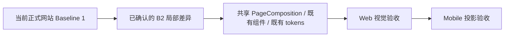

# v0.26.2 全站视觉 Baseline 1→2 差异与组件契约方案

状态：正式产品方案

父版本：`v0.26.1` / `e0b1fae8a738a6d442cbd1235b431b530824ca8a`

## 1. 目标与边界

本版本只把 Xing 已确认的 Baseline 1 → Baseline 2 局部差异转为可实现、可验收的页面能力合同。Baseline 1 是当前正式网站；Baseline 2 只叠加本文件列出的差异，未列出的视觉、结构和内容全部保持不变。



本版本不改变产品定位、业务事实、路由、IA、schema、ContentSet、内容正文、审核、媒体事实或独立内容发布身份；不回写 v0.26.1。

## 2. 统一视觉基线

- 冷白页面、专业克制的现有网站风格继续作为唯一基线。
- 不使用装饰线、分割线、纯黑按钮、纸张式大卡片、厚重阴影、炫光或整站浮起。
- 只有真实媒体窗口使用既有轻微环境阴影；简讯、长文、观察集合和 About 正文保持近乎平面。
- 复用现有 PageComposition、ShowcaseModule、ObservationRail、RichDocument、ClosingAction 和 tokens，不新增第二套 CSS 或页面私有布局。
- 统一辅助文字为产品总案定义的 `#64748B`；不改变字体家族和主色。

## 3. 页面差异合同

| ID | 路由 / 组件 | 允许修改 | 保持不变 |
| --- | --- | --- | --- |
| B2-HOME-01 | `/` / ProductHeading | 在 `Robotaxi 运营平台` 左上增加 `最新作品`；与标题使用现有 `--space-1`（4px）紧邻 | 不创建新 section，不增加大段垂直空间 |
| B2-HOME-02 | `/` / ClosingAction | 产品内容结束后保留既有底部行动区，使用现有浅色底 | 不白底化、不加媒体阴影、不新增边框 |
| B2-HOME-03 | `/` / ObservationRail | 标题统一为 `最新观察简讯`，末尾增加 `更多观察` | 不改观察正文、来源和数据 |
| B2-PRODUCT-01 | `/products` / LatestUpdateCard | 保留 `NEW + v... + 查看最新版`；查看最新版跳转已登记的 `https://robotaxi.xingbuild.top/` | 不加入长版本说明，不改变版本事实来源 |
| B2-PRODUCT-02 | `/products` / ProductHero | 未使用的眉题、边界说明槽位视觉上收紧；组件槽位仍保留 | 不删除 schema、字段或产品语义能力 |
| B2-PRODUCT-03 | `/products` / ShowcaseModule | 手机端说明在上、媒体在下；同模块间距 `20–24px`，跨模块间距 `56–72px`；空 label 不留占位 | 不改变四个 module、mediaId 或内容事实 |
| B2-PRODUCT-04 | `/products` / ClosingAction | 桌面左右布局，手机上下布局；操作按钮等宽且单行 | 不改变 CTA 目标、浅色底和已有行动语义 |
| B2-OBS-01 | `/business-observations` / PageHeader + ObservationRail | 左侧 `经营观察`，右侧 `最新简讯` 平齐；`企业经营体系`仅作为文章标题 | 不增加说明文字，不把文章标题当页面 H1 |
| B2-ABOUT-01 | `/about` / RichDocument | 保持连续阅读、近乎平面的冷白表面 | 不新增卡片、联系区或页面私有布局 |
| B2-GLOBAL-01 | 全站 / shared tokens | 辅助文字使用 `#64748B` | 不换字体家族、不改主色和已确认内容 |

页面能力关系：`SiteShell → PageComposition → 共享组件 → 已登记内容槽位`。这次只调整共享组件的组合、可选槽位和 token，不为每个页面制造个性化实现。

## 4. 内容与产品兼容合同

```yaml
contentImpact: compatible
contentImpactReason: visual-layout-and-token-only
affectedTargets: [home, practice, article, businessObservation, profile, observation]
affectedRoutes: [/, /products, /business-observations, /observations, /about]
affectedFields: [page-heading-slot, observation-rail-heading, closing-action-layout, shared-muted-text-token]
compatibilityEvidence: v0.26.2-baseline-1-2-delta
```

内容 task 继续只填写既有 ContentSet 字段；不需要重新生成内容、不改变 `contentSetId/contentSetHash`，不重发已发布内容。若实现中发现需要新增字段、路由、schema 或改变媒体合同，必须停止并另形成产品能力方案。

## 5. Engineering 实现合同

1. 只复用既有 PageComposition、ShowcaseModule、ObservationRail、RichDocument、ClosingAction 和共享 tokens。
2. 空眉题、空边界和空 label 必须条件渲染并自动收紧，不使用 `visibility:hidden` 保留空白。
3. 首页与 `/products` 继续读取同一 B 端产品结构化对象；页面差异只体现在已登记标题和 CTA 投影。
4. `--shadow-media` 只能用于 MediaStage；阅读内容和 ClosingAction 不复用媒体阴影。
5. 保持每页一个 H1：首页产品标题、经营观察页面标题、About 页面标题责任清楚。
6. 版本号继续读取真实 Robotaxi 产品版本事实；不得由内容 task 管理。
7. 不修改 ContentSet、内容正文、审核、媒体、ProductArtifact 或 SitePublication 逻辑。

## 6. 验收合同

产品/视觉使用 `xingbuild-visual-ux-review` 做独立验收，并保留图形证据：

- Web：`1600×1067`；手机：`390×844`；窄屏：`320px`；另做等效 200% 缩放验证。
- 五路由 `/`、`/products`、`/business-observations`、`/observations`、`/about`：每页一个 H1、无横向溢出、无控制台错误。
- 首页显示 `最新作品 → Robotaxi 运营平台 → ClosingAction → 最新观察简讯 → 更多观察`。
- `/products` 版本入口跳转 Robotaxi；四个模块的说明/媒体关系与空槽位收紧正确。
- `/business-observations` 标题行左右平齐；`企业经营体系`不承担页面 H1。
- `/about` 连续阅读结构稳定；阅读内容无媒体同款厚重阴影。
- 键盘焦点、按钮可访问名称、Reduced Motion、自然换行通过。
- 38-entry active ContentSet、33 条观察、article/profile/businessObservation/practice 身份保持不变；不运行内容发布。

## 7. 明确不做

- 不重造视觉系统，不复制参考站品牌或页面。
- 不改产品路由、IA、schema、业务逻辑或上游事实。
- 不修改内容正文、审核、来源、媒体和 ContentSet。
- 不新增页面、候选、task、branch、worktree、scheduler 或第二套发布器。
- 不在 v0.26.1 上回写；本方案完成后由 Engineering 形成新的产品版本闭环。

## 8. 视觉来源与证据

- 已确认视觉稿：`/Users/kingjin/.codex/visualizations/2026/08/05/019fd068-cd5d-7f30-9642-32d0589a4953/confirmed-visual-design/BASELINE-1-2-DELTA-REVIEW.md`
- 视觉交接：`XBUILD-VISUAL-DESIGN-HANDOFF.md`
- 专业验收方法：`xingbuild-visual-ux-review`
