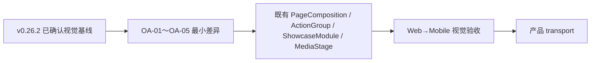

# v0.26.3 Baseline 2 视觉验收差异收口方案

## 版本定位

本方案继承 v0.26.2 的 Baseline 1→2 视觉系统，只收口正式公网验收发现的 OA-01～OA-05。
它不是新的视觉方向，也不改变页面架构、ContentSet、内容发布或 Site Publication。



## 根因判断

这不是全站重构，也不是内容事实错误，而是 v0.26.2 实现阶段有 5 个投影层偏差：

1. 首页错误复用了产品页 CTA 语义；
2. Hero ActionGroup 仍按文案 intrinsic width 展开；
3. ShowcaseModule 同时显示相同 group 与 label；
4. 空 boundary 与 ClosingAction 默认 eyebrow/摘要未收紧；
5. MediaStage 仍使用双层、过宽的媒体阴影。

这些问题都应在共享组件或页面投影层修正，不应由内容 task 改正文、删字段或创建新媒体。

## OA-01～OA-05 正式合同

| ID | 责任位置 | 必须变化 | 保留能力 |
| --- | --- | --- | --- |
| OA-01 | 首页 `ActionGroup` 投影 | 主 CTA 文案为“查看最新B端产品”，目标为 `/products`；次 CTA 仍为“浏览经营观察”。`/products` 才显示“进入 Robotaxi运营平台”并指向登记外链。 | 既有 action schema、路由和安全外链校验 |
| OA-02 | Hero `ActionGroup` 组件 | 同一 Hero action 组的两个按钮共享同一有效宽度；宽度由最长标签与共享 padding/tokens 确定，不由页面私有 CSS 决定。桌面与移动均等宽，390/320px 保持单行、无溢出。 | ClosingAction 的单按钮/移动堆叠行为 |
| OA-03 | `ShowcaseModule` 视觉投影 | 当 `group` 为空，或 `group === label` 时隐藏视觉 label；只保留模块标题、说明和媒体。`group` 字段及组件能力继续保留，只有真正不同的分类才显示。 | registry、schema、内容字段和未来不同分类 |
| OA-04 | `ProductHero` / `ClosingAction` 投影 | 当前产品页不渲染 boundary；空槽位自动收紧。ClosingAction 保留结构和 Robotaxi 入口，但隐藏未确认的默认“继续进入”和重复摘要；不删除字段或组件能力。 | ClosingAction、boundary 字段、未来有明确内容时的投影 |
| OA-05 | `MediaStage` | 媒体只保留单层、低扩散、低透明度的轻阴影；正文、简讯、长文、About、ClosingAction 继续无媒体阴影。 | 媒体窗口、fallback、action、响应式比例 |

## 影响边界

```text
产品版本：影响 v0.26.3 产品视觉投影
内容事实：不改正文、审核、来源、媒体、ContentSet、contentHash
内容运营：不需要重新 prepare/build/transport/finalize
发布架构：不改 ProductArtifact、SiteSnapshot、SitePublication、Coordinator
页面能力：增强共享组件条件投影，不新增页面、路由或第二套样式系统
```

## Engineering 实现约束

1. 只修改既有 `PageComposition`、`ActionGroup`、`ShowcaseModule`、`ProductHero`、`ClosingAction`、`MediaStage` 及其 tokens/styles；不创建同义组件。
2. 首页与产品页使用明确的页面投影配置，禁止用同一个产品页 CTA 文案覆盖首页语义。
3. 等宽按钮必须是共享 ActionGroup 能力；不得为首页和产品页分别写宽度补丁。
4. label/boundary/eyebrow/summary 只能条件渲染收紧，不得用隐藏占位保留空白。
5. 阴影只改 `MediaStage` token；不得把阴影扩散到文章、简讯或行动区。
6. ContentSet 与内容发布合同保持只读消费；不改 `.content-workspace` 内容事实。

## 验收合同

- 复用正式验收相同视口：1600×1067、390×844、320px；五路由 `/`、`/products`、`/business-observations`、`/observations`、`/about`。
- 首页 CTA 精确为“查看最新B端产品”→`/products`；产品页 CTA 精确为“进入 Robotaxi运营平台”→登记 Robotaxi 外链。
- Hero action 组按钮宽度相等，390/320px 文案单行且无横向溢出。
- 四个模块在 `group===label` 时只显示一次标题；字段和未来异类 group 仍可显示分类。
- 产品 Hero 不显示 boundary；ClosingAction 不出现默认“继续进入”或重复摘要。
- MediaStage 仅一层轻阴影；正文/简讯/About/ClosingAction `box-shadow: none`。
- DOM、截图、computed style、console、键盘焦点、Reduced Motion 和 ContentSet 隔离均有证据。
- `npm run check`、视觉专项、站点 QA、closeout、preflight、exact build 通过后，才进行独立视觉验收。

## 非目标

- 不回写 v0.26.2 或更早版本。
- 不重新设计颜色、字体、页面 IA、内容对象或媒体合同。
- 不重发既有内容，不通知 ops-content 重新运营。
- 不创建分支、worktree、并行发布器或新的内容身份。
