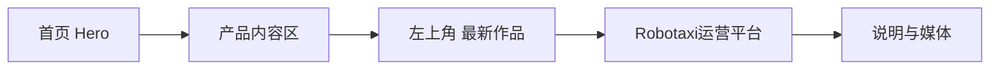

# v0.26.4 H-02 首页产品内容区标签位置方案

## 版本定位

本方案只修复候选 `XBUILD-VISUAL-ACCEPTANCE-LEDGER-001` 的 H-02，不改变 v0.26.3 已冻结的其他视觉合同、内容事实或发布架构。



## 根因

`最新作品` 当前作为 `ProductHero` 的居中 `heroEyebrow` 渲染，导致产品内容区的身份标签错误占用首页 Hero 中轴。它应属于产品内容区的局部标签，而不是全页 Hero 眉题。

## 正式合同

- 首页产品内容区保留 `最新作品`。
- 标签位于产品内容区左上角，与 `Robotaxi运营平台` 标题形成紧密垂直关系，使用既有 `--space-1`（4px）间距。
- 标签不再居中，不进入首页 Hero 的个人定位、说明或 CTA 中轴。
- 标签移动后不产生额外大段空白、重复 margin 或空 DOM 占位；产品标题、说明、媒体和四个模块的顺序保持不变。
- `/products` 不新增该标签；全局 Header 的 `B端产品` 菜单保持不变。
- 继续复用既有 `PageComposition`、`ProductHero`、`ShowcaseFlow` 与 tokens，不新增页面、路由、schema 或第二套样式系统。

## 页面结构

```text
首页 Hero：个人定位 → 说明 → 两个 CTA
首页产品内容区：最新作品（左上） → Robotaxi运营平台 → 说明 → 媒体/模块
/products：NEW/版本/查看最新版 → Robotaxi运营平台 → 说明 → CTA → 媒体/模块
```

## 不变范围

- 不修改 ContentSet、正文、审核、来源、mediaId、媒体文件或内容 hash。
- 不修改 v0.26.3 tag/history，不回写旧版本。
- 不修改 SitePublication、Coordinator、ProductArtifact 或独立内容发布合同。
- 不通知或运行 ops-content；产品上线后内容继续沿用既有 active ContentSet。

## Engineering 合同

1. 只调整首页产品内容区的投影位置与间距；禁止通过首页私有大段负 margin 或固定坐标补丁实现。
2. `最新作品` 必须是产品内容区结构中的标签节点，和标题同一内容列/起点；不作为全页 Hero eyebrow 传入。
3. Web `1600×1067`、Mobile `390×844`、窄屏 `320×844` 均需验证标签左对齐、标题后紧邻、无横向溢出和无空占位。
4. `/products`、经营观察、观察详情、About 的既有视觉合同不得回归。

## 验收

- H-02：三种视口截图中，`最新作品` 位于首页产品内容区左侧起点，距 `Robotaxi运营平台` 标题 4px；不在 Hero 中轴。
- 首页 Hero 仍只显示个人定位、说明与两个 CTA。
- 五路由 `main=1`、`h1=1`、无横向溢出、无 console/page error。
- 运行 `npm run check`、`release:prepare`、视觉/站点 QA、`release:closeout-check`、`release:preflight`、`git diff --check`。
- 完成 clean commit/tag 与 ProductArtifact 后，由产品/视觉按 `xingbuild-visual-ux-review` 独立 Web→Mobile 验收；通过后才允许 product transport。
