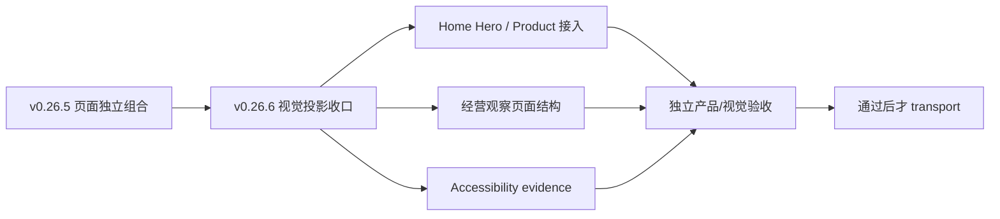

# v0.26.6 视觉验收收口与经营观察页面投影方案

## 目标

在保留 v0.26.5 页面独立接入架构的前提下，一次性收口独立视觉验收发现的页面布局、投影和可访问性问题。v0.26.4 继续在线；v0.26.5 不 transport；内容运营、ContentSet 和发布工具不因本版本暂停或重发。

## 根因与范围

v0.26.5 已解除 Home 与 `/products` 的页面编排耦合，但复验发现旧视觉合同未完整投影：Hero ActionGroup 桌面偏移、Home ProductHero 被错误设为 start、经营观察页 H1/栏目层级仍嵌在双栏主栏、摘要与图形仍被渲染，以及对比度证据不完整。

本版本只修正页面投影和证据，不改内容事实。

## 正式合同

### Home

- Hero 两个 CTA 等宽、同高、同一行；桌面 ActionGroup 的几何中心必须与 Hero 主视觉轴重合，390px/320px 仍单行且不溢出。
- `最新作品` 保持在 Home 产品内容容器左上角；它与产品内容区垂直间距为 4px。
- `Robotaxi运营平台` 标题和说明保持独立居中，不因标签左上锚定而使用 `align=start`。
- Home 的内容接入、CTA 和 ClosingAction 仍由 `HomeProductProjection` 独立持有。

### `/business-observations`

- `经营观察` 是整行居中的页面 H1，不放在双栏主栏内。
- H1 下方建立栏目标题行：左侧 `最新经营观察`，右侧 `最新简讯`，同基线、同字号。
- `企业经营体系` 只作为左侧文章标题，字号低于页面 H1，并收紧与正文的距离。
- 暂不显示文章摘要投影；保留源字段供内容 task 后续更新。
- 暂不显示架构图投影；不删除图片文件、不删除正文 block、不改变内容事实。
- 隐藏后相邻内容自动上移，不留下 margin、gap 或空 DOM 占位。

### Accessibility

- 重新运行 axe，并保存具体 violation 的 selector、HTML 摘要、前景/背景色、对比度和修正后的证据。
- `color-contrast` serious violation 必须为 0；不能以“历史内容”无 selector 地略过。
- 五路由键盘路径、focus-visible、accessible name、Reduced Motion、320px reflow 和 200% 等效视口继续通过。

## 内容与发布保护合同

- `content:check`、`article:check`、`practice:check` 必须通过；既有 active ContentSet 的数量、hash、ContentReleaseId、mediaId、review 和发布事实不变。
- 不修改 `.content-workspace/content`、draft、review、recovery、ledger、ContentSet、ContentReleaseId、contentHash、media 或正文。
- 不修改 `content-release` CLI、ContentSet Candidate、SitePublication Coordinator 或内容发布生命周期。
- 产品 build 保持内容隔离；`dist/client/content-manifest.json` 的空产品内容投影不等于删除线上 active 内容。
- 只有产品公网验证完成后，内容 task 才可按自己的合同工作；本版本不要求内容 prepare/build/transport/finalize。
- v0.26.6 本地或公网验收失败时，继续保持 v0.26.4 线上运行；不得发布部分产品或改变 active 内容。

## Engineering 合同

1. 保留 v0.26.5 的 `HomeProductProjection` 与 `ProductsShowcase` 页面独立组合，不回退到共享页面级编排器。
2. 将 Home label 与居中 ProductHero 分成明确的页面内部区域；桌面 ActionGroup 使用共享对齐能力，禁止页面私有偏移补丁。
3. 将经营观察 H1 从 `TwoColumnLayout` 中移出，在双栏内容之前建立独立页眉和同基线栏目标题行。
4. 通过显式 projection props 控制 article summary/figure 显示，不删除源字段或 block。
5. 修复对比度后保存可复核的 axe node evidence；不要降低内容颜色或删除内容来规避检查。
6. 为页面投影和空内容增加运行时隔离测试；不要修改内容发布逻辑。

## 验收

- Web `1600×1067`、Mobile `390×844`、窄屏 `320×844`；五路由 `/`、`/products`、`/business-observations`、`/observations`、`/about`。
- Home ActionGroup 桌面中心与 Hero 主轴中心误差为 0（允许 ≤1px 浮点误差）；移动单行无溢出。
- Home `最新作品` 左上锚定、垂直 gap=4px；Robotaxi 标题/说明居中。
- 经营观察 H1 整行居中；栏目标题同基线同字号；文章标题降级；摘要/架构图不渲染且无空白。
- 每页 `main=1`、`h1=1`、overflow=false、console/pageerror=[]；axe violations=0，contrast node evidence 完整。
- v0.26.5 页面独立性测试继续通过；Home 与 `/products` 的结构、CTA、ClosingAction 互不继承。
- `content:check`、`article:check`、`practice:check` 通过；内容身份与 active 集合精确保持。
- `npm run check`、分层 QA、`release:prepare`、exact HEAD `release:build`、`release:closeout-check`、`release:preflight`、独立 Web→Mobile 验收、Coordinator 公网验证全部通过后才允许 transport。

## 不做

- 不修改 v0.26.4 或 v0.26.5 tag/history，不移动 tag。
- 不回写内容正文、审核、来源、media、ContentSet 或内容台账。
- 不让内容 task 修复页面，不创建第二套发布器或页面样式系统。
- 不在未通过视觉/可访问性验收前发布 v0.26.6。
