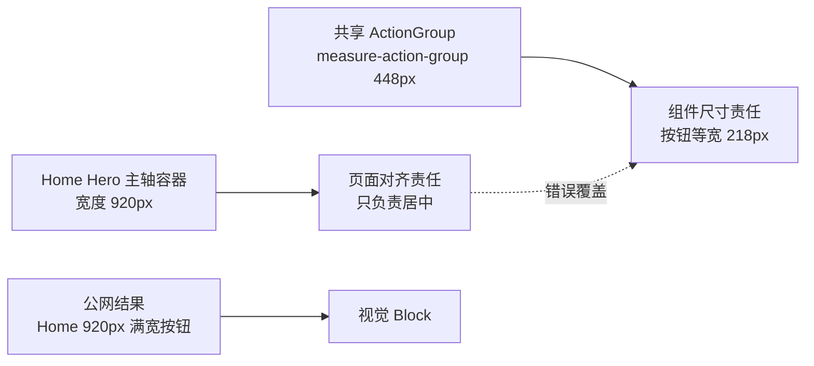
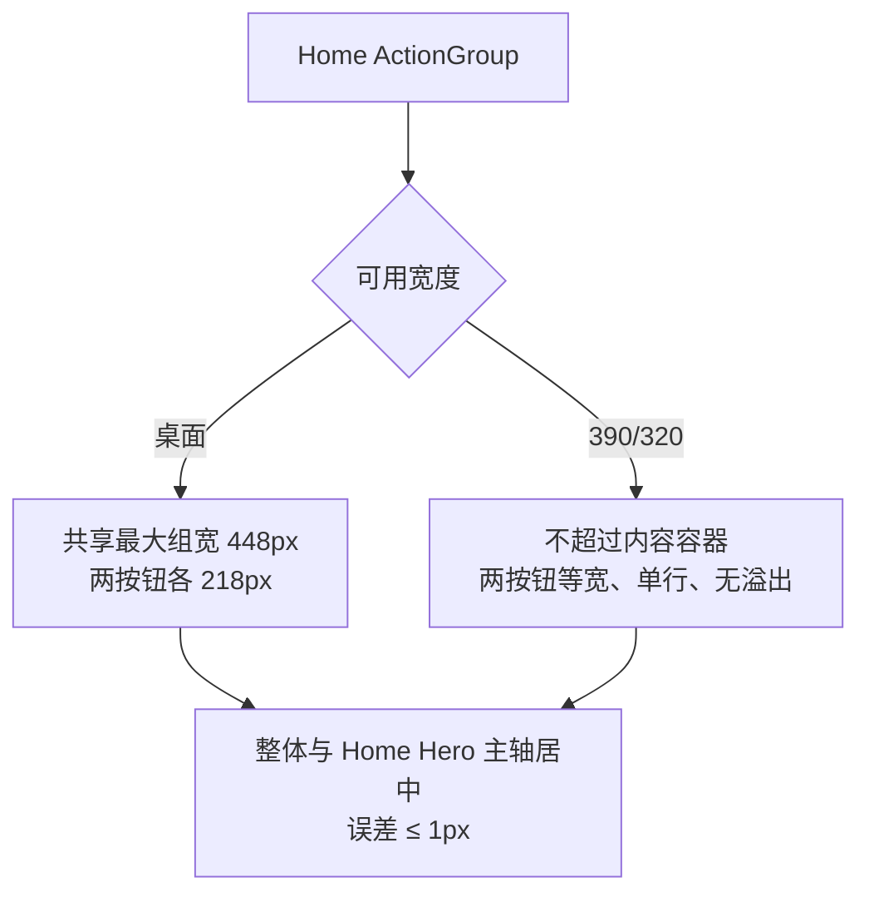

# xingbuild v0.26.7：首页 CTA 共享尺寸回归修复方案

状态：正式产品/视觉方案
父版本：`v0.26.6` / `098499040449aadd8f4bdc14a11bd9fd9df10889`
责任：产品/视觉定义合同；Engineering 实现与验收；内容与 Ops 不参与本版本。

## 1. 结论

v0.26.6 的公网视觉验收只剩一个回归：Home 的 ActionGroup 被页面私有规则拉伸为 920px，两个按钮各约 454px；`/products` 的同一共享组件仍是约 448px 组宽、218px/按钮。

这是布局责任混用，不是按钮组件本身的问题：



本版本只修复“对齐容器”和“共享组件尺寸”被同一个元素承担的问题，不改变 Home、Products 的页面独立性，不改变内容对象或发布工具。

## 2. 正式合同

### 2.1 共享尺寸合同

- `ActionGroup equalWidth` 继续是全站唯一等宽按钮尺寸来源；实际 group 最大宽度由 `--measure-action-group` 决定。
- Home 不得在实际 ActionGroup 元素上设置 `width: min(100%, var(--measure-product-hero))` 或同等页面私有宽度覆盖。
- 如需与 Hero 主轴对齐，使用独立的 Home 对齐容器/布局层；容器负责 `margin-inline:auto` 与 `justify-content:center`，ActionGroup 负责自身共享宽度。
- `/products` 的现有尺寸、按钮文案、外链和布局保持不变。

### 2.2 响应式合同



- Web `1600×1067`：group 总宽应为共享 `--measure-action-group`（当前约 448px），两按钮等宽（当前约 218px），group 中心与 Hero 中心误差 `≤1px`。
- Mobile `390×844`、窄屏 `320×844`：group 随内容容器收缩，按钮等宽、文字单行、无横向溢出；不得以固定 448px 造成裁切。
- Hero、Home 内容区的视觉轴与标签左锚点保持 v0.26.6 已通过事实：`最新作品` gap=4px，Robotaxi 标题/说明居中。

### 2.3 架构与边界

- 保留 `HomeProductProjection` 与 `ProductsShowcase` 的独立 IA、布局、组件组合和生命周期。
- 只允许共享 `ActionGroup` 的尺寸合同、tokens 和基础布局原语；不重新引入共享页面投影或页面级开关。
- 不修改 ContentSet、ContentReleaseId、正文、审核、来源、媒体、ContentSet Coordinator、SitePublication 或内容 CLI。

## 3. 产品—内容兼容声明

```yaml
contentImpact: compatible
contentImpactReason: home-action-group-width-only
affectedTargets: [home]
affectedRoutes: [/, /products]
affectedFields: [home-action-group-width, home-action-group-axis]
compatibilityEvidence: v0.26.6-public-visual-block-v266-oa02-width
```

产品 build 继续保持 `publishedSlugs=[]` 的产品隔离事实；内容 task 不需重新 prepare/build/transport，ops-content 保持停止直到产品版本完成公网视觉验收。

## 4. Engineering 实现限制

1. 先定位 Home ActionGroup 的实际宽度覆盖，不修改共享 `ActionGroup` 的既定尺寸合同来迁就 Home。
2. 优先通过 Home 外层对齐容器解决主轴，不新增第二套按钮样式或页面私有 token。
3. 保留键盘 focus-visible、按钮 accessible name、Reduced Motion、现有 CTA href 与安全外链。
4. 不修改 `/products` 视觉结果；必须提供 Home 与 `/products` 对比的 computed geometry 证据。
5. 不修改内容文件、内容发布脚本、Coordinator、ProductArtifact 结构或 SitePublication 逻辑。

## 5. 验收合同

- 视口：Web `1600×1067`、`1280×1067`；Mobile `390×844`；窄屏 `320×844`；必要时等效 200% CSS 视口。
- 路由：至少 `/`、`/products`，并回归 `/business-observations`、`/observations`、`/about`。
- DOM/几何：Home group width 不超过共享 `--measure-action-group`；桌面两个按钮约 `218px` 等宽；Home group center/Hero center delta `≤1px`；Mobile 单行无溢出。
- 对比回归：`/products` 两按钮仍约 `218px` 等宽；CTA 文案/目标、4 个视频属性、H-02、经营观察页面已通过项均保持。
- 质量：`npm run check`、`release:prepare`、相关页面/视觉专项、`release:build`、`release:closeout-check`、`release:preflight`、`git diff --check`；内容 `content:check`、`article:check`、`practice:check` 通过。
- 产品/视觉按 `xingbuild-visual-ux-review` 先做本地 Web→Mobile 验收；上线后由 design-ui 做同一视口公网验收。

## 6. 发布顺序

```text
Engineering 实现 + 分层 QA
→ v0.26.7 commit/tag/clean + exact ProductArtifact
→ 产品/视觉本地独立验收
→ 持续授权 product transport
→ SitePublication 公网验证
→ design-ui 公网视觉验收
→ 内容保持既有 ContentSet，不重发
```

v0.26.6 保持不可变；若本版本失败，不修改旧 tag，不运行内容发布，不以 HTTP 200 或 deployment success 替代视觉验收。
