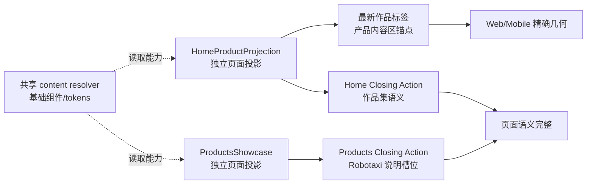

# xingbuild v0.26.8：首页作品锚点与 Product Presentation Closing Action 方案

状态：正式产品/视觉方案
父版本：`v0.26.7` / `763861c57b9047b863841300c8d9acb4aa05bedf`
来源：v0.26.7 design-ui 公网视觉验收 `Block`：`B-01/H-02`、`B-02/H-09/S-04`
责任：产品/视觉定义合同；Engineering 实现与自 QA；内容与 Ops 不参与本版本。

## 1. 结论

v0.26.7 的产品页面独立架构、冷白视觉和 CTA 尺寸已通过公网验收；剩余问题是两个页面投影的局部语义和锚点没有按已确认基线落地：



本版本只修复：

1. Home 的“最新作品”标签锚定到 Robotaxi 标题的左起点，同时保留标题和说明的居中排版；
2. Home 与 `/products` 各自补齐自己的 Product Presentation Closing Action 语义。

这不是内容发布能力变更，也不是把两个页面重新合并为一个共享投影。页面继续各自拥有 IA、布局、组件组合、交互语义和生命周期；只共享内容读取能力、基础组件、tokens、媒体安全链接和空内容降级。

## 2. B-01：Home“最新作品”锚点

### 2.1 页面语义

- `最新作品` 仍是 Home 产品内容区的页眉标签，不进入 Hero 中轴，也不在 `/products` 渲染。
- `Robotaxi运营平台` 标题与说明继续在自己的 ProductHero 中心轴居中；不得因为标签锚点而把标题、说明改为左对齐。
- 标签与标题保持 `--space-1`（4px）垂直间距；标签隐藏时不留空白。

### 2.2 几何合同

对 Home 的同一产品内容区，在所有指定视口中：

```text
abs(latestWorkLabel.left - robotaxiProductTitle.left) <= 1px
abs(label.bottom - title.top) = 4px（允许浏览器取整误差）
robotaxiProductTitle.text-align = center
robotaxiProductIntro.text-align = center
```

标签只能改变自身锚点或包裹层定位；不得给 ProductHero、标题或说明增加页面私有 `text-align: start`、固定宽度或新的视觉 token。

## 3. B-02：页面独立的 Product Presentation Closing Action

### 3.1 Home 投影

Home 的 Closing Action 由 `HomeProductProjection` 自己定义，不读取 `/products` 的页面级 Closing Action 配置。正式文案为：

```text
标题：查看我的最新作品
说明：它将经营规划、需求、供给、运营调度、订单、履约、指标、经营反馈连接成可运行可学习经营闭环
操作：进入 Robotaxi运营平台
目标：https://robotaxi.xingbuild.top/
```

操作继续使用已登记的 Robotaxi 外链和现有安全属性；不得显示默认“继续进入”。

### 3.2 `/products` 投影

`ProductsShowcase` 自己定义 Robotaxi 产品 Closing Action：

```text
标题：Robotaxi运营平台
说明：使用既有已登记的 Robotaxi 产品说明槽位（当前为 product configuration 的 closing.summary）
操作：进入 Robotaxi运营平台
目标：https://robotaxi.xingbuild.top/
```

说明必须实际渲染；若该已登记槽位为空，使用页面合法的空内容降级，不伪造内容、不显示默认“继续进入”。

### 3.3 独立投影边界

- `HomeProductProjection` 和 `ProductsShowcase` 不共享页面级 Closing Action 对象、页面级开关或生命周期。
- 可以复用 `ClosingAction` 这种无业务状态的基础渲染组件、`ActionGroup` 尺寸合同、tokens、外链安全处理和空内容降级。
- 任一页面改变标题、说明、CTA、显示/隐藏规则或上移后的间距，不得强制改变另一页面。
- 不新增内容字段、路由、ContentSet、ContentReleaseId、媒体事实或内容发布命令；现有 Robotaxi 说明槽位足以表达 `/products` 需求。

## 4. 内容兼容与产品边界

```yaml
contentImpact: compatible
contentImpactReason: page-local-product-presentation-projection-only
affectedTargets: [home, practice]
affectedRoutes: [/, /products]
affectedFields:
  - home-latest-work-anchor
  - home-product-closing-title
  - home-product-closing-summary
  - practice-product-closing-summary-projection
compatibilityEvidence: v0.26.7-public-visual-block-B01-B02
```

- 产品 build 继续保持产品与 ContentSet 隔离：产品 `content-manifest` 的 published content projection 不由本版本写入；Site Publication 仍由 Coordinator 在 transport 时组装当前 ProductArtifact 与 active ContentSet。
- 不修改 `.content-workspace/` 内容正文、来源、审核、媒体、ContentSet Candidate、receipt、revision、发布台账或内容任务状态。
- 不运行 content prepare/build/transport/finalize，不重发既有内容；`ops-content` 保持停止，直到产品完成本地与公网视觉验收后再按其自身合同决定是否恢复。
- 如果 Engineering 发现现有 Robotaxi 说明槽位无法读取，只能报告产品能力阻断并补充正式合同；不得让内容 task 手工复制或改写事实。

## 5. Engineering 实现限制

1. 先拆分 Home 与 Products 的页面投影配置，保持两页独立 IA；不得重新引入共享 `ShowcaseFlow` 或共享页面级 `projectClosingAction`。
2. B-01 只调整标签锚点；不得把 Robotaxi 标题/说明改为左对齐，不得改变 4px 间距或 Hero 中心轴。
3. B-02 在各自页面投影中声明文案和显示规则；可复用无状态 `ClosingAction` primitive，但不能让一个页面的文案覆盖另一页面。
4. `/products` 必须使用现有登记的 Robotaxi closing summary；Home 使用本方案固定的作品集语义文案。两者的外链必须继续通过已登记安全配置。
5. 保留键盘 focus-visible、accessible name、`target=_blank`/`rel=noreferrer`、Reduced Motion、视频 autoplay/muted/loop/controls=false 及既有空内容降级。
6. 不修改 ContentSet、内容脚本、Coordinator、ProductArtifact、SiteSnapshot、SitePublication、内容 schema、媒体文件或任何已发布内容事实。

## 6. 验收合同

### 6.1 路由与视口

- 重点路由：`/`、`/products`；回归：`/business-observations`、`/observations`、`/about`。
- Web：`1600×1067`、`1280×1067`；Mobile：`390×844`；窄屏：`320×844`；必要时等效 200% CSS 视口。

### 6.2 必须通过

- Home 三种宽度中，`最新作品` 与 Robotaxi 标题左起点误差 `≤1px`，垂直 gap 为 4px；标题和说明仍为居中。
- Home Closing Action 精确显示本方案标题和说明；`/products` 显示 Robotaxi 标题与已登记说明槽位；两页均不显示默认“继续进入”。
- Home 与 `/products` 的 CTA 目标、安全属性、等宽规则、键盘路径和 accessible name 保持正确。
- Home 与 `/products` 页面投影仍独立；静态检查确认不存在共享页面级 Closing Action/投影开关耦合。
- 五路由无横向溢出、每页一个 H1、console/page error 为 0；媒体与 Reduced Motion 回归通过。
- `npm run check`、`release:prepare`、页面/视觉专项、`release:build`、`release:closeout-check`、`release:preflight`、`git diff --check`，以及 `content:check`、`article:check`、`practice:check` 通过。既有 retained fixture/environment failures 必须分层报告，不能隐藏。
- 产品/视觉按 `xingbuild-visual-ux-review` 完成本地 Web→Mobile 独立验收；产品上线后 design-ui 按同一证据边界完成公网验收。

### 6.3 内容独立性回归

- 产品 build 不产生新的内容身份，不改变 active ContentSet 数量、正文、审核、来源、媒体或发布台账。
- Site Publication 只在产品 transport 时由 Coordinator 读取当前 ProductArtifact + active ContentSet；本版本不调用内容发布入口。
- 现有内容发布工具的 prepare/build/resume/finalize 合同和内容 task 的独立生命周期不变。

## 7. 发布顺序

```text
Engineering 实现 + 分层 QA
→ v0.26.8 commit/tag/clean + exact ProductArtifact
→ 产品/视觉本地 xingbuild-visual-ux-review Approve
→ 持续授权 product transport
→ SitePublication 公网验证与 finalize
→ design-ui 公网视觉验收
→ 内容保持既有 ContentSet，不重发
```

v0.26.7 保持不可变；本版本任何失败都必须进入 Publish Incident 或下一产品版本，不回写旧 tag/history/current，不以 deployment success 或 HTTP 200 替代视觉验收。
